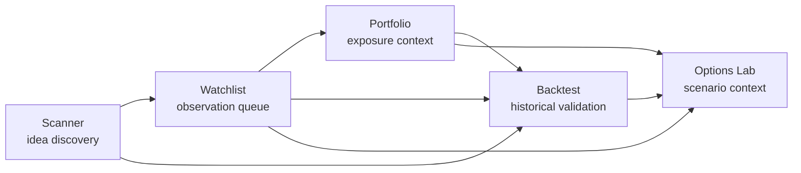

# Research Workspace Scanner/Watchlist Salvage

## Objective

This branch is a merge-safe salvage of the independently useful Scanner/Watchlist slice from the broader Research Workspace v1 exploration. It is not a completion claim for the full Research Workspace v1 goal.

Kept in this merge candidate:

- Route-map documentation for the intended read-only research flow.
- Shared read-only `ResearchWorkspaceFlowPanel`.
- Scanner handoff links with consumer-safe route context.
- Watchlist route intake that filters or spotlights existing records only.

Deferred out of this merge candidate:

- Portfolio page integration.
- Backtest page integration.
- Options Lab page integration.

## Workflow Map

## Read-Only Contract

- Scanner and Watchlist research links may pass only `symbol`, `market`, and safe enum-like `source` route context.
- Forbidden in route handoff hrefs and consumer DOM: `scannerRunId`, `watchlistItemId`, raw IDs, `Run #`, `Rank #`, provider/cache/runtime/debug terms, internal reason codes, and JSON/debug payloads.
- Watchlist route intake may set local filters or spotlight an existing observed symbol. It must not save, remove, rescore, refresh, send alerts, create alerts, or create watchlist records.
- Portfolio, Backtest, and Options Lab pages are only route-map destinations in this salvage. Their page-level integrations remain deferred.
- Consumer UI must use evidence language: known evidence, missing evidence, latest-available data, local validation sample states, confidence caps, and next verification steps. Technical diagnostics and raw identifiers stay hidden.

## Current Route Inventory

| Surface | Route | Existing safe entry points | Mutation controls to avoid for this goal |
| --- | --- | --- | --- |
| Scanner | `/scanner`, `/:locale/scanner` | result evidence strips, next-step panel, candidate detail rail, backtest navigation | scanner run/retry, analysis launch, watchlist save, batch save |
| Watchlist | `/watchlist`, `/:locale/watchlist` | list filters, observation summary, scanner lineage, backtest navigation | add/remove item, score refresh, batch scan/backtest, live alert controls |
| Portfolio | `/portfolio`, `/:locale/portfolio` | deferred in this salvage | account/holding/cash mutations, import/sync write paths |
| Backtest | `/backtest`, `/:locale/backtest` | deferred in this salvage | backtest engine/math changes, result schema changes |
| Options Lab | `/options-lab`, `/:locale/options-lab` | deferred in this salvage | ranking semantic changes, execution-style recommendations |

## Checkpoints

- [x] `checkpoint(research): map workflow`
- [x] `checkpoint(research): connect scanner and watchlist`
- [ ] `checkpoint(research): connect portfolio and backtest` (deferred)
- [ ] `checkpoint(research): connect options scenarios` (deferred)
- [ ] `feat(research): add workspace v1` (deferred; not claimed by this branch)

## Validation Plan

- Focused frontend tests for route handoffs and safe evidence panels:
  - Scanner
  - Watchlist
- Frontend typecheck/build from `apps/dsa-web`.
- Changed-file lint and design checks.
- `git diff --check origin/main..HEAD`.
- Secret scan before final push.

## Progress Log

### 2026-06-11

- Mapped current routes and mutation boundaries.
- Confirmed this salvage should stay frontend-only and Scanner/Watchlist-only.
- Confirmed no provider runtime/fallback/cache/scoring, backtest math, options ranking, portfolio accounting, auth/RBAC/session behavior is in scope.
- Added shared read-only research workspace route handoff helpers and a consumer-safe workflow panel.
- Connected Scanner to research workflow routes with `symbol`, `market`, and `source` only.
- Connected Watchlist route query intake so scanner handoffs can filter and explain existing or missing observation records without creating watchlist items.
- Removed Portfolio and Backtest page integrations from this merge candidate; Options Lab page integration is not present in the final diff.
- Validation evidence:
  - `npm --prefix apps/dsa-web run test -- src/components/research/**tests**/ResearchWorkspaceFlowPanel.test.tsx src/pages/**tests**/UserScannerPage.test.tsx src/pages/**tests**/WatchlistPage.test.tsx` did not enter npm under zsh because the glob raised `no matches found`.
  - `noglob npm --prefix apps/dsa-web run test -- src/components/research/**tests**/ResearchWorkspaceFlowPanel.test.tsx src/pages/**tests**/UserScannerPage.test.tsx src/pages/**tests**/WatchlistPage.test.tsx` reached Vitest but matched no files.
  - `npm --prefix apps/dsa-web run test -- src/components/research/__tests__/ResearchWorkspaceFlowPanel.test.tsx src/pages/__tests__/UserScannerPage.test.tsx src/pages/__tests__/WatchlistPage.test.tsx` passed: 3 files, 150 tests.
  - `npm --prefix apps/dsa-web run typecheck` passed.
  - `npm --prefix apps/dsa-web run lint:changed` passed.
  - `npm --prefix apps/dsa-web run check:design:changed` passed.
  - `npm --prefix apps/dsa-web run build` passed.
  - `git diff --check origin/main` passed as the pre-commit effective diff whitespace check.
  - `./scripts/release_secret_scan.sh --base-ref origin/main` passed before commit.
  - `git diff --check origin/main..HEAD` passed after the salvage commit.
  - `./scripts/release_secret_scan.sh --base-ref origin/main` passed after the salvage commit with `origin/main..HEAD: 8`, staged `0`, working tree `0`, and untracked `0`.
  - `git status --short --branch` showed a clean `codex/research-workspace-scanner-watchlist-salvage` branch after the salvage commit.
