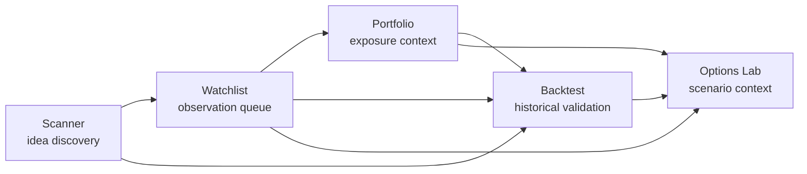

# Research Workspace v1 Goal Progress

## Objective

Build a read-only WolfyStock Research Workspace that lets a scanner idea move through watchlist observation, portfolio exposure review, backtest validation, and options scenario context without adding trading, portfolio mutation, live alert sending, personalized advice, or provider/runtime behavior changes.

## Workflow Map

## Read-Only Contract

- Scanner links may pass symbol, market, run metadata, and context through route query parameters only.
- Watchlist context may filter or spotlight an existing observed symbol, but must not save, remove, rescore, refresh, or create alerts unless the user triggers existing explicit controls.
- Portfolio context may summarize existing holdings and exposure state only; it must not create accounts, holdings, cash ledger entries, sync records, or scenario side effects beyond existing explicit scenario controls.
- Backtest context may prefill a symbol and explain evidence gaps; it must not change backtest math, stored results, optimizer behavior, or ranking semantics.
- Options Lab context may prefill a symbol and explain scenario readiness; it must not rank strategies differently or generate execution guidance.
- Consumer UI must use evidence language: known evidence, missing evidence, older/latest-available data, local validation sample states, confidence caps, and next verification steps. Raw diagnostics, provider/cache/runtime labels, internal ids, and JSON/debug details stay hidden.

## Current Route Inventory

| Surface | Route | Existing safe entry points | Mutation controls to avoid for this goal |
| --- | --- | --- | --- |
| Scanner | `/scanner`, `/:locale/scanner` | result evidence strips, next-step panel, candidate detail rail, backtest navigation | scanner run/retry, analysis launch, watchlist save, batch save |
| Watchlist | `/watchlist`, `/:locale/watchlist` | list filters, observation summary, scanner lineage, backtest navigation | add/remove item, score refresh, batch scan/backtest, live alert controls |
| Portfolio | `/portfolio`, `/:locale/portfolio` | holdings/exposure/risk summaries, valuation trust strips | account/holding/cash mutations, import/sync write paths |
| Backtest | `/backtest`, `/:locale/backtest` | scanner handoff prefill, research boundary, rule/historical workspace | backtest engine/math changes, result schema changes |
| Options Lab | `/options-lab`, `/:locale/options-lab` | readiness gate, scenario evidence, chain/readiness summaries | ranking semantic changes, execution-style recommendations |

## Checkpoints

- [x] `checkpoint(research): map workflow`
- [ ] `checkpoint(research): connect scanner and watchlist`
- [ ] `checkpoint(research): connect portfolio and backtest`
- [ ] `checkpoint(research): connect options scenarios`
- [ ] `feat(research): add workspace v1`

## Validation Plan

- Focused frontend tests for route handoffs and safe evidence panels:
  - Scanner
  - Watchlist
  - Portfolio
  - Backtest
  - Options Lab
- Frontend typecheck/build from `apps/dsa-web`.
- Bounded Playwright smoke for Scanner, Watchlist, Portfolio, Backtest, and Options routes.
- `git diff --check`.
- Secret scan before final push.

## Progress Log

### 2026-06-11

- Mapped current routes and mutation boundaries.
- Confirmed the first implementation should stay frontend-only unless a missing read-only projection becomes necessary.
- Confirmed no provider runtime/fallback/cache/scoring, backtest math, options ranking, portfolio accounting, auth/RBAC/session behavior is in scope.
