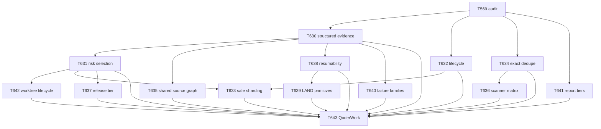

# T569 Test Redundancy, Runtime Cost, and Engineering Workflow Audit

> Status: audit complete; the single canonical timing pass was non-green. This report does not convert failed, skipped, unavailable, static-only, or inferred evidence into a pass.

## Executive decision

WolfyStock is over-defensive in validation frequency and scope, but not in the semantics it protects. The immediate safe cleanup is only three exact duplicate nodes. Material wall-clock improvement comes from reusing immutable setup/source graphs, isolating mutable lifecycle, risk-selecting gates, and resuming content-addressed evidence. Auth/RBAC, owner isolation, provider/no-live truth, fail-closed distinctions, persistence, release identity, secrets, and target-environment qualification must not be weakened.

| Decision | Result |
|---|---|
| Accepted base SHA | `4220b383cdfd0afa70f51e674c22246262ec0195` |
| Accepted tree SHA | `74b8cae5ba78cd5944f66286ccc9d44ff21a92a3` |
| Environment fingerprint | `f706a3347b41e5598fad2068950a4fbd6ccd14ac43d0480f22f4df76f8ffa07a` |
| Backend inventory | 8,142 nodes in 669 files; 7,250 unique callables; 892 expanded nodes |
| Frontend inventory | 176 Vitest files / 2,206 expanded declarations; 64 Playwright specs / 718 project cases |
| Canonical timing | 831.673 s wall; exit 1; 8,096 passed parents, 23 failed parents, 23 skipped |
| Conservative | 8,139 corpus/canonical nodes; -3; 0.172 s measured |
| Moderate | 8,126 corpus/canonical nodes; -16; 68-113 s inferred lifecycle saving |
| Aggressive | 8,126 corpus, 8,108 canonical executions; 18 moved to release; not default |
| Next QoderWork | T643, only after T630-T642 stabilize |

## Evidence identity and method

- Environment: Darwin arm64, Python 3.11.15, pytest 9.1.1, Node 20.20.2, npm 10.8.2, Vitest 4.1.0, Playwright 1.58.2, Chromium 145.0.7632.6 revision 1208.
- Python authority: `requirements-python311-dev.lock`, projection `darwin-arm64-cpython311-development`, lock SHA-256 `35f4840f3daba497fabde96c135e3c27e2e17d7fb50adb466a34757d33ac3d36`; bootstrap network use was false.
- Backend topology: 8,142 nodes, SHA-256 `383fd5b6f7cab1c9a343fb92a50e887ee512f17edc76b7e758fad6f533247745`; exact collection matched topology.
- Historical topology baseline: `1f554d42ca7fee0e4c71f80f0b1c15680526032a`, 7,609 nodes, SHA-256 `445301088c77a7235c8ed97c90367203124ec54c87a1e5adc614af43a0aca2f4`.
- Exactly one complete timing pass ran, after checking that no concurrent T566 full suite was active. A separate 114-node targeted timing run supplemented node-level evidence.
- Mutation probes were temporary and did not write repository files. No browser, UAT, release-real-runtime, QoderWork, or live provider run was performed.
- Measured, derived, inferred, and unknown values remain separate throughout.

## Backend inventory

Collection took 14.58 s. Parameter expansion is 892 / 8,142 = 10.955539%; therefore 89.044461% of collected nodes are unique callable identities. The topology contains 7,550 surviving baseline nodes, 592 new nodes, and 59 historical collection gaps, a net +533 versus the 7,609-node historical baseline.

### Directory, family, and marker totals

| Directory | Nodes |
|---|---:|
| `tests` | 6,330 |
| `tests/api` | 1,194 |
| `tests/architecture` | 12 |
| `tests/contracts` | 25 |
| `tests/scripts` | 365 |
| `tests/services` | 216 |

| Canonical owner/family | Nodes | Full-pass seconds |
|---|---:|---:|
| `residual_repository_integration` | 1,779 | 117.127 |
| `market` | 1,577 | 51.201 |
| `provider_external_network` | 1,122 | 43.120 |
| `api_schema_contracts` | 906 | 65.673 |
| `runtime_operator_tooling` | 838 | 93.296 |
| `backtest` | 502 | 63.091 |
| `auth_security` | 495 | 76.956 |
| `database_storage_migrations` | 328 | 51.635 |
| `scanner` | 318 | 12.908 |
| `portfolio_broker` | 277 | 200.052 |

| Marker combination | Nodes |
|---|---:|
| `none` | 7,044 |
| `parametrize` | 1,071 |
| `destructive_postgres+skip` | 22 |
| `skipif` | 3 |
| `benchmark` | 2 |

### Parameterization and unittest arithmetic

- 7,250 unique collected callables + 892 parameter expansions = 8,142 collected parent nodes.
- 3,091 collected nodes are unittest TestCase method nodes. Static class discovery finds 3091 TestCase-style definitions; the collected-node total is authoritative because inheritance and generated cases can differ from lexical definitions.
- 104 lexical `subTest` call sites emitted 722 runtime child events: 718 passed and 4 failed. They are not separately collected nodes.
- JUnit arithmetic is 8,864 cases = 8,142 parents + 722 subtest events.
- Four test-like nested helper methods are intentionally uncollected and are recorded in the JSON report.

### Complete per-file backend node inventory

| Path | Nodes | Unique callables | Expansion | Baseline | New | Owner counts |
|---|---:|---:|---:|---:|---:|---|
| `tests/api/test_actor_projection.py` | 4 | 4 | 0 | 0 | 4 | api_schema_contracts:4 |
| `tests/api/test_admin_cost_summary.py` | 9 | 9 | 0 | 9 | 0 | api_schema_contracts:9 |
| `tests/api/test_admin_logs.py` | 57 | 57 | 0 | 57 | 0 | api_schema_contracts:57 |
| `tests/api/test_admin_logs_real_pg.py` | 1 | 1 | 0 | 1 | 0 | api_schema_contracts:1 |
| `tests/api/test_admin_mission_control.py` | 5 | 5 | 0 | 5 | 0 | api_schema_contracts:5 |
| `tests/api/test_admin_ops_status.py` | 18 | 16 | 2 | 18 | 0 | api_schema_contracts:18 |
| `tests/api/test_admin_portfolio.py` | 11 | 11 | 0 | 11 | 0 | portfolio_broker:11 |
| `tests/api/test_admin_provider_circuit_diagnostics.py` | 35 | 35 | 0 | 35 | 0 | provider_external_network:35 |
| `tests/api/test_admin_quota_dry_run.py` | 19 | 19 | 0 | 19 | 0 | api_schema_contracts:19 |
| `tests/api/test_admin_rbac_r3b_routes.py` | 9 | 9 | 0 | 9 | 0 | auth_security:9 |
| `tests/api/test_admin_real_auth_session_smoke.py` | 4 | 4 | 0 | 4 | 0 | auth_security:4 |
| `tests/api/test_admin_security.py` | 20 | 20 | 0 | 20 | 0 | auth_security:20 |
| `tests/api/test_admin_spa_shell_guard.py` | 13 | 6 | 7 | 13 | 0 | api_schema_contracts:13 |
| `tests/api/test_admin_surface_readiness.py` | 9 | 9 | 0 | 8 | 1 | api_schema_contracts:9 |
| `tests/api/test_admin_user_activity.py` | 6 | 6 | 0 | 6 | 0 | api_schema_contracts:6 |
| `tests/api/test_admin_users.py` | 12 | 12 | 0 | 12 | 0 | api_schema_contracts:12 |
| `tests/api/test_agent_skills_exposure_invariant.py` | 17 | 4 | 13 | 17 | 0 | api_schema_contracts:17 |
| `tests/api/test_agent_stock_research_contract.py` | 5 | 5 | 0 | 5 | 0 | provider_external_network:5 |
| `tests/api/test_analysis.py` | 2 | 2 | 0 | 2 | 0 | api_schema_contracts:2 |
| `tests/api/test_analysis_preview_consumer_projection.py` | 1 | 1 | 0 | 1 | 0 | api_schema_contracts:1 |
| `tests/api/test_analysis_quota_route_pilot.py` | 29 | 27 | 2 | 29 | 0 | api_schema_contracts:29 |
| `tests/api/test_auth_mfa_foundation.py` | 26 | 26 | 0 | 26 | 0 | auth_security:26 |
| `tests/api/test_auth_rbac_release_contracts.py` | 14 | 14 | 0 | 13 | 1 | auth_security:14 |
| `tests/api/test_auth_security_hardening.py` | 16 | 16 | 0 | 16 | 0 | auth_security:16 |
| `tests/api/test_backtest_parameter_sweep_api.py` | 6 | 6 | 0 | 6 | 0 | backtest:6 |
| `tests/api/test_backtest_public_boundary_auth_disabled.py` | 3 | 3 | 0 | 3 | 0 | auth_security:3 |
| `tests/api/test_cn_provider_health.py` | 4 | 4 | 0 | 4 | 0 | provider_external_network:4 |
| `tests/api/test_consumer_api_diagnostic_redaction_endpoints.py` | 7 | 7 | 0 | 7 | 0 | api_schema_contracts:7 |
| `tests/api/test_consumer_safe_error_envelope.py` | 22 | 14 | 8 | 22 | 0 | api_schema_contracts:22 |
| `tests/api/test_crypto_realtime.py` | 10 | 10 | 0 | 10 | 0 | api_schema_contracts:10 |
| `tests/api/test_daily_intelligence_endpoint.py` | 2 | 2 | 0 | 2 | 0 | api_schema_contracts:2 |
| `tests/api/test_dashboard_overview_contract.py` | 7 | 7 | 0 | 7 | 0 | api_schema_contracts:7 |
| `tests/api/test_data_source_gap_registry.py` | 2 | 2 | 0 | 2 | 0 | provider_external_network:2 |
| `tests/api/test_data_source_validation.py` | 13 | 13 | 0 | 13 | 0 | provider_external_network:13 |
| `tests/api/test_data_sources.py` | 3 | 3 | 0 | 3 | 0 | provider_external_network:3 |
| `tests/api/test_historical_ohlcv_cache_preflight.py` | 16 | 16 | 0 | 16 | 0 | market:16 |
| `tests/api/test_homepage_intelligence_endpoint.py` | 11 | 11 | 0 | 11 | 0 | api_schema_contracts:11 |
| `tests/api/test_leveraged_etf_mapper.py` | 5 | 5 | 0 | 5 | 0 | api_schema_contracts:5 |
| `tests/api/test_liquidity_monitor.py` | 9 | 9 | 0 | 9 | 0 | market:9 |
| `tests/api/test_logging.py` | 2 | 2 | 0 | 2 | 0 | api_schema_contracts:2 |
| `tests/api/test_mac118_api_route_contracts.py` | 2 | 2 | 0 | 2 | 0 | api_schema_contracts:2 |
| `tests/api/test_market_briefing.py` | 9 | 9 | 0 | 9 | 0 | market:9 |
| `tests/api/test_market_cache.py` | 37 | 37 | 0 | 37 | 0 | market:37 |
| `tests/api/test_market_cache_import_boundary.py` | 11 | 11 | 0 | 11 | 0 | market:11 |
| `tests/api/test_market_cn_breadth.py` | 7 | 7 | 0 | 7 | 0 | market:7 |
| `tests/api/test_market_cn_flows.py` | 7 | 7 | 0 | 7 | 0 | market:7 |
| `tests/api/test_market_cn_indices.py` | 20 | 20 | 0 | 20 | 0 | market:20 |
| `tests/api/test_market_cn_short_sentiment.py` | 2 | 2 | 0 | 2 | 0 | market:2 |
| `tests/api/test_market_crypto.py` | 14 | 14 | 0 | 14 | 0 | market:14 |
| `tests/api/test_market_data_readiness.py` | 3 | 3 | 0 | 3 | 0 | market:3 |
| `tests/api/test_market_decision_cockpit_endpoint.py` | 4 | 4 | 0 | 4 | 0 | market:4 |
| `tests/api/test_market_endpoint_provider_regressions.py` | 6 | 6 | 0 | 6 | 0 | provider_external_network:6 |
| `tests/api/test_market_freshness.py` | 11 | 11 | 0 | 11 | 0 | market:11 |
| `tests/api/test_market_futures.py` | 5 | 5 | 0 | 5 | 0 | market:5 |
| `tests/api/test_market_fx_commodities.py` | 2 | 2 | 0 | 2 | 0 | market:2 |
| `tests/api/test_market_intelligence_payload_smoke.py` | 6 | 6 | 0 | 6 | 0 | market:6 |
| `tests/api/test_market_macro_cards.py` | 11 | 11 | 0 | 11 | 0 | market:11 |
| `tests/api/test_market_provider_operations.py` | 30 | 25 | 5 | 30 | 0 | provider_external_network:30 |
| `tests/api/test_market_regime_read_model_endpoint.py` | 9 | 9 | 0 | 9 | 0 | market:9 |
| `tests/api/test_market_rotation_radar.py` | 20 | 20 | 0 | 20 | 0 | market:20 |
| `tests/api/test_market_scenario_lab_endpoint.py` | 19 | 19 | 0 | 19 | 0 | market:19 |
| `tests/api/test_market_sentiment.py` | 8 | 8 | 0 | 8 | 0 | market:8 |
| `tests/api/test_market_temperature.py` | 43 | 43 | 0 | 43 | 0 | market:43 |
| `tests/api/test_market_us_breadth.py` | 6 | 6 | 0 | 6 | 0 | market:6 |
| `tests/api/test_notification_channels.py` | 31 | 31 | 0 | 31 | 0 | api_schema_contracts:31 |
| `tests/api/test_openapi_docs_auth_gate.py` | 15 | 7 | 8 | 13 | 2 | auth_security:15 |
| `tests/api/test_options_lab.py` | 47 | 47 | 0 | 47 | 0 | market:47 |
| `tests/api/test_portfolio_history.py` | 3 | 3 | 0 | 3 | 0 | portfolio_broker:3 |
| `tests/api/test_portfolio_owner_isolation.py` | 8 | 8 | 0 | 8 | 0 | portfolio_broker:8 |
| `tests/api/test_portfolio_scenario_risk.py` | 7 | 7 | 0 | 7 | 0 | portfolio_broker:7 |
| `tests/api/test_portfolio_structure_review_endpoint.py` | 1 | 1 | 0 | 1 | 0 | portfolio_broker:1 |
| `tests/api/test_production_ingress_static_containment.py` | 10 | 10 | 0 | 0 | 10 | api_schema_contracts:10 |
| `tests/api/test_professional_data_capability_registry.py` | 3 | 3 | 0 | 3 | 0 | api_schema_contracts:3 |
| `tests/api/test_provider_cache.py` | 6 | 6 | 0 | 6 | 0 | provider_external_network:6 |
| `tests/api/test_provider_fallback.py` | 10 | 10 | 0 | 10 | 0 | provider_external_network:10 |
| `tests/api/test_provider_fit_advisor.py` | 3 | 3 | 0 | 3 | 0 | provider_external_network:3 |
| `tests/api/test_provider_operations_matrix.py` | 22 | 22 | 0 | 22 | 0 | provider_external_network:22 |
| `tests/api/test_provider_usage_ledger.py` | 2 | 2 | 0 | 2 | 0 | portfolio_broker:2 |
| `tests/api/test_public_api_surface_safety.py` | 43 | 43 | 0 | 43 | 0 | api_schema_contracts:43 |
| `tests/api/test_quant_duckdb.py` | 14 | 14 | 0 | 14 | 0 | api_schema_contracts:14 |
| `tests/api/test_quant_factor_research_report.py` | 3 | 3 | 0 | 3 | 0 | provider_external_network:3 |
| `tests/api/test_research_queue_endpoint.py` | 2 | 2 | 0 | 2 | 0 | provider_external_network:2 |
| `tests/api/test_research_radar_endpoint.py` | 4 | 4 | 0 | 4 | 0 | provider_external_network:4 |
| `tests/api/test_route_inventory.py` | 2 | 2 | 0 | 0 | 2 | api_schema_contracts:2 |
| `tests/api/test_route_uniqueness.py` | 1 | 1 | 0 | 1 | 0 | api_schema_contracts:1 |
| `tests/api/test_runtime_api_edge_contracts.py` | 10 | 3 | 7 | 10 | 0 | api_schema_contracts:10 |
| `tests/api/test_scanner.py` | 12 | 12 | 0 | 11 | 1 | scanner:12 |
| `tests/api/test_scanner_diagnostics.py` | 74 | 4 | 70 | 1 | 73 | scanner:74 |
| `tests/api/test_scanner_research_overlay_endpoint.py` | 3 | 3 | 0 | 3 | 0 | scanner:3 |
| `tests/api/test_security_launch_preflight.py` | 13 | 13 | 0 | 13 | 0 | auth_security:13 |
| `tests/api/test_settings_data_source_validation.py` | 4 | 4 | 0 | 4 | 0 | provider_external_network:4 |
| `tests/api/test_stock_evidence_api.py` | 12 | 12 | 0 | 12 | 0 | market:12 |
| `tests/api/test_stock_history_endpoint.py` | 5 | 5 | 0 | 5 | 0 | market:5 |
| `tests/api/test_stock_quote_recovery.py` | 3 | 3 | 0 | 3 | 0 | market:3 |
| `tests/api/test_stock_structure_decision_endpoint.py` | 20 | 20 | 0 | 20 | 0 | market:20 |
| `tests/api/test_stock_symbol_validation_contract.py` | 8 | 8 | 0 | 8 | 0 | market:8 |
| `tests/api/test_t128_api_route_compatibility.py` | 6 | 4 | 2 | 6 | 0 | api_schema_contracts:6 |
| `tests/api/test_trading_safety_absence.py` | 4 | 4 | 0 | 4 | 0 | api_schema_contracts:4 |
| `tests/api/test_user_alerts.py` | 17 | 17 | 0 | 17 | 0 | api_schema_contracts:17 |
| `tests/api/test_user_write_audit_coverage.py` | 7 | 7 | 0 | 4 | 3 | api_schema_contracts:7 |
| `tests/api/test_watchlist_research_overlay_endpoint.py` | 3 | 3 | 0 | 2 | 1 | provider_external_network:3 |
| `tests/architecture/test_boundary_debt_manifest.py` | 3 | 3 | 0 | 0 | 3 | residual_repository_integration:3 |
| `tests/architecture/test_direct_storage_debt.py` | 2 | 2 | 0 | 0 | 2 | database_storage_migrations:2 |
| `tests/architecture/test_protected_semantics_architecture.py` | 2 | 2 | 0 | 0 | 2 | residual_repository_integration:2 |
| `tests/architecture/test_provider_heavy_debt.py` | 3 | 3 | 0 | 0 | 3 | provider_external_network:3 |
| `tests/architecture/test_service_api_schema_debt.py` | 2 | 2 | 0 | 0 | 2 | api_schema_contracts:2 |
| `tests/contracts/test_protected_semantics_contract.py` | 7 | 1 | 6 | 0 | 7 | api_schema_contracts:7 |
| `tests/contracts/test_source_observation_facts.py` | 18 | 12 | 6 | 0 | 18 | api_schema_contracts:18 |
| `tests/scripts/test_authenticated_uat_contract.py` | 3 | 3 | 0 | 0 | 3 | runtime_operator_tooling:3 |
| `tests/scripts/test_bootstrap_worktree.py` | 8 | 7 | 1 | 0 | 8 | runtime_operator_tooling:8 |
| `tests/scripts/test_build_ai_project_manual.py` | 3 | 3 | 0 | 3 | 0 | runtime_operator_tooling:3 |
| `tests/scripts/test_data_chain_operator_verifier.py` | 7 | 7 | 0 | 7 | 0 | runtime_operator_tooling:7 |
| `tests/scripts/test_dev_start_backend.py` | 5 | 5 | 0 | 5 | 0 | runtime_operator_tooling:5 |
| `tests/scripts/test_docker_python_lock.py` | 16 | 11 | 5 | 0 | 16 | runtime_operator_tooling:16 |
| `tests/scripts/test_domain_test_topology.py` | 9 | 9 | 0 | 0 | 9 | runtime_operator_tooling:9 |
| `tests/scripts/test_historical_ohlcv_cache_preflight_cli.py` | 2 | 2 | 0 | 2 | 0 | runtime_operator_tooling:2 |
| `tests/scripts/test_historical_ohlcv_operator_verifier.py` | 10 | 10 | 0 | 10 | 0 | runtime_operator_tooling:10 |
| `tests/scripts/test_local_data_cache_schema_verifier.py` | 7 | 7 | 0 | 7 | 0 | runtime_operator_tooling:7 |
| `tests/scripts/test_market_regime_evidence_verifier.py` | 1 | 1 | 0 | 1 | 0 | runtime_operator_tooling:1 |
| `tests/scripts/test_market_regime_read_model_verifier.py` | 1 | 1 | 0 | 1 | 0 | runtime_operator_tooling:1 |
| `tests/scripts/test_private_beta_bootstrap_scripts.py` | 8 | 8 | 0 | 8 | 0 | runtime_operator_tooling:8 |
| `tests/scripts/test_private_beta_critical_path_smoke.py` | 6 | 6 | 0 | 6 | 0 | runtime_operator_tooling:6 |
| `tests/scripts/test_pytest_discovery_isolation.py` | 2 | 2 | 0 | 0 | 2 | runtime_operator_tooling:2 |
| `tests/scripts/test_quote_snapshot_operator_verifier.py` | 7 | 7 | 0 | 7 | 0 | runtime_operator_tooling:7 |
| `tests/scripts/test_seed_uat_consumer_test_accounts.py` | 2 | 2 | 0 | 2 | 0 | runtime_operator_tooling:2 |
| `tests/scripts/test_smoke_market_data_authenticated.py` | 4 | 4 | 0 | 4 | 0 | runtime_operator_tooling:4 |
| `tests/scripts/test_uat_fresh_build_verifier.py` | 20 | 20 | 0 | 20 | 0 | runtime_operator_tooling:20 |
| `tests/scripts/test_uat_runtime_harness.py` | 53 | 53 | 0 | 47 | 6 | runtime_operator_tooling:53 |
| `tests/scripts/test_uat_runtime_smoke_pack.py` | 19 | 19 | 0 | 19 | 0 | runtime_operator_tooling:19 |
| `tests/scripts/test_validation_owner_manifest.py` | 5 | 5 | 0 | 5 | 0 | runtime_operator_tooling:5 |
| `tests/scripts/test_validation_owner_planner.py` | 24 | 11 | 13 | 24 | 0 | runtime_operator_tooling:24 |
| `tests/scripts/test_web_build_artifact.py` | 10 | 10 | 0 | 6 | 4 | runtime_operator_tooling:10 |
| `tests/scripts/test_wolfy_browser_tools.py` | 6 | 6 | 0 | 0 | 6 | runtime_operator_tooling:6 |
| `tests/scripts/test_wolfy_cli.py` | 9 | 9 | 0 | 0 | 9 | runtime_operator_tooling:9 |
| `tests/scripts/test_wolfy_components.py` | 19 | 17 | 2 | 0 | 19 | runtime_operator_tooling:19 |
| `tests/scripts/test_wolfy_identity.py` | 11 | 6 | 5 | 0 | 11 | runtime_operator_tooling:11 |
| `tests/scripts/test_wolfy_manager.py` | 13 | 10 | 3 | 0 | 13 | runtime_operator_tooling:13 |
| `tests/scripts/test_wolfy_python_lock.py` | 44 | 33 | 11 | 0 | 44 | runtime_operator_tooling:44 |
| `tests/scripts/test_wolfy_qualification.py` | 4 | 4 | 0 | 0 | 4 | runtime_operator_tooling:4 |
| `tests/scripts/test_wolfy_runtime.py` | 13 | 11 | 2 | 0 | 13 | runtime_operator_tooling:13 |
| `tests/scripts/test_wolfy_services.py` | 4 | 4 | 0 | 0 | 4 | runtime_operator_tooling:4 |
| `tests/scripts/test_wolfy_snapshots.py` | 10 | 10 | 0 | 0 | 10 | runtime_operator_tooling:10 |
| `tests/services/test_analysis_research_readiness_projection.py` | 17 | 17 | 0 | 17 | 0 | provider_external_network:17 |
| `tests/services/test_confidence_evidence_consistency.py` | 6 | 6 | 0 | 6 | 0 | residual_repository_integration:6 |
| `tests/services/test_consumer_api_diagnostic_redaction.py` | 9 | 6 | 3 | 9 | 0 | api_schema_contracts:9 |
| `tests/services/test_cross_surface_research_synthesis_engine.py` | 7 | 7 | 0 | 7 | 0 | provider_external_network:7 |
| `tests/services/test_data_coverage_quality_matrix.py` | 8 | 8 | 0 | 8 | 0 | residual_repository_integration:8 |
| `tests/services/test_earnings_calendar_readiness_contract.py` | 4 | 4 | 0 | 4 | 0 | api_schema_contracts:4 |
| `tests/services/test_evidence_provenance_ledger.py` | 3 | 3 | 0 | 3 | 0 | portfolio_broker:3 |
| `tests/services/test_home_llm_evidence_input.py` | 5 | 5 | 0 | 5 | 0 | residual_repository_integration:5 |
| `tests/services/test_home_source_provenance_sidecar.py` | 7 | 7 | 0 | 7 | 0 | residual_repository_integration:7 |
| `tests/services/test_liquidity_source_provenance_sidecar.py` | 7 | 7 | 0 | 7 | 0 | market:7 |
| `tests/services/test_market_intelligence_source_provenance_sidecar.py` | 7 | 7 | 0 | 7 | 0 | market:7 |
| `tests/services/test_market_regime_divergence_detector.py` | 7 | 7 | 0 | 7 | 0 | market:7 |
| `tests/services/test_market_scanner_source_provenance_sidecar.py` | 8 | 8 | 0 | 8 | 0 | scanner:8 |
| `tests/services/test_news_catalyst_producer_lineage.py` | 6 | 6 | 0 | 6 | 0 | residual_repository_integration:6 |
| `tests/services/test_news_catalyst_read_contract.py` | 6 | 6 | 0 | 6 | 0 | api_schema_contracts:6 |
| `tests/services/test_report_evidence_export.py` | 6 | 6 | 0 | 6 | 0 | residual_repository_integration:6 |
| `tests/services/test_research_narrative_composer.py` | 5 | 5 | 0 | 5 | 0 | provider_external_network:5 |
| `tests/services/test_research_narrative_scanner_adapter.py` | 3 | 3 | 0 | 3 | 0 | scanner:3 |
| `tests/services/test_research_packet_v1.py` | 7 | 7 | 0 | 7 | 0 | provider_external_network:7 |
| `tests/services/test_research_packet_v1_adoption.py` | 3 | 3 | 0 | 3 | 0 | provider_external_network:3 |
| `tests/services/test_research_packet_v1_fixtures.py` | 12 | 7 | 5 | 12 | 0 | provider_external_network:12 |
| `tests/services/test_research_queue_evidence_provenance_adapter.py` | 3 | 3 | 0 | 3 | 0 | provider_external_network:3 |
| `tests/services/test_research_readiness_contract.py` | 9 | 9 | 0 | 9 | 0 | provider_external_network:9 |
| `tests/services/test_rotation_source_provenance_sidecar.py` | 6 | 6 | 0 | 6 | 0 | market:6 |
| `tests/services/test_single_stock_evidence_packet.py` | 7 | 6 | 1 | 7 | 0 | market:7 |
| `tests/services/test_single_stock_fundamentals_earnings_normalizer.py` | 9 | 8 | 1 | 9 | 0 | market:9 |
| `tests/services/test_single_stock_news_catalyst_extractor.py` | 10 | 9 | 1 | 10 | 0 | market:10 |
| `tests/services/test_single_stock_source_capability_matrix.py` | 9 | 6 | 3 | 9 | 0 | market:9 |
| `tests/services/test_source_provenance_contract.py` | 8 | 8 | 0 | 8 | 0 | api_schema_contracts:8 |
| `tests/services/test_stock_evidence_conflict_detector.py` | 8 | 8 | 0 | 8 | 0 | market:8 |
| `tests/services/test_us_fundamentals_service.py` | 4 | 4 | 0 | 4 | 0 | market:4 |
| `tests/test_admin_activity_service.py` | 1 | 1 | 0 | 1 | 0 | residual_repository_integration:1 |
| `tests/test_admin_data_missing_drilldown.py` | 3 | 3 | 0 | 3 | 0 | residual_repository_integration:3 |
| `tests/test_admin_incident_timeline_service.py` | 2 | 2 | 0 | 2 | 0 | residual_repository_integration:2 |
| `tests/test_admin_observability_contracts.py` | 14 | 14 | 0 | 14 | 0 | api_schema_contracts:14 |
| `tests/test_admin_rbac.py` | 38 | 38 | 0 | 38 | 0 | auth_security:38 |
| `tests/test_admin_rbac_route_inventory.py` | 6 | 6 | 0 | 6 | 0 | auth_security:6 |
| `tests/test_agent_executor.py` | 31 | 31 | 0 | 31 | 0 | residual_repository_integration:31 |
| `tests/test_agent_models_api.py` | 18 | 18 | 0 | 18 | 0 | residual_repository_integration:18 |
| `tests/test_agent_pipeline.py` | 39 | 39 | 0 | 38 | 1 | residual_repository_integration:39 |
| `tests/test_agent_registry.py` | 56 | 56 | 0 | 56 | 0 | residual_repository_integration:56 |
| `tests/test_agent_stock_evidence_service.py` | 9 | 9 | 0 | 9 | 0 | market:9 |
| `tests/test_ai_decision_public_safety.py` | 13 | 13 | 0 | 13 | 0 | residual_repository_integration:13 |
| `tests/test_ai_evidence_adapters.py` | 9 | 9 | 0 | 9 | 0 | residual_repository_integration:9 |
| `tests/test_ai_evidence_cross_engine_contracts.py` | 12 | 4 | 8 | 12 | 0 | api_schema_contracts:12 |
| `tests/test_ai_evidence_dry_run_explanation.py` | 11 | 11 | 0 | 11 | 0 | residual_repository_integration:11 |
| `tests/test_ai_evidence_packet.py` | 9 | 9 | 0 | 9 | 0 | residual_repository_integration:9 |
| `tests/test_ai_evidence_packet_versioning.py` | 6 | 6 | 0 | 6 | 0 | residual_repository_integration:6 |
| `tests/test_ai_routing_cost_boundary.py` | 10 | 10 | 0 | 10 | 0 | residual_repository_integration:10 |
| `tests/test_akshare_capability_probe.py` | 5 | 5 | 0 | 5 | 0 | provider_external_network:5 |
| `tests/test_akshare_cn_ohlcv_cache_runtime.py` | 8 | 8 | 0 | 7 | 1 | provider_external_network:8 |
| `tests/test_akshare_realtime_logging.py` | 4 | 4 | 0 | 4 | 0 | provider_external_network:4 |
| `tests/test_alpaca_fetcher.py` | 6 | 6 | 0 | 6 | 0 | residual_repository_integration:6 |
| `tests/test_alphavantage_provider.py` | 3 | 3 | 0 | 3 | 0 | provider_external_network:3 |
| `tests/test_analysis_api_contract.py` | 44 | 44 | 0 | 44 | 0 | api_schema_contracts:44 |
| `tests/test_analysis_history.py` | 29 | 29 | 0 | 29 | 0 | residual_repository_integration:29 |
| `tests/test_analysis_integration.py` | 4 | 4 | 0 | 4 | 0 | residual_repository_integration:4 |
| `tests/test_analysis_metadata.py` | 25 | 25 | 0 | 25 | 0 | residual_repository_integration:25 |
| `tests/test_analyzer_news_prompt.py` | 4 | 4 | 0 | 4 | 0 | residual_repository_integration:4 |
| `tests/test_api_abuse_request_safety_evidence_check.py` | 2 | 2 | 0 | 2 | 0 | api_schema_contracts:2 |
| `tests/test_api_app_cors.py` | 4 | 4 | 0 | 4 | 0 | auth_security:4 |
| `tests/test_api_app_health.py` | 12 | 12 | 0 | 12 | 0 | api_schema_contracts:12 |
| `tests/test_ask_command.py` | 2 | 2 | 0 | 2 | 0 | residual_repository_integration:2 |
| `tests/test_auth.py` | 31 | 31 | 0 | 31 | 0 | auth_security:31 |
| `tests/test_auth_api.py` | 64 | 64 | 0 | 60 | 4 | auth_security:64 |
| `tests/test_auth_route_capability_inventory.py` | 17 | 17 | 0 | 17 | 0 | auth_security:17 |
| `tests/test_auth_status_setup_state.py` | 6 | 6 | 0 | 6 | 0 | auth_security:6 |
| `tests/test_auto_trace_check.py` | 3 | 3 | 0 | 3 | 0 | residual_repository_integration:3 |
| `tests/test_autocomplete_pr0.py` | 13 | 13 | 0 | 13 | 0 | residual_repository_integration:13 |
| `tests/test_backend_metrics_snapshot_service.py` | 13 | 10 | 3 | 13 | 0 | residual_repository_integration:13 |
| `tests/test_backend_modular_import_boundaries.py` | 24 | 24 | 0 | 24 | 0 | residual_repository_integration:24 |
| `tests/test_backtest_access_isolation.py` | 7 | 7 | 0 | 7 | 0 | backtest:7 |
| `tests/test_backtest_api_contract.py` | 59 | 59 | 0 | 55 | 4 | backtest:59 |
| `tests/test_backtest_bounded_grid_runner.py` | 9 | 9 | 0 | 9 | 0 | backtest:9 |
| `tests/test_backtest_data_source_routing.py` | 27 | 11 | 16 | 27 | 0 | backtest:27 |
| `tests/test_backtest_data_sufficiency_gate.py` | 14 | 14 | 0 | 14 | 0 | backtest:14 |
| `tests/test_backtest_engine.py` | 19 | 19 | 0 | 19 | 0 | backtest:19 |
| `tests/test_backtest_execution_model_registry.py` | 13 | 5 | 8 | 12 | 1 | backtest:13 |
| `tests/test_backtest_execution_model_versioning_contract.py` | 2 | 2 | 0 | 2 | 0 | backtest:2 |
| `tests/test_backtest_execution_realism_readiness_contract.py` | 1 | 1 | 0 | 1 | 0 | backtest:1 |
| `tests/test_backtest_golden_contracts.py` | 5 | 5 | 0 | 5 | 0 | backtest:5 |
| `tests/test_backtest_golden_metrics.py` | 3 | 3 | 0 | 3 | 0 | backtest:3 |
| `tests/test_backtest_job_contracts.py` | 3 | 3 | 0 | 3 | 0 | backtest:3 |
| `tests/test_backtest_oos_parameter_readiness_contract.py` | 1 | 1 | 0 | 1 | 0 | backtest:1 |
| `tests/test_backtest_parameter_stability_contract.py` | 11 | 11 | 0 | 11 | 0 | backtest:11 |
| `tests/test_backtest_parameter_sweep_pilot.py` | 11 | 11 | 0 | 11 | 0 | backtest:11 |
| `tests/test_backtest_pit_universe_adjusted_data_readiness_contract.py` | 3 | 3 | 0 | 3 | 0 | backtest:3 |
| `tests/test_backtest_professional_readiness.py` | 7 | 7 | 0 | 7 | 0 | backtest:7 |
| `tests/test_backtest_regime_attribution_readiness.py` | 6 | 6 | 0 | 6 | 0 | backtest:6 |
| `tests/test_backtest_regime_attribution_readiness_contract.py` | 1 | 1 | 0 | 1 | 0 | backtest:1 |
| `tests/test_backtest_reproducibility_manifest_contract.py` | 11 | 11 | 0 | 7 | 4 | backtest:11 |
| `tests/test_backtest_service.py` | 38 | 38 | 0 | 37 | 1 | backtest:38 |
| `tests/test_backtest_stress_monte_carlo_readiness_contract.py` | 1 | 1 | 0 | 1 | 0 | backtest:1 |
| `tests/test_backtest_summary.py` | 1 | 1 | 0 | 1 | 0 | backtest:1 |
| `tests/test_backtest_walkforward_oos_contract.py` | 8 | 8 | 0 | 8 | 0 | backtest:8 |
| `tests/test_backup_restore_drill_check.py` | 30 | 25 | 5 | 19 | 11 | database_storage_migrations:30 |
| `tests/test_backup_restore_drill_smoke.py` | 1 | 1 | 0 | 1 | 0 | database_storage_migrations:1 |
| `tests/test_baostock_capability_probe.py` | 4 | 4 | 0 | 4 | 0 | provider_external_network:4 |
| `tests/test_baostock_source_contract.py` | 3 | 3 | 0 | 3 | 0 | provider_external_network:3 |
| `tests/test_build_provenance_service.py` | 3 | 3 | 0 | 3 | 0 | residual_repository_integration:3 |
| `tests/test_catalyst_event_exposure.py` | 4 | 4 | 0 | 4 | 0 | residual_repository_integration:4 |
| `tests/test_chip_structure_fallback.py` | 23 | 23 | 0 | 23 | 0 | residual_repository_integration:23 |
| `tests/test_cn_hk_flow_contracts.py` | 20 | 11 | 9 | 20 | 0 | api_schema_contracts:20 |
| `tests/test_cn_money_market_rates_contracts.py` | 14 | 7 | 7 | 14 | 0 | market:14 |
| `tests/test_cn_provider_health_service.py` | 9 | 9 | 0 | 9 | 0 | provider_external_network:9 |
| `tests/test_cn_provider_source_contract.py` | 15 | 4 | 11 | 15 | 0 | provider_external_network:15 |
| `tests/test_coinbase_public_provider.py` | 6 | 6 | 0 | 6 | 0 | provider_external_network:6 |
| `tests/test_config_env_compat.py` | 16 | 16 | 0 | 16 | 0 | runtime_operator_tooling:16 |
| `tests/test_config_manager.py` | 3 | 3 | 0 | 3 | 0 | runtime_operator_tooling:3 |
| `tests/test_config_registry.py` | 7 | 7 | 0 | 7 | 0 | runtime_operator_tooling:7 |
| `tests/test_config_snapshot_evidence_check.py` | 9 | 9 | 0 | 9 | 0 | runtime_operator_tooling:9 |
| `tests/test_config_validate_structured.py` | 37 | 37 | 0 | 37 | 0 | runtime_operator_tooling:37 |
| `tests/test_consumer_issue_labels.py` | 10 | 6 | 4 | 10 | 0 | residual_repository_integration:10 |
| `tests/test_contracts_namespace.py` | 5 | 5 | 0 | 5 | 0 | api_schema_contracts:5 |
| `tests/test_conversation_manager.py` | 1 | 1 | 0 | 1 | 0 | residual_repository_integration:1 |
| `tests/test_cross_asset_driver_readiness.py` | 3 | 3 | 0 | 3 | 0 | runtime_operator_tooling:3 |
| `tests/test_crypto_realtime_service.py` | 6 | 6 | 0 | 6 | 0 | residual_repository_integration:6 |
| `tests/test_custom_source_contracts.py` | 8 | 8 | 0 | 8 | 0 | api_schema_contracts:8 |
| `tests/test_custom_strategy_contracts.py` | 23 | 21 | 2 | 23 | 0 | api_schema_contracts:23 |
| `tests/test_daily_intelligence_service.py` | 4 | 4 | 0 | 4 | 0 | residual_repository_integration:4 |
| `tests/test_data_coverage_matrix_batch.py` | 10 | 10 | 0 | 10 | 0 | residual_repository_integration:10 |
| `tests/test_data_coverage_matrix_builder.py` | 22 | 13 | 9 | 22 | 0 | residual_repository_integration:22 |
| `tests/test_data_coverage_matrix_consumer_projection_examples.py` | 6 | 2 | 4 | 6 | 0 | residual_repository_integration:6 |
| `tests/test_data_coverage_matrix_contract.py` | 11 | 6 | 5 | 11 | 0 | api_schema_contracts:11 |
| `tests/test_data_coverage_surface_fixtures.py` | 4 | 4 | 0 | 4 | 0 | residual_repository_integration:4 |
| `tests/test_data_coverage_surface_registry.py` | 4 | 4 | 0 | 4 | 0 | residual_repository_integration:4 |
| `tests/test_data_coverage_surface_snapshot.py` | 11 | 11 | 0 | 11 | 0 | residual_repository_integration:11 |
| `tests/test_data_fetcher_manager_alpaca.py` | 9 | 9 | 0 | 9 | 0 | residual_repository_integration:9 |
| `tests/test_data_fetcher_manager_twelve_data.py` | 4 | 4 | 0 | 4 | 0 | residual_repository_integration:4 |
| `tests/test_data_fetcher_prefetch_stock_names.py` | 6 | 6 | 0 | 6 | 0 | market:6 |
| `tests/test_data_pipeline_r1.py` | 14 | 14 | 0 | 14 | 0 | residual_repository_integration:14 |
| `tests/test_data_quality_contract_regressions.py` | 12 | 2 | 10 | 12 | 0 | api_schema_contracts:12 |
| `tests/test_data_quality_contracts.py` | 19 | 12 | 7 | 19 | 0 | api_schema_contracts:19 |
| `tests/test_data_source_gap_registry_service.py` | 2 | 2 | 0 | 2 | 0 | provider_external_network:2 |
| `tests/test_data_source_router.py` | 30 | 27 | 3 | 30 | 0 | provider_external_network:30 |
| `tests/test_data_tools_get_stock_info.py` | 1 | 1 | 0 | 1 | 0 | market:1 |
| `tests/test_data_tools_portfolio_snapshot.py` | 4 | 4 | 0 | 4 | 0 | portfolio_broker:4 |
| `tests/test_database_doctor.py` | 12 | 12 | 0 | 12 | 0 | database_storage_migrations:12 |
| `tests/test_database_doctor_cleanup.py` | 3 | 3 | 0 | 3 | 0 | database_storage_migrations:3 |
| `tests/test_database_manager_formal_integration.py` | 5 | 5 | 0 | 5 | 0 | database_storage_migrations:5 |
| `tests/test_db_index_batch_a.py` | 4 | 4 | 0 | 4 | 0 | database_storage_migrations:4 |
| `tests/test_db_index_batch_b.py` | 3 | 3 | 0 | 3 | 0 | database_storage_migrations:3 |
| `tests/test_db_retention_preview_report.py` | 9 | 9 | 0 | 9 | 0 | database_storage_migrations:9 |
| `tests/test_destructive_postgres_policy.py` | 4 | 4 | 0 | 0 | 4 | database_storage_migrations:4 |
| `tests/test_domain_normalization_contracts.py` | 3 | 3 | 0 | 0 | 3 | api_schema_contracts:3 |
| `tests/test_dotenv_loader.py` | 2 | 2 | 0 | 2 | 0 | residual_repository_integration:2 |
| `tests/test_durable_runtime_contracts.py` | 7 | 7 | 0 | 7 | 0 | api_schema_contracts:7 |
| `tests/test_durable_runtime_progress_projection.py` | 6 | 6 | 0 | 6 | 0 | runtime_operator_tooling:6 |
| `tests/test_durable_runtime_v1_recovery.py` | 4 | 4 | 0 | 4 | 0 | runtime_operator_tooling:4 |
| `tests/test_durable_runtime_v1_worker.py` | 4 | 4 | 0 | 4 | 0 | runtime_operator_tooling:4 |
| `tests/test_durable_task_atomicity.py` | 8 | 8 | 0 | 0 | 8 | residual_repository_integration:8 |
| `tests/test_durable_task_state.py` | 20 | 20 | 0 | 20 | 0 | residual_repository_integration:20 |
| `tests/test_event_intelligence_contracts.py` | 13 | 7 | 6 | 13 | 0 | api_schema_contracts:13 |
| `tests/test_event_intelligence_timeline.py` | 5 | 5 | 0 | 5 | 0 | residual_repository_integration:5 |
| `tests/test_event_radar_service.py` | 10 | 10 | 0 | 10 | 0 | residual_repository_integration:10 |
| `tests/test_event_window_service.py` | 7 | 7 | 0 | 7 | 0 | residual_repository_integration:7 |
| `tests/test_evidence_artifact_sanitize.py` | 23 | 23 | 0 | 23 | 0 | residual_repository_integration:23 |
| `tests/test_evidence_cli_contracts.py` | 8 | 8 | 0 | 8 | 0 | api_schema_contracts:8 |
| `tests/test_evidence_safety.py` | 7 | 7 | 0 | 7 | 0 | residual_repository_integration:7 |
| `tests/test_evidence_validator_adversarial_matrix.py` | 43 | 5 | 38 | 43 | 0 | residual_repository_integration:43 |
| `tests/test_execution_log_service.py` | 34 | 34 | 0 | 34 | 0 | residual_repository_integration:34 |
| `tests/test_export_filter.py` | 1 | 1 | 0 | 1 | 0 | residual_repository_integration:1 |
| `tests/test_factor_experiment_manifest_contract.py` | 6 | 6 | 0 | 6 | 0 | api_schema_contracts:6 |
| `tests/test_factor_exposure_contract.py` | 7 | 7 | 0 | 7 | 0 | api_schema_contracts:7 |
| `tests/test_factor_metrics_contract.py` | 6 | 6 | 0 | 6 | 0 | api_schema_contracts:6 |
| `tests/test_factor_neutralization_contract.py` | 7 | 7 | 0 | 7 | 0 | api_schema_contracts:7 |
| `tests/test_factor_observation_contract.py` | 5 | 5 | 0 | 5 | 0 | api_schema_contracts:5 |
| `tests/test_factor_registry_contract.py` | 4 | 4 | 0 | 4 | 0 | api_schema_contracts:4 |
| `tests/test_factor_research_report_contract.py` | 10 | 10 | 0 | 10 | 0 | provider_external_network:10 |
| `tests/test_feishu_stream.py` | 2 | 2 | 0 | 2 | 0 | residual_repository_integration:2 |
| `tests/test_fetcher_logging.py` | 3 | 3 | 0 | 3 | 0 | residual_repository_integration:3 |
| `tests/test_formatters.py` | 23 | 23 | 0 | 23 | 0 | residual_repository_integration:23 |
| `tests/test_frontend_design_constitution_guard.py` | 43 | 43 | 0 | 43 | 0 | residual_repository_integration:43 |
| `tests/test_frontend_secret_namespace_guard.py` | 4 | 4 | 0 | 4 | 0 | residual_repository_integration:4 |
| `tests/test_fundamental_adapter.py` | 9 | 9 | 0 | 9 | 0 | market:9 |
| `tests/test_fundamental_context.py` | 16 | 16 | 0 | 16 | 0 | market:16 |
| `tests/test_futures_contracts.py` | 13 | 9 | 4 | 13 | 0 | api_schema_contracts:13 |
| `tests/test_fx_commodities_contracts.py` | 14 | 10 | 4 | 14 | 0 | api_schema_contracts:14 |
| `tests/test_fx_rate_service.py` | 4 | 4 | 0 | 4 | 0 | residual_repository_integration:4 |
| `tests/test_get_latest_data.py` | 4 | 4 | 0 | 4 | 0 | residual_repository_integration:4 |
| `tests/test_historical_market_data_foundation.py` | 10 | 7 | 3 | 10 | 0 | market:10 |
| `tests/test_historical_ohlcv_cache_preflight.py` | 19 | 19 | 0 | 18 | 1 | market:19 |
| `tests/test_historical_ohlcv_readiness_service.py` | 42 | 42 | 0 | 42 | 0 | market:42 |
| `tests/test_history_news_fallback.py` | 3 | 3 | 0 | 3 | 0 | residual_repository_integration:3 |
| `tests/test_hk_realtime_routing.py` | 1 | 1 | 0 | 1 | 0 | residual_repository_integration:1 |
| `tests/test_home_score_authenticity_guardrails.py` | 6 | 6 | 0 | 6 | 0 | auth_security:6 |
| `tests/test_homepage_after_close_developments_service.py` | 7 | 7 | 0 | 7 | 0 | residual_repository_integration:7 |
| `tests/test_homepage_ai_capex_infrastructure_service.py` | 7 | 7 | 0 | 7 | 0 | residual_repository_integration:7 |
| `tests/test_homepage_capabilities_service.py` | 5 | 5 | 0 | 5 | 0 | residual_repository_integration:5 |
| `tests/test_homepage_cockpit_capabilities_manifest.py` | 5 | 5 | 0 | 5 | 0 | residual_repository_integration:5 |
| `tests/test_homepage_cockpit_coverage_consistency.py` | 3 | 3 | 0 | 3 | 0 | residual_repository_integration:3 |
| `tests/test_homepage_cockpit_public_surface_guard.py` | 21 | 2 | 19 | 21 | 0 | residual_repository_integration:21 |
| `tests/test_homepage_cockpit_section_layout.py` | 6 | 6 | 0 | 6 | 0 | residual_repository_integration:6 |
| `tests/test_homepage_cockpit_uat_readiness.py` | 6 | 6 | 0 | 6 | 0 | runtime_operator_tooling:6 |
| `tests/test_homepage_contract_aggregate_smoke.py` | 16 | 2 | 14 | 16 | 0 | api_schema_contracts:16 |
| `tests/test_homepage_cross_asset_indicators_service.py` | 8 | 8 | 0 | 8 | 0 | runtime_operator_tooling:8 |
| `tests/test_homepage_daily_market_brief_service.py` | 7 | 7 | 0 | 7 | 0 | market:7 |
| `tests/test_homepage_demo_payload_service.py` | 8 | 8 | 0 | 8 | 0 | residual_repository_integration:8 |
| `tests/test_homepage_driver_chain_service.py` | 8 | 8 | 0 | 8 | 0 | residual_repository_integration:8 |
| `tests/test_homepage_earnings_catalysts_service.py` | 7 | 7 | 0 | 7 | 0 | residual_repository_integration:7 |
| `tests/test_homepage_empty_state_service.py` | 4 | 4 | 0 | 4 | 0 | residual_repository_integration:4 |
| `tests/test_homepage_event_impact_map_service.py` | 7 | 7 | 0 | 7 | 0 | residual_repository_integration:7 |
| `tests/test_homepage_evidence_quality_service.py` | 7 | 7 | 0 | 7 | 0 | residual_repository_integration:7 |
| `tests/test_homepage_explanation_service.py` | 5 | 5 | 0 | 5 | 0 | residual_repository_integration:5 |
| `tests/test_homepage_geopolitical_commodity_risk_service.py` | 9 | 9 | 0 | 9 | 0 | residual_repository_integration:9 |
| `tests/test_homepage_import_boundary.py` | 14 | 1 | 13 | 14 | 0 | residual_repository_integration:14 |
| `tests/test_homepage_intelligence_cockpit_aggregate.py` | 3 | 3 | 0 | 2 | 1 | residual_repository_integration:3 |
| `tests/test_homepage_intelligence_serialization_budget.py` | 2 | 2 | 0 | 2 | 0 | residual_repository_integration:2 |
| `tests/test_homepage_language_safety.py` | 8 | 1 | 7 | 8 | 0 | residual_repository_integration:8 |
| `tests/test_homepage_liquidity_credit_service.py` | 9 | 9 | 0 | 9 | 0 | market:9 |
| `tests/test_homepage_market_breadth_service.py` | 7 | 7 | 0 | 7 | 0 | market:7 |
| `tests/test_homepage_policy_regulation_watch_service.py` | 9 | 9 | 0 | 9 | 0 | residual_repository_integration:9 |
| `tests/test_homepage_pre_session_research_checklist_service.py` | 7 | 7 | 0 | 7 | 0 | auth_security:7 |
| `tests/test_homepage_public_copy.py` | 8 | 8 | 0 | 8 | 0 | residual_repository_integration:8 |
| `tests/test_homepage_public_copy_consistency.py` | 5 | 1 | 4 | 5 | 0 | residual_repository_integration:5 |
| `tests/test_homepage_public_disclosure_boundary.py` | 2 | 2 | 0 | 2 | 0 | residual_repository_integration:2 |
| `tests/test_homepage_rates_pricing_service.py` | 8 | 8 | 0 | 8 | 0 | residual_repository_integration:8 |
| `tests/test_homepage_research_priorities_service.py` | 4 | 4 | 0 | 4 | 0 | provider_external_network:4 |
| `tests/test_homepage_risk_regime_service.py` | 8 | 8 | 0 | 8 | 0 | residual_repository_integration:8 |
| `tests/test_homepage_scenario_watchlist_service.py` | 8 | 8 | 0 | 8 | 0 | residual_repository_integration:8 |
| `tests/test_homepage_schema_serialization_stress.py` | 27 | 1 | 26 | 27 | 0 | api_schema_contracts:27 |
| `tests/test_homepage_section_layout_service.py` | 6 | 6 | 0 | 6 | 0 | residual_repository_integration:6 |
| `tests/test_homepage_style_leadership_rotation_service.py` | 9 | 9 | 0 | 9 | 0 | market:9 |
| `tests/test_homepage_theme_capital_flow_service.py` | 9 | 9 | 0 | 9 | 0 | residual_repository_integration:9 |
| `tests/test_homepage_volatility_positioning_service.py` | 7 | 7 | 0 | 7 | 0 | residual_repository_integration:7 |
| `tests/test_image_stock_extractor_litellm.py` | 37 | 37 | 0 | 31 | 6 | market:37 |
| `tests/test_import_parser.py` | 20 | 20 | 0 | 20 | 0 | residual_repository_integration:20 |
| `tests/test_incident_response_evidence.py` | 4 | 4 | 0 | 4 | 0 | residual_repository_integration:4 |
| `tests/test_intelligence_report_packet.py` | 7 | 7 | 0 | 7 | 0 | residual_repository_integration:7 |
| `tests/test_investor_signal_model.py` | 8 | 8 | 0 | 8 | 0 | residual_repository_integration:8 |
| `tests/test_isolated_pg_restore_smoke.py` | 6 | 6 | 0 | 6 | 0 | database_storage_migrations:6 |
| `tests/test_launch_acceptance_evidence.py` | 22 | 22 | 0 | 22 | 0 | residual_repository_integration:22 |
| `tests/test_leveraged_etf_mapper_service.py` | 10 | 7 | 3 | 10 | 0 | residual_repository_integration:10 |
| `tests/test_liquidity_impulse_synthesis_adapter.py` | 5 | 5 | 0 | 5 | 0 | market:5 |
| `tests/test_liquidity_impulse_synthesis_service.py` | 12 | 12 | 0 | 12 | 0 | market:12 |
| `tests/test_liquidity_limited_confidence_projection.py` | 16 | 9 | 7 | 16 | 0 | market:16 |
| `tests/test_liquidity_monitor_service.py` | 119 | 110 | 9 | 119 | 0 | market:119 |
| `tests/test_litellm_local_cost_map.py` | 3 | 3 | 0 | 3 | 0 | residual_repository_integration:3 |
| `tests/test_llm_channel_config.py` | 19 | 19 | 0 | 19 | 0 | runtime_operator_tooling:19 |
| `tests/test_llm_cost_ledger.py` | 32 | 32 | 0 | 32 | 0 | portfolio_broker:32 |
| `tests/test_llm_identity_semantics.py` | 5 | 5 | 0 | 5 | 0 | residual_repository_integration:5 |
| `tests/test_llm_instrumentation.py` | 4 | 4 | 0 | 4 | 0 | residual_repository_integration:4 |
| `tests/test_llm_owner_context.py` | 9 | 9 | 0 | 9 | 0 | residual_repository_integration:9 |
| `tests/test_llm_usage.py` | 18 | 18 | 0 | 18 | 0 | residual_repository_integration:18 |
| `tests/test_local_quote_snapshot_provider.py` | 2 | 2 | 0 | 2 | 0 | provider_external_network:2 |
| `tests/test_local_soak_performance_smoke.py` | 12 | 12 | 0 | 12 | 0 | runtime_operator_tooling:12 |
| `tests/test_logging_config.py` | 3 | 3 | 0 | 3 | 0 | runtime_operator_tooling:3 |
| `tests/test_macro_provider_readiness_contract.py` | 3 | 3 | 0 | 3 | 0 | provider_external_network:3 |
| `tests/test_main_runtime_startup.py` | 19 | 12 | 7 | 0 | 19 | runtime_operator_tooling:19 |
| `tests/test_manual_release_approval_evidence_check.py` | 5 | 5 | 0 | 5 | 0 | runtime_operator_tooling:5 |
| `tests/test_market_analyzer_generate_text.py` | 8 | 8 | 0 | 8 | 0 | market:8 |
| `tests/test_market_breadth_readiness_service.py` | 3 | 3 | 0 | 3 | 0 | market:3 |
| `tests/test_market_cache_fallback_contracts.py` | 14 | 14 | 0 | 13 | 1 | market:14 |
| `tests/test_market_data_availability_contracts.py` | 14 | 14 | 0 | 14 | 0 | market:14 |
| `tests/test_market_data_readiness_diagnostics.py` | 26 | 26 | 0 | 26 | 0 | market:26 |
| `tests/test_market_data_source_registry.py` | 39 | 39 | 0 | 39 | 0 | provider_external_network:39 |
| `tests/test_market_decision_cockpit_service.py` | 10 | 10 | 0 | 10 | 0 | market:10 |
| `tests/test_market_decision_semantics.py` | 8 | 8 | 0 | 8 | 0 | market:8 |
| `tests/test_market_intelligence_runtime_diagnostic.py` | 36 | 29 | 7 | 32 | 4 | market:36 |
| `tests/test_market_intelligence_smoke_checklist.py` | 3 | 3 | 0 | 3 | 0 | market:3 |
| `tests/test_market_intelligence_trust_gate.py` | 7 | 7 | 0 | 7 | 0 | market:7 |
| `tests/test_market_overview_api.py` | 15 | 15 | 0 | 15 | 0 | market:15 |
| `tests/test_market_overview_core_quote_repair.py` | 22 | 22 | 0 | 22 | 0 | market:22 |
| `tests/test_market_overview_depth.py` | 17 | 17 | 0 | 17 | 0 | market:17 |
| `tests/test_market_overview_evidence_snapshot.py` | 34 | 34 | 0 | 34 | 0 | market:34 |
| `tests/test_market_overview_provider_boundaries.py` | 18 | 18 | 0 | 18 | 0 | provider_external_network:18 |
| `tests/test_market_overview_provider_deadlines.py` | 12 | 12 | 0 | 12 | 0 | provider_external_network:12 |
| `tests/test_market_overview_provider_freshness.py` | 8 | 8 | 0 | 8 | 0 | provider_external_network:8 |
| `tests/test_market_overview_snapshot.py` | 12 | 10 | 2 | 12 | 0 | market:12 |
| `tests/test_market_persistence_evidence_service.py` | 11 | 11 | 0 | 11 | 0 | database_storage_migrations:11 |
| `tests/test_market_persistence_snapshot_store.py` | 9 | 9 | 0 | 9 | 0 | database_storage_migrations:9 |
| `tests/test_market_provider_operations_boundary.py` | 17 | 7 | 10 | 17 | 0 | provider_external_network:17 |
| `tests/test_market_pulse_service.py` | 7 | 7 | 0 | 7 | 0 | market:7 |
| `tests/test_market_regime_decision_engine.py` | 6 | 6 | 0 | 6 | 0 | market:6 |
| `tests/test_market_regime_evidence_service.py` | 11 | 11 | 0 | 11 | 0 | market:11 |
| `tests/test_market_regime_projection_runtime_verifier.py` | 4 | 4 | 0 | 4 | 0 | market:4 |
| `tests/test_market_regime_read_model_service.py` | 9 | 9 | 0 | 9 | 0 | market:9 |
| `tests/test_market_regime_synthesis_adapter.py` | 5 | 5 | 0 | 5 | 0 | market:5 |
| `tests/test_market_regime_synthesis_service.py` | 12 | 12 | 0 | 12 | 0 | market:12 |
| `tests/test_market_rotation_radar_service.py` | 89 | 89 | 0 | 89 | 0 | market:89 |
| `tests/test_market_scanner_api_contract.py` | 22 | 22 | 0 | 22 | 0 | scanner:22 |
| `tests/test_market_scanner_ops_service.py` | 17 | 17 | 0 | 17 | 0 | scanner:17 |
| `tests/test_market_scanner_public_safety.py` | 5 | 5 | 0 | 5 | 0 | scanner:5 |
| `tests/test_market_scanner_service.py` | 95 | 95 | 0 | 84 | 11 | scanner:95 |
| `tests/test_market_scenario_lab_engine.py` | 13 | 13 | 0 | 13 | 0 | market:13 |
| `tests/test_market_session_status_service.py` | 10 | 6 | 4 | 10 | 0 | auth_security:10 |
| `tests/test_market_strategy.py` | 4 | 4 | 0 | 4 | 0 | market:4 |
| `tests/test_market_temperature_input_snapshot.py` | 11 | 11 | 0 | 11 | 0 | market:11 |
| `tests/test_model_pricing_policy_import.py` | 13 | 13 | 0 | 13 | 0 | residual_repository_integration:13 |
| `tests/test_money_flow_service.py` | 8 | 8 | 0 | 8 | 0 | residual_repository_integration:8 |
| `tests/test_multi_agent.py` | 93 | 93 | 0 | 91 | 2 | residual_repository_integration:93 |
| `tests/test_multi_user_phase1.py` | 6 | 6 | 0 | 6 | 0 | residual_repository_integration:6 |
| `tests/test_multi_user_phase3.py` | 8 | 8 | 0 | 8 | 0 | residual_repository_integration:8 |
| `tests/test_name_to_code_resolver.py` | 19 | 19 | 0 | 19 | 0 | residual_repository_integration:19 |
| `tests/test_near_live_market_data.py` | 11 | 11 | 0 | 11 | 0 | market:11 |
| `tests/test_news_intel.py` | 3 | 3 | 0 | 3 | 0 | residual_repository_integration:3 |
| `tests/test_news_strategy_config.py` | 2 | 2 | 0 | 2 | 0 | runtime_operator_tooling:2 |
| `tests/test_notification.py` | 29 | 29 | 0 | 29 | 0 | residual_repository_integration:29 |
| `tests/test_notification_delivery_rehearsal_evidence_check.py` | 5 | 5 | 0 | 5 | 0 | residual_repository_integration:5 |
| `tests/test_notification_sender.py` | 54 | 54 | 0 | 54 | 0 | provider_external_network:54 |
| `tests/test_official_macro_cache_prewarm.py` | 8 | 8 | 0 | 8 | 0 | market:8 |
| `tests/test_official_macro_source_registry.py` | 12 | 12 | 0 | 12 | 0 | market:12 |
| `tests/test_official_macro_transport.py` | 70 | 54 | 16 | 64 | 6 | provider_external_network:70 |
| `tests/test_offline_network_policy.py` | 11 | 8 | 3 | 0 | 11 | provider_external_network:11 |
| `tests/test_operator_evidence_archive_pack.py` | 6 | 6 | 0 | 6 | 0 | runtime_operator_tooling:6 |
| `tests/test_operator_evidence_archive_schema_workflow.py` | 2 | 2 | 0 | 2 | 0 | api_schema_contracts:2 |
| `tests/test_operator_evidence_bundle_check.py` | 7 | 7 | 0 | 7 | 0 | runtime_operator_tooling:7 |
| `tests/test_operator_evidence_bundle_diff.py` | 5 | 5 | 0 | 5 | 0 | runtime_operator_tooling:5 |
| `tests/test_operator_evidence_command_docs.py` | 3 | 3 | 0 | 3 | 0 | runtime_operator_tooling:3 |
| `tests/test_operator_evidence_docs_safety.py` | 1 | 1 | 0 | 1 | 0 | runtime_operator_tooling:1 |
| `tests/test_operator_evidence_fixture_pack.py` | 6 | 6 | 0 | 6 | 0 | runtime_operator_tooling:6 |
| `tests/test_operator_evidence_gap_analyzer.py` | 5 | 5 | 0 | 5 | 0 | runtime_operator_tooling:5 |
| `tests/test_operator_evidence_manifest_check.py` | 7 | 7 | 0 | 7 | 0 | runtime_operator_tooling:7 |
| `tests/test_operator_evidence_preflight.py` | 4 | 4 | 0 | 4 | 0 | runtime_operator_tooling:4 |
| `tests/test_operator_evidence_schema_reference.py` | 3 | 3 | 0 | 3 | 0 | api_schema_contracts:3 |
| `tests/test_operator_evidence_template_pack.py` | 9 | 9 | 0 | 9 | 0 | runtime_operator_tooling:9 |
| `tests/test_operator_evidence_workflow_e2e.py` | 3 | 3 | 0 | 3 | 0 | runtime_operator_tooling:3 |
| `tests/test_operator_evidence_workflow_run.py` | 7 | 7 | 0 | 7 | 0 | runtime_operator_tooling:7 |
| `tests/test_operator_evidence_workflow_smoke.py` | 3 | 3 | 0 | 3 | 0 | runtime_operator_tooling:3 |
| `tests/test_operator_evidence_workspace_guard.py` | 2 | 2 | 0 | 2 | 0 | runtime_operator_tooling:2 |
| `tests/test_options_authority_policy_matrix.py` | 62 | 19 | 43 | 62 | 0 | auth_security:62 |
| `tests/test_options_authority_policy_parity.py` | 36 | 3 | 33 | 36 | 0 | auth_security:36 |
| `tests/test_options_authority_sanitizers.py` | 10 | 3 | 7 | 0 | 10 | auth_security:10 |
| `tests/test_options_data_quality_gates.py` | 26 | 26 | 0 | 26 | 0 | market:26 |
| `tests/test_options_event_calendar_authority.py` | 13 | 13 | 0 | 13 | 0 | auth_security:13 |
| `tests/test_options_expiration_calendar_authority.py` | 9 | 9 | 0 | 9 | 0 | auth_security:9 |
| `tests/test_options_expiration_source_candidate_evidence.py` | 7 | 7 | 0 | 7 | 0 | market:7 |
| `tests/test_options_iv_rank_authority.py` | 23 | 14 | 9 | 23 | 0 | auth_security:23 |
| `tests/test_options_lab_service.py` | 55 | 53 | 2 | 55 | 0 | market:55 |
| `tests/test_options_market_data_provider.py` | 77 | 48 | 29 | 77 | 0 | provider_external_network:77 |
| `tests/test_options_market_structure_observation.py` | 7 | 7 | 0 | 7 | 0 | market:7 |
| `tests/test_options_structure_contract.py` | 12 | 12 | 0 | 12 | 0 | market:12 |
| `tests/test_persisted_json_integrity.py` | 7 | 2 | 5 | 0 | 7 | residual_repository_integration:7 |
| `tests/test_personal_summary_service.py` | 7 | 7 | 0 | 7 | 0 | residual_repository_integration:7 |
| `tests/test_pipeline_analysis_observability.py` | 1 | 1 | 0 | 1 | 0 | residual_repository_integration:1 |
| `tests/test_pipeline_fetch_error.py` | 1 | 1 | 0 | 1 | 0 | residual_repository_integration:1 |
| `tests/test_pipeline_multidim_quality.py` | 28 | 28 | 0 | 28 | 0 | residual_repository_integration:28 |
| `tests/test_pipeline_notification_image_routing.py` | 4 | 4 | 0 | 4 | 0 | residual_repository_integration:4 |
| `tests/test_pipeline_prefetch_dry_run.py` | 4 | 4 | 0 | 4 | 0 | residual_repository_integration:4 |
| `tests/test_pipeline_realtime_indicators.py` | 27 | 27 | 0 | 27 | 0 | residual_repository_integration:27 |
| `tests/test_polygon_us_breadth_provider.py` | 32 | 32 | 0 | 32 | 0 | provider_external_network:32 |
| `tests/test_portfolio_api.py` | 56 | 56 | 0 | 48 | 8 | portfolio_broker:56 |
| `tests/test_portfolio_api_contract.py` | 5 | 5 | 0 | 5 | 0 | portfolio_broker:5 |
| `tests/test_portfolio_golden_contracts.py` | 8 | 8 | 0 | 8 | 0 | portfolio_broker:8 |
| `tests/test_portfolio_ibkr_sync.py` | 17 | 17 | 0 | 11 | 6 | portfolio_broker:17 |
| `tests/test_portfolio_pr2.py` | 39 | 39 | 0 | 30 | 9 | portfolio_broker:39 |
| `tests/test_portfolio_risk_board_lookup.py` | 5 | 5 | 0 | 5 | 0 | portfolio_broker:5 |
| `tests/test_portfolio_risk_diagnostics.py` | 4 | 4 | 0 | 4 | 0 | portfolio_broker:4 |
| `tests/test_portfolio_risk_service.py` | 2 | 2 | 0 | 2 | 0 | portfolio_broker:2 |
| `tests/test_portfolio_scenario_risk_read_model.py` | 4 | 4 | 0 | 4 | 0 | portfolio_broker:4 |
| `tests/test_portfolio_service.py` | 46 | 46 | 0 | 44 | 2 | portfolio_broker:46 |
| `tests/test_portfolio_snapshot_benchmark.py` | 1 | 1 | 0 | 1 | 0 | backtest:1 |
| `tests/test_portfolio_structure_review_service.py` | 4 | 4 | 0 | 4 | 0 | portfolio_broker:4 |
| `tests/test_portfolio_valuation_truth.py` | 6 | 6 | 0 | 0 | 6 | portfolio_broker:6 |
| `tests/test_postgres_phase_a.py` | 16 | 16 | 0 | 9 | 7 | database_storage_migrations:16 |
| `tests/test_postgres_phase_a_real_pg.py` | 4 | 4 | 0 | 4 | 0 | database_storage_migrations:4 |
| `tests/test_postgres_phase_b.py` | 5 | 5 | 0 | 5 | 0 | database_storage_migrations:5 |
| `tests/test_postgres_phase_b_real_pg.py` | 2 | 2 | 0 | 2 | 0 | database_storage_migrations:2 |
| `tests/test_postgres_phase_c.py` | 3 | 3 | 0 | 3 | 0 | database_storage_migrations:3 |
| `tests/test_postgres_phase_c_real_pg.py` | 1 | 1 | 0 | 1 | 0 | database_storage_migrations:1 |
| `tests/test_postgres_phase_d.py` | 5 | 5 | 0 | 5 | 0 | database_storage_migrations:5 |
| `tests/test_postgres_phase_d_real_pg.py` | 1 | 1 | 0 | 1 | 0 | database_storage_migrations:1 |
| `tests/test_postgres_phase_e.py` | 4 | 4 | 0 | 4 | 0 | database_storage_migrations:4 |
| `tests/test_postgres_phase_e_real_pg.py` | 2 | 2 | 0 | 2 | 0 | database_storage_migrations:2 |
| `tests/test_postgres_phase_f.py` | 81 | 81 | 0 | 81 | 0 | database_storage_migrations:81 |
| `tests/test_postgres_phase_f_real_pg.py` | 6 | 6 | 0 | 6 | 0 | database_storage_migrations:6 |
| `tests/test_postgres_phase_g.py` | 9 | 9 | 0 | 9 | 0 | database_storage_migrations:9 |
| `tests/test_postgres_phase_g_real_pg.py` | 3 | 3 | 0 | 3 | 0 | database_storage_migrations:3 |
| `tests/test_postgres_runtime_real_pg.py` | 2 | 2 | 0 | 2 | 0 | database_storage_migrations:2 |
| `tests/test_private_beta_acceptance_scorecard.py` | 5 | 5 | 0 | 5 | 0 | residual_repository_integration:5 |
| `tests/test_private_beta_uat_evidence_check.py` | 8 | 8 | 0 | 8 | 0 | runtime_operator_tooling:8 |
| `tests/test_product_read_model.py` | 4 | 4 | 0 | 4 | 0 | residual_repository_integration:4 |
| `tests/test_production_config_readiness.py` | 10 | 10 | 0 | 10 | 0 | runtime_operator_tooling:10 |
| `tests/test_professional_data_capability_registry_service.py` | 5 | 5 | 0 | 5 | 0 | residual_repository_integration:5 |
| `tests/test_provider_activation_verifier.py` | 10 | 10 | 0 | 10 | 0 | provider_external_network:10 |
| `tests/test_provider_capability_matrix.py` | 27 | 21 | 6 | 27 | 0 | provider_external_network:27 |
| `tests/test_provider_circuit_observer.py` | 27 | 27 | 0 | 27 | 0 | provider_external_network:27 |
| `tests/test_provider_circuit_storage.py` | 11 | 11 | 0 | 11 | 0 | database_storage_migrations:11 |
| `tests/test_provider_contract_boundary.py` | 2 | 2 | 0 | 2 | 0 | provider_external_network:2 |
| `tests/test_provider_credential_inventory.py` | 5 | 5 | 0 | 5 | 0 | auth_security:5 |
| `tests/test_provider_credentials.py` | 6 | 6 | 0 | 6 | 0 | auth_security:6 |
| `tests/test_provider_data_ports.py` | 12 | 10 | 2 | 0 | 12 | provider_external_network:12 |
| `tests/test_provider_evidence_snapshot.py` | 3 | 3 | 0 | 3 | 0 | provider_external_network:3 |
| `tests/test_provider_fit_advisor_service.py` | 10 | 10 | 0 | 10 | 0 | provider_external_network:10 |
| `tests/test_provider_fit_metadata.py` | 25 | 10 | 15 | 25 | 0 | provider_external_network:25 |
| `tests/test_provider_freshness_contracts.py` | 10 | 4 | 6 | 10 | 0 | provider_external_network:10 |
| `tests/test_provider_http.py` | 11 | 11 | 0 | 11 | 0 | provider_external_network:11 |
| `tests/test_provider_market_stats.py` | 33 | 16 | 17 | 33 | 0 | provider_external_network:33 |
| `tests/test_provider_operations_matrix_service.py` | 4 | 4 | 0 | 4 | 0 | provider_external_network:4 |
| `tests/test_provider_operator_evidence_check.py` | 6 | 6 | 0 | 6 | 0 | provider_external_network:6 |
| `tests/test_provider_plan_advisor.py` | 11 | 11 | 0 | 11 | 0 | provider_external_network:11 |
| `tests/test_provider_runtime_boundary.py` | 5 | 5 | 0 | 5 | 0 | provider_external_network:5 |
| `tests/test_provider_runtime_contracts.py` | 31 | 31 | 0 | 31 | 0 | provider_external_network:31 |
| `tests/test_provider_sla_licensing_evidence_check.py` | 10 | 10 | 0 | 10 | 0 | provider_external_network:10 |
| `tests/test_provider_types.py` | 18 | 18 | 0 | 13 | 5 | provider_external_network:18 |
| `tests/test_provider_usage_ledger.py` | 10 | 10 | 0 | 10 | 0 | portfolio_broker:10 |
| `tests/test_provider_validation.py` | 7 | 7 | 0 | 7 | 0 | provider_external_network:7 |
| `tests/test_public_analysis_preview_api.py` | 3 | 3 | 0 | 3 | 0 | residual_repository_integration:3 |
| `tests/test_public_data_quality_service.py` | 15 | 10 | 5 | 15 | 0 | residual_repository_integration:15 |
| `tests/test_pure_helper_import_boundaries.py` | 17 | 2 | 15 | 17 | 0 | residual_repository_integration:17 |
| `tests/test_pytdx_capability_probe.py` | 4 | 4 | 0 | 4 | 0 | provider_external_network:4 |
| `tests/test_qualified_release_integration.py` | 10 | 7 | 3 | 0 | 10 | runtime_operator_tooling:10 |
| `tests/test_quant_duckdb_service.py` | 22 | 22 | 0 | 22 | 0 | database_storage_migrations:22 |
| `tests/test_quota_cost_notification_release_contracts.py` | 5 | 5 | 0 | 5 | 0 | api_schema_contracts:5 |
| `tests/test_quota_operator_evidence_check.py` | 7 | 7 | 0 | 7 | 0 | runtime_operator_tooling:7 |
| `tests/test_quota_policy_service.py` | 50 | 50 | 0 | 50 | 0 | residual_repository_integration:50 |
| `tests/test_quota_reserve_release_operator_evidence_check.py` | 16 | 16 | 0 | 16 | 0 | runtime_operator_tooling:16 |
| `tests/test_quota_storage_idempotency.py` | 8 | 8 | 0 | 8 | 0 | database_storage_migrations:8 |
| `tests/test_quote_ohlcv_snapshot_lineage.py` | 21 | 14 | 7 | 21 | 0 | market:21 |
| `tests/test_quote_snapshot_readiness.py` | 3 | 3 | 0 | 3 | 0 | market:3 |
| `tests/test_reason_code_vocabulary.py` | 8 | 8 | 0 | 8 | 0 | residual_repository_integration:8 |
| `tests/test_release_gate_summary.py` | 30 | 8 | 22 | 5 | 25 | runtime_operator_tooling:30 |
| `tests/test_release_restore_rollback_drill.py` | 6 | 6 | 0 | 6 | 0 | database_storage_migrations:6 |
| `tests/test_release_review_report_render.py` | 5 | 5 | 0 | 5 | 0 | runtime_operator_tooling:5 |
| `tests/test_release_secret_scan.py` | 14 | 14 | 0 | 11 | 3 | runtime_operator_tooling:14 |
| `tests/test_report_integrity.py` | 15 | 15 | 0 | 15 | 0 | residual_repository_integration:15 |
| `tests/test_report_language.py` | 6 | 6 | 0 | 6 | 0 | residual_repository_integration:6 |
| `tests/test_report_renderer.py` | 38 | 38 | 0 | 38 | 0 | residual_repository_integration:38 |
| `tests/test_report_schema.py` | 6 | 6 | 0 | 6 | 0 | api_schema_contracts:6 |
| `tests/test_research_budget_profiles.py` | 7 | 7 | 0 | 7 | 0 | provider_external_network:7 |
| `tests/test_research_checklist_composer.py` | 5 | 5 | 0 | 5 | 0 | provider_external_network:5 |
| `tests/test_research_gap_prioritizer.py` | 4 | 4 | 0 | 4 | 0 | provider_external_network:4 |
| `tests/test_research_packet_redaction_fuzzer.py` | 4 | 4 | 0 | 4 | 0 | provider_external_network:4 |
| `tests/test_research_queue_aggregator_service.py` | 3 | 3 | 0 | 3 | 0 | provider_external_network:3 |
| `tests/test_research_queue_service.py` | 9 | 9 | 0 | 9 | 0 | provider_external_network:9 |
| `tests/test_research_radar_candidate_engine.py` | 12 | 12 | 0 | 12 | 0 | provider_external_network:12 |
| `tests/test_research_radar_service.py` | 16 | 16 | 0 | 16 | 0 | provider_external_network:16 |
| `tests/test_restore_pitr_operator_evidence_check.py` | 11 | 11 | 0 | 11 | 0 | database_storage_migrations:11 |
| `tests/test_rollback_rehearsal_evidence.py` | 7 | 7 | 0 | 7 | 0 | residual_repository_integration:7 |
| `tests/test_rotation_radar_quote_provider.py` | 2 | 2 | 0 | 2 | 0 | provider_external_network:2 |
| `tests/test_rotation_state_evidence.py` | 9 | 9 | 0 | 9 | 0 | market:9 |
| `tests/test_rotation_theme_registry.py` | 6 | 6 | 0 | 6 | 0 | market:6 |
| `tests/test_route_access_policy.py` | 8 | 8 | 0 | 8 | 0 | residual_repository_integration:8 |
| `tests/test_rule_backtest_compute_golden.py` | 3 | 3 | 0 | 3 | 0 | backtest:3 |
| `tests/test_rule_backtest_execution_truth.py` | 10 | 10 | 0 | 0 | 10 | backtest:10 |
| `tests/test_rule_backtest_reopen_acceptance.py` | 7 | 7 | 0 | 4 | 3 | backtest:7 |
| `tests/test_rule_backtest_service.py` | 192 | 192 | 0 | 182 | 10 | backtest:192 |
| `tests/test_rule_backtest_support_bundle_e2e.py` | 7 | 7 | 0 | 7 | 0 | backtest:7 |
| `tests/test_rule_backtest_universe_service.py` | 15 | 15 | 0 | 15 | 0 | backtest:15 |
| `tests/test_runtime_container.py` | 6 | 6 | 0 | 0 | 6 | runtime_operator_tooling:6 |
| `tests/test_runtime_settings.py` | 11 | 11 | 0 | 0 | 11 | runtime_operator_tooling:11 |
| `tests/test_scanner_ai_service.py` | 6 | 6 | 0 | 6 | 0 | scanner:6 |
| `tests/test_scanner_evidence_packet.py` | 9 | 9 | 0 | 9 | 0 | scanner:9 |
| `tests/test_scanner_factor_observations.py` | 8 | 8 | 0 | 5 | 3 | scanner:8 |
| `tests/test_scanner_golden_contracts.py` | 5 | 5 | 0 | 5 | 0 | scanner:5 |
| `tests/test_scanner_readiness_evaluator.py` | 18 | 15 | 3 | 18 | 0 | scanner:18 |
| `tests/test_scanner_research_overlay_service.py` | 6 | 6 | 0 | 6 | 0 | scanner:6 |
| `tests/test_scanner_strategy_simulation.py` | 6 | 6 | 0 | 5 | 1 | scanner:6 |
| `tests/test_scanner_universe_lifecycle.py` | 7 | 7 | 0 | 7 | 0 | scanner:7 |
| `tests/test_scanner_universe_real_source_lifecycle.py` | 14 | 14 | 0 | 14 | 0 | scanner:14 |
| `tests/test_scenario_baseline_snapshot_service.py` | 25 | 25 | 0 | 25 | 0 | residual_repository_integration:25 |
| `tests/test_search_news_freshness.py` | 16 | 16 | 0 | 16 | 0 | provider_external_network:16 |
| `tests/test_search_performance.py` | 2 | 2 | 0 | 2 | 0 | provider_external_network:2 |
| `tests/test_search_provider_fallbacks.py` | 7 | 7 | 0 | 7 | 0 | provider_external_network:7 |
| `tests/test_search_searxng.py` | 20 | 20 | 0 | 20 | 0 | provider_external_network:20 |
| `tests/test_search_tavily_provider.py` | 9 | 9 | 0 | 9 | 0 | provider_external_network:9 |
| `tests/test_sec_edgar_companyfacts_parser.py` | 4 | 4 | 0 | 4 | 0 | provider_external_network:4 |
| `tests/test_sec_edgar_evidence_service.py` | 7 | 7 | 0 | 7 | 0 | provider_external_network:7 |
| `tests/test_sector_rotation_taxonomy.py` | 3 | 3 | 0 | 3 | 0 | market:3 |
| `tests/test_sector_theme_strength_service.py` | 12 | 6 | 6 | 5 | 7 | residual_repository_integration:12 |
| `tests/test_security_mfa_operator_evidence_check.py` | 8 | 8 | 0 | 8 | 0 | auth_security:8 |
| `tests/test_security_operator_acceptance_check.py` | 14 | 14 | 0 | 14 | 0 | auth_security:14 |
| `tests/test_server_frontend_bootstrap.py` | 1 | 1 | 0 | 1 | 0 | residual_repository_integration:1 |
| `tests/test_single_stock_evidence_contract.py` | 10 | 7 | 3 | 10 | 0 | market:10 |
| `tests/test_social_sentiment_service.py` | 23 | 23 | 0 | 23 | 0 | residual_repository_integration:23 |
| `tests/test_source_confidence_contract.py` | 68 | 30 | 38 | 68 | 0 | api_schema_contracts:68 |
| `tests/test_source_freshness_summary_service.py` | 6 | 6 | 0 | 6 | 0 | residual_repository_integration:6 |
| `tests/test_staging_ingress_operator_evidence_check.py` | 11 | 11 | 0 | 11 | 0 | runtime_operator_tooling:11 |
| `tests/test_staging_ingress_smoke.py` | 9 | 9 | 0 | 6 | 3 | runtime_operator_tooling:9 |
| `tests/test_staging_integration_smoke.py` | 7 | 7 | 0 | 7 | 0 | runtime_operator_tooling:7 |
| `tests/test_stock_analyzer_bias.py` | 8 | 8 | 0 | 8 | 0 | market:8 |
| `tests/test_stock_api_freshness_contract.py` | 5 | 5 | 0 | 5 | 0 | market:5 |
| `tests/test_stock_code_bse.py` | 16 | 16 | 0 | 16 | 0 | market:16 |
| `tests/test_stock_code_utils.py` | 31 | 31 | 0 | 31 | 0 | market:31 |
| `tests/test_stock_evidence_packet.py` | 8 | 8 | 0 | 8 | 0 | market:8 |
| `tests/test_stock_service_intraday_boundary.py` | 4 | 3 | 1 | 4 | 0 | market:4 |
| `tests/test_stock_service_validation.py` | 5 | 5 | 0 | 5 | 0 | market:5 |
| `tests/test_stock_structure_decision_engine.py` | 7 | 7 | 0 | 7 | 0 | market:7 |
| `tests/test_stock_structure_decision_service.py` | 17 | 17 | 0 | 17 | 0 | market:17 |
| `tests/test_stooq_fallback.py` | 4 | 4 | 0 | 4 | 0 | residual_repository_integration:4 |
| `tests/test_storage.py` | 7 | 7 | 0 | 7 | 0 | database_storage_migrations:7 |
| `tests/test_storage_db_url_redaction.py` | 4 | 4 | 0 | 4 | 0 | database_storage_migrations:4 |
| `tests/test_storage_migration_readiness_report.py` | 11 | 11 | 0 | 11 | 0 | database_storage_migrations:11 |
| `tests/test_symbol_classification_boundary.py` | 42 | 9 | 33 | 42 | 0 | market:42 |
| `tests/test_symbol_evidence_readiness.py` | 3 | 3 | 0 | 3 | 0 | market:3 |
| `tests/test_symbol_normalization_boundary.py` | 18 | 3 | 15 | 18 | 0 | market:18 |
| `tests/test_system_config_api.py` | 9 | 9 | 0 | 9 | 0 | runtime_operator_tooling:9 |
| `tests/test_system_config_service.py` | 61 | 61 | 0 | 60 | 1 | runtime_operator_tooling:61 |
| `tests/test_task_queue_config_sync.py` | 7 | 7 | 0 | 7 | 0 | runtime_operator_tooling:7 |
| `tests/test_task_queue_db_dedupe.py` | 5 | 5 | 0 | 5 | 0 | database_storage_migrations:5 |
| `tests/test_task_queue_execution_chain.py` | 2 | 2 | 0 | 2 | 0 | residual_repository_integration:2 |
| `tests/test_theme_correlation_breadth_snapshot.py` | 4 | 4 | 0 | 4 | 0 | market:4 |
| `tests/test_tickflow_fetcher.py` | 11 | 11 | 0 | 11 | 0 | provider_external_network:11 |
| `tests/test_tickflow_market_review_fallback.py` | 7 | 7 | 0 | 7 | 0 | provider_external_network:7 |
| `tests/test_trust_evidence_snapshot_projection.py` | 16 | 3 | 13 | 16 | 0 | residual_repository_integration:16 |
| `tests/test_trust_evidence_snapshot_schema.py` | 32 | 6 | 26 | 32 | 0 | api_schema_contracts:32 |
| `tests/test_tushare_fetcher_followups.py` | 3 | 3 | 0 | 3 | 0 | provider_external_network:3 |
| `tests/test_twelve_data_fetcher.py` | 3 | 3 | 0 | 3 | 0 | residual_repository_integration:3 |
| `tests/test_uat_provider_isolation_boundary.py` | 6 | 6 | 0 | 3 | 3 | provider_external_network:6 |
| `tests/test_us_breadth_contracts.py` | 15 | 11 | 4 | 15 | 0 | market:15 |
| `tests/test_us_fundamentals_provider.py` | 9 | 9 | 0 | 9 | 0 | provider_external_network:9 |
| `tests/test_us_history_helper.py` | 7 | 7 | 0 | 7 | 0 | residual_repository_integration:7 |
| `tests/test_us_index_mapping.py` | 27 | 27 | 0 | 27 | 0 | residual_repository_integration:27 |
| `tests/test_us_ohlcv_cache_refresh.py` | 5 | 5 | 0 | 5 | 0 | market:5 |
| `tests/test_us_ohlcv_coverage_readiness.py` | 4 | 4 | 0 | 4 | 0 | market:4 |
| `tests/test_user_alert_dry_run_fixtures.py` | 11 | 5 | 6 | 11 | 0 | residual_repository_integration:11 |
| `tests/test_user_alert_dry_run_pipeline.py` | 8 | 8 | 0 | 8 | 0 | residual_repository_integration:8 |
| `tests/test_user_alert_dry_run_summary.py` | 4 | 4 | 0 | 4 | 0 | residual_repository_integration:4 |
| `tests/test_user_alert_evaluation.py` | 8 | 8 | 0 | 8 | 0 | runtime_operator_tooling:8 |
| `tests/test_user_alert_event_packet.py` | 5 | 5 | 0 | 5 | 0 | residual_repository_integration:5 |
| `tests/test_user_alert_presentation.py` | 4 | 4 | 0 | 4 | 0 | residual_repository_integration:4 |
| `tests/test_user_alert_service.py` | 6 | 6 | 0 | 6 | 0 | residual_repository_integration:6 |
| `tests/test_user_alert_suppression_policy.py` | 8 | 8 | 0 | 8 | 0 | residual_repository_integration:8 |
| `tests/test_user_notification_preferences.py` | 7 | 7 | 0 | 7 | 0 | residual_repository_integration:7 |
| `tests/test_vix_metadata.py` | 4 | 4 | 0 | 4 | 0 | residual_repository_integration:4 |
| `tests/test_watchlist_api.py` | 27 | 27 | 0 | 27 | 0 | residual_repository_integration:27 |
| `tests/test_watchlist_research_overlay_service.py` | 4 | 4 | 0 | 4 | 0 | provider_external_network:4 |
| `tests/test_watchlist_score_refresh.py` | 13 | 13 | 0 | 12 | 1 | residual_repository_integration:13 |
| `tests/test_ws2_durable_task_worker.py` | 19 | 19 | 0 | 17 | 2 | residual_repository_integration:19 |
| `tests/test_ws2_multi_instance_preflight.py` | 5 | 5 | 0 | 4 | 1 | residual_repository_integration:5 |
| `tests/test_ws2_multi_instance_smoke.py` | 7 | 7 | 0 | 7 | 0 | runtime_operator_tooling:7 |
| `tests/test_ws2_sse_operator_decision_check.py` | 6 | 6 | 0 | 6 | 0 | runtime_operator_tooling:6 |
| `tests/test_ws2_sse_topology.py` | 3 | 3 | 0 | 3 | 0 | residual_repository_integration:3 |
| `tests/test_ws2_target_environment_evidence_check.py` | 9 | 9 | 0 | 9 | 0 | residual_repository_integration:9 |
| `tests/test_ws7_cleanup.py` | 4 | 4 | 0 | 4 | 0 | residual_repository_integration:4 |
| `tests/test_yfinance_symbol_boundary.py` | 14 | 5 | 9 | 14 | 0 | provider_external_network:14 |
| `tests/test_yfinance_us_indices.py` | 8 | 8 | 0 | 8 | 0 | provider_external_network:8 |

## Frontend inventory

### Vitest

- 176 files, 1,926 lexical test declarations, 2,206 expanded declarations, +280 dynamic expansion, and 192 describe declarations.
- 18 files exceed the topology's 50,000-byte large-owner threshold. The largest are MarketOverviewPage (6,026 lines), HomeSurfacePage (5,213), UserScannerPage (4,694), and PortfolioPage (4,496).
- Large owner files mix many contract generations; this is a triage/maintenance issue, not automatic semantic redundancy.

| Path | Owner | Bytes | Lines | Large |
|---|---|---:|---:|---|
| `apps/dsa-web/scripts/check-design-constitution.test.mjs` | `runtime_operator_tooling` | 6182 | 198 | no |
| `apps/dsa-web/src/__tests__/AppLocaleRouting.test.tsx` | `runtime_operator_tooling` | 8052 | 229 | no |
| `apps/dsa-web/src/__tests__/AppRoutes.test.tsx` | `frontend_shared` | 79426 | 1890 | yes |
| `apps/dsa-web/src/__tests__/ProtectedRouteAuthRequired.test.tsx` | `milestone_t451_auth_session` | 10703 | 303 | no |
| `apps/dsa-web/src/__tests__/relevant_admin_auth_harness_tests.test.ts` | `milestone_t451_auth_session` | 2821 | 69 | no |
| `apps/dsa-web/src/api/__tests__/adminLogs.test.ts` | `api_schema_contracts` | 3469 | 130 | no |
| `apps/dsa-web/src/api/__tests__/adminNotifications.test.ts` | `api_schema_contracts` | 2514 | 94 | no |
| `apps/dsa-web/src/api/__tests__/adminOpsStatus.test.ts` | `api_schema_contracts` | 16543 | 400 | no |
| `apps/dsa-web/src/api/__tests__/auth.test.ts` | `milestone_t451_auth_session` | 1327 | 45 | no |
| `apps/dsa-web/src/api/__tests__/backtest.test.ts` | `backtest` | 20405 | 670 | no |
| `apps/dsa-web/src/api/__tests__/client.test.ts` | `api_schema_contracts` | 17840 | 577 | no |
| `apps/dsa-web/src/api/__tests__/dailyIntelligence.test.ts` | `api_schema_contracts` | 5363 | 156 | no |
| `apps/dsa-web/src/api/__tests__/error.test.ts` | `api_schema_contracts` | 7271 | 249 | no |
| `apps/dsa-web/src/api/__tests__/liquidityMonitor.test.ts` | `market` | 23136 | 593 | no |
| `apps/dsa-web/src/api/__tests__/market-readiness.test.ts` | `market` | 43334 | 913 | no |
| `apps/dsa-web/src/api/__tests__/market.test.ts` | `market` | 50306 | 1307 | yes |
| `apps/dsa-web/src/api/__tests__/marketDecisionCockpit.test.ts` | `market` | 11593 | 275 | no |
| `apps/dsa-web/src/api/__tests__/marketOverview.test.ts` | `market` | 14218 | 422 | no |
| `apps/dsa-web/src/api/__tests__/marketProviderOperations.test.ts` | `market` | 12935 | 355 | no |
| `apps/dsa-web/src/api/__tests__/marketRotation.test.ts` | `market` | 43866 | 1073 | no |
| `apps/dsa-web/src/api/__tests__/optionsLab.test.ts` | `market` | 28810 | 894 | no |
| `apps/dsa-web/src/api/__tests__/portfolio.test.ts` | `portfolio_broker` | 42002 | 1246 | no |
| `apps/dsa-web/src/api/__tests__/quant.test.ts` | `api_schema_contracts` | 4785 | 133 | no |
| `apps/dsa-web/src/api/__tests__/reportNormalizer.test.ts` | `api_schema_contracts` | 23790 | 675 | no |
| `apps/dsa-web/src/api/__tests__/researchRadar.test.ts` | `api_schema_contracts` | 13179 | 325 | no |
| `apps/dsa-web/src/api/__tests__/researchReadiness.test.ts` | `api_schema_contracts` | 654 | 17 | no |
| `apps/dsa-web/src/api/__tests__/scanner.test.ts` | `scanner` | 23479 | 653 | no |
| `apps/dsa-web/src/api/__tests__/scenarioLab.test.ts` | `api_schema_contracts` | 11228 | 305 | no |
| `apps/dsa-web/src/api/__tests__/stockEvidence.test.ts` | `api_schema_contracts` | 17185 | 518 | no |
| `apps/dsa-web/src/api/__tests__/stocks.test.ts` | `api_schema_contracts` | 31309 | 885 | no |
| `apps/dsa-web/src/api/__tests__/systemConfig.test.ts` | `api_schema_contracts` | 6350 | 206 | no |
| `apps/dsa-web/src/api/__tests__/userAlerts.test.ts` | `api_schema_contracts` | 6834 | 241 | no |
| `apps/dsa-web/src/api/__tests__/watchlist.test.ts` | `scanner` | 13260 | 362 | no |
| `apps/dsa-web/src/components/access/__tests__/AccessGatePage.test.tsx` | `frontend_shared` | 3902 | 74 | no |
| `apps/dsa-web/src/components/admin/__tests__/AdminDrillThroughStrip.test.tsx` | `runtime_operator_tooling` | 3382 | 94 | no |
| `apps/dsa-web/src/components/admin/__tests__/AdminOpsL0OverviewStrip.test.tsx` | `runtime_operator_tooling` | 2172 | 49 | no |
| `apps/dsa-web/src/components/auth/__tests__/AuthGuardOverlay.test.tsx` | `milestone_t451_auth_session` | 11471 | 264 | no |
| `apps/dsa-web/src/components/backtest/__tests__/BacktestExecutionReadinessPanel.test.tsx` | `backtest` | 3945 | 93 | no |
| `apps/dsa-web/src/components/backtest/__tests__/BacktestResultReport.test.tsx` | `backtest` | 41377 | 859 | no |
| `apps/dsa-web/src/components/backtest/__tests__/BacktestSupportExportsDisclosure.test.tsx` | `backtest` | 19702 | 526 | no |
| `apps/dsa-web/src/components/backtest/__tests__/DeterministicBacktestChartWorkspace.test.tsx` | `backtest` | 3725 | 123 | no |
| `apps/dsa-web/src/components/backtest/__tests__/DeterministicBacktestResultView.test.tsx` | `backtest` | 12607 | 301 | no |
| `apps/dsa-web/src/components/backtest/__tests__/NormalBacktestWorkspace.test.tsx` | `backtest` | 1700 | 48 | no |
| `apps/dsa-web/src/components/backtest/__tests__/ParameterSweepPanel.test.tsx` | `backtest` | 18847 | 512 | no |
| `apps/dsa-web/src/components/backtest/__tests__/compareDisplayHelpers.test.ts` | `backtest` | 2079 | 38 | no |
| `apps/dsa-web/src/components/backtest/__tests__/executionTraceUtils.test.ts` | `backtest` | 3091 | 92 | no |
| `apps/dsa-web/src/components/backtest/__tests__/normalizeDeterministicBacktestResult.test.ts` | `backtest` | 7689 | 238 | no |
| `apps/dsa-web/src/components/backtest/__tests__/ruleBacktestP6.test.ts` | `backtest` | 15149 | 459 | no |
| `apps/dsa-web/src/components/backtest/__tests__/strategyCatalog.test.ts` | `backtest` | 5330 | 126 | no |
| `apps/dsa-web/src/components/charts/__tests__/CoreMarketChart.test.tsx` | `market` | 10771 | 272 | no |
| `apps/dsa-web/src/components/charts/__tests__/chartAccessibility.test.ts` | `market` | 2388 | 59 | no |
| `apps/dsa-web/src/components/common/__tests__/ApiErrorAlert.test.tsx` | `api_schema_contracts` | 3257 | 82 | no |
| `apps/dsa-web/src/components/common/__tests__/AppErrorBoundary.test.tsx` | `frontend_shared` | 2711 | 82 | no |
| `apps/dsa-web/src/components/common/__tests__/Badge.test.tsx` | `frontend_shared` | 553 | 15 | no |
| `apps/dsa-web/src/components/common/__tests__/BrandedLoadingScreen.test.tsx` | `frontend_shared` | 965 | 16 | no |
| `apps/dsa-web/src/components/common/__tests__/Button.test.tsx` | `frontend_shared` | 2287 | 55 | no |
| `apps/dsa-web/src/components/common/__tests__/ConfirmDialog.test.tsx` | `frontend_shared` | 13020 | 387 | no |
| `apps/dsa-web/src/components/common/__tests__/ConsumerResearchEmptyState.test.tsx` | `frontend_shared` | 4564 | 115 | no |
| `apps/dsa-web/src/components/common/__tests__/Drawer.test.tsx` | `frontend_shared` | 8449 | 262 | no |
| `apps/dsa-web/src/components/common/__tests__/Input.test.tsx` | `frontend_shared` | 4564 | 115 | no |
| `apps/dsa-web/src/components/common/__tests__/ObservationOnlyBoundary.test.tsx` | `frontend_shared` | 1251 | 25 | no |
| `apps/dsa-web/src/components/common/__tests__/Select.test.tsx` | `frontend_shared` | 3726 | 108 | no |
| `apps/dsa-web/src/components/common/__tests__/WorkspacePageHeader.test.tsx` | `frontend_shared` | 1345 | 37 | no |
| `apps/dsa-web/src/components/common/__tests__/visualFoundationSurfaces.test.tsx` | `frontend_shared` | 5467 | 133 | no |
| `apps/dsa-web/src/components/evidence/__tests__/AdminEvidenceDiagnosticsConsole.test.tsx` | `runtime_operator_tooling` | 10333 | 311 | no |
| `apps/dsa-web/src/components/evidence/__tests__/AdminEvidenceDryRunPreview.test.tsx` | `runtime_operator_tooling` | 3051 | 47 | no |
| `apps/dsa-web/src/components/evidence/__tests__/DataTrustEvidenceChips.test.tsx` | `frontend_shared` | 2909 | 87 | no |
| `apps/dsa-web/src/components/guidance/__tests__/guidancePrimitives.test.tsx` | `frontend_shared` | 3427 | 81 | no |
| `apps/dsa-web/src/components/home-bento/__tests__/FullDecisionReportDrawerNoAdvice.test.tsx` | `frontend_shared` | 17920 | 499 | no |
| `apps/dsa-web/src/components/home-bento/__tests__/HomeCandlestickChart.test.tsx` | `market` | 3492 | 111 | no |
| `apps/dsa-web/src/components/layout/__tests__/ConsumerProtectedFrame.test.tsx` | `frontend_shared` | 3272 | 85 | no |
| `apps/dsa-web/src/components/layout/__tests__/Shell.test.tsx` | `frontend_shared` | 93780 | 2001 | yes |
| `apps/dsa-web/src/components/linear/__tests__/LinearPrimitives.test.tsx` | `frontend_shared` | 6582 | 141 | no |
| `apps/dsa-web/src/components/liquidity-monitor/__tests__/liquidityConfidenceSemantics.test.ts` | `market` | 1775 | 42 | no |
| `apps/dsa-web/src/components/market-rotation/__tests__/rotationEvidenceSemantics.test.ts` | `market` | 4202 | 118 | no |
| `apps/dsa-web/src/components/portfolio/__tests__/PortfolioExposureResearchContextPanel.test.tsx` | `portfolio_broker` | 2371 | 79 | no |
| `apps/dsa-web/src/components/portfolio/__tests__/PortfolioScenarioRiskPanel.test.tsx` | `portfolio_broker` | 13022 | 315 | no |
| `apps/dsa-web/src/components/research/__tests__/EvidenceGapExplanation.test.tsx` | `frontend_shared` | 2890 | 58 | no |
| `apps/dsa-web/src/components/research/__tests__/ResearchAnatomyFoundation.test.tsx` | `frontend_shared` | 12957 | 308 | no |
| `apps/dsa-web/src/components/research/__tests__/ResearchWorkspaceFlowPanel.test.tsx` | `frontend_shared` | 3509 | 67 | no |
| `apps/dsa-web/src/components/scanner/__tests__/ScannerCandidatePresenters.test.tsx` | `scanner` | 2308 | 76 | no |
| `apps/dsa-web/src/components/scanner/__tests__/ScannerScoreTrustStrip.test.tsx` | `scanner` | 3688 | 113 | no |
| `apps/dsa-web/src/components/scanner/__tests__/scannerDisplayHelpers.test.ts` | `scanner` | 2048 | 33 | no |
| `apps/dsa-web/src/components/settings/__tests__/ApiSourceCard.test.tsx` | `api_schema_contracts` | 3329 | 69 | no |
| `apps/dsa-web/src/components/settings/__tests__/AuthSettingsCard.test.tsx` | `milestone_t451_auth_session` | 3653 | 112 | no |
| `apps/dsa-web/src/components/settings/__tests__/DataSourceLibraryDrawer.test.tsx` | `runtime_operator_tooling` | 7307 | 208 | no |
| `apps/dsa-web/src/components/settings/__tests__/FactorResearchReportPanel.test.tsx` | `runtime_operator_tooling` | 7885 | 239 | no |
| `apps/dsa-web/src/components/settings/__tests__/IntelligentImport.test.tsx` | `runtime_operator_tooling` | 5425 | 164 | no |
| `apps/dsa-web/src/components/settings/__tests__/LLMChannelEditor.test.tsx` | `runtime_operator_tooling` | 8980 | 206 | no |
| `apps/dsa-web/src/components/settings/__tests__/SettingsCategoryNav.test.tsx` | `runtime_operator_tooling` | 1817 | 51 | no |
| `apps/dsa-web/src/components/settings/__tests__/SettingsField.test.tsx` | `runtime_operator_tooling` | 2387 | 85 | no |
| `apps/dsa-web/src/components/settings/__tests__/changePasswordCardState.test.ts` | `milestone_t451_auth_session` | 2188 | 78 | no |
| `apps/dsa-web/src/components/settings/__tests__/dataSourceLibraryShared.test.ts` | `runtime_operator_tooling` | 4106 | 122 | no |
| `apps/dsa-web/src/components/settings/__tests__/useDataSourceLibraryController.test.tsx` | `runtime_operator_tooling` | 3388 | 121 | no |
| `apps/dsa-web/src/components/terminal/__tests__/TerminalPrimitives.test.tsx` | `frontend_shared` | 4146 | 89 | no |
| `apps/dsa-web/src/components/theme/__tests__/ThemeProvider.test.tsx` | `frontend_shared` | 5179 | 121 | no |
| `apps/dsa-web/src/components/ui/__tests__/StatusBadge.test.tsx` | `frontend_shared` | 3738 | 100 | no |
| `apps/dsa-web/src/components/user-alerts/__tests__/UserAlertsRailPanel.test.tsx` | `frontend_shared` | 5866 | 153 | no |
| `apps/dsa-web/src/components/watchlist/__tests__/LeveragedEtfMapper.test.tsx` | `scanner` | 6806 | 150 | no |
| `apps/dsa-web/src/contexts/__tests__/AuthContext.test.tsx` | `milestone_t451_auth_session` | 15187 | 483 | no |
| `apps/dsa-web/src/contexts/__tests__/UiLanguageContext.test.tsx` | `frontend_shared` | 3635 | 100 | no |
| `apps/dsa-web/src/hooks/__tests__/useDashboardLifecycle.test.tsx` | `frontend_shared` | 4109 | 128 | no |
| `apps/dsa-web/src/hooks/__tests__/useElementSize.test.tsx` | `frontend_shared` | 3624 | 112 | no |
| `apps/dsa-web/src/hooks/__tests__/usePrefersReducedMotion.test.tsx` | `frontend_shared` | 2674 | 87 | no |
| `apps/dsa-web/src/hooks/__tests__/useProductSurface.test.ts` | `frontend_shared` | 2167 | 62 | no |
| `apps/dsa-web/src/hooks/__tests__/useSafariInteractionReady.test.tsx` | `frontend_shared` | 2500 | 76 | no |
| `apps/dsa-web/src/hooks/__tests__/useSystemConfig.test.tsx` | `frontend_shared` | 2141 | 86 | no |
| `apps/dsa-web/src/hooks/__tests__/useTaskStream.test.tsx` | `frontend_shared` | 2649 | 100 | no |
| `apps/dsa-web/src/i18n/__tests__/bootstrap.test.ts` | `frontend_shared` | 1896 | 65 | no |
| `apps/dsa-web/src/i18n/__tests__/catalogs.test.ts` | `frontend_shared` | 1645 | 47 | no |
| `apps/dsa-web/src/i18n/__tests__/core.test.ts` | `frontend_shared` | 2185 | 59 | no |
| `apps/dsa-web/src/pages/__tests__/AdminCostObservabilityPage.test.tsx` | `runtime_operator_tooling` | 34972 | 836 | no |
| `apps/dsa-web/src/pages/__tests__/AdminEvidenceWorkflowPage.test.tsx` | `runtime_operator_tooling` | 19957 | 353 | no |
| `apps/dsa-web/src/pages/__tests__/AdminLaunchCockpitPage.test.tsx` | `runtime_operator_tooling` | 19263 | 435 | no |
| `apps/dsa-web/src/pages/__tests__/AdminLogsPage.test.tsx` | `runtime_operator_tooling` | 75057 | 1773 | yes |
| `apps/dsa-web/src/pages/__tests__/AdminMissionControlPage.test.tsx` | `runtime_operator_tooling` | 10492 | 254 | no |
| `apps/dsa-web/src/pages/__tests__/AdminNotificationsPage.test.tsx` | `runtime_operator_tooling` | 19465 | 453 | no |
| `apps/dsa-web/src/pages/__tests__/AdminProviderCircuitDiagnosticsPage.test.tsx` | `runtime_operator_tooling` | 17684 | 393 | no |
| `apps/dsa-web/src/pages/__tests__/AdminUsersPage.test.tsx` | `runtime_operator_tooling` | 26793 | 646 | no |
| `apps/dsa-web/src/pages/__tests__/BacktestPage.lazy.test.tsx` | `backtest` | 3544 | 110 | no |
| `apps/dsa-web/src/pages/__tests__/BacktestPage.test.tsx` | `backtest` | 114657 | 2555 | yes |
| `apps/dsa-web/src/pages/__tests__/DeterministicBacktestResultPage.test.tsx` | `backtest` | 79724 | 2089 | yes |
| `apps/dsa-web/src/pages/__tests__/GuestHomePage.test.tsx` | `milestone_t448_consumer_product` | 18112 | 362 | no |
| `apps/dsa-web/src/pages/__tests__/HomeSurfacePage.test.tsx` | `milestone_t448_consumer_product` | 246750 | 5213 | yes |
| `apps/dsa-web/src/pages/__tests__/LiquidityMonitorPage.test.tsx` | `market` | 79298 | 1871 | yes |
| `apps/dsa-web/src/pages/__tests__/LoginPage.test.tsx` | `milestone_t451_auth_session` | 23086 | 545 | no |
| `apps/dsa-web/src/pages/__tests__/MarketOverviewPage.test.tsx` | `market` | 266772 | 6026 | yes |
| `apps/dsa-web/src/pages/__tests__/MarketProviderOperationsPage.test.tsx` | `market` | 124547 | 2499 | yes |
| `apps/dsa-web/src/pages/__tests__/MarketRotationRadarPage.test.tsx` | `market` | 99799 | 2251 | yes |
| `apps/dsa-web/src/pages/__tests__/NotFoundPage.test.tsx` | `milestone_t448_consumer_product` | 3192 | 81 | no |
| `apps/dsa-web/src/pages/__tests__/OptionsLabPage.test.tsx` | `market` | 133012 | 3299 | yes |
| `apps/dsa-web/src/pages/__tests__/PersonalSettingsPage.test.tsx` | `runtime_operator_tooling` | 18916 | 407 | no |
| `apps/dsa-web/src/pages/__tests__/PortfolioPage.test.tsx` | `portfolio_broker` | 195493 | 4496 | yes |
| `apps/dsa-web/src/pages/__tests__/ResearchIaPages.test.tsx` | `milestone_t448_consumer_product` | 115871 | 2515 | yes |
| `apps/dsa-web/src/pages/__tests__/ResetPasswordPage.test.tsx` | `milestone_t451_auth_session` | 4297 | 110 | no |
| `apps/dsa-web/src/pages/__tests__/RuleBacktestComparePage.test.tsx` | `backtest` | 49961 | 1349 | no |
| `apps/dsa-web/src/pages/__tests__/ScannerSurfacePage.test.tsx` | `scanner` | 1974 | 55 | no |
| `apps/dsa-web/src/pages/__tests__/ScenarioLabPage.test.tsx` | `milestone_t448_consumer_product` | 35435 | 845 | no |
| `apps/dsa-web/src/pages/__tests__/SettingsPage.test.tsx` | `runtime_operator_tooling` | 163620 | 4067 | yes |
| `apps/dsa-web/src/pages/__tests__/StockStructureDecisionPage.test.tsx` | `market` | 95709 | 2253 | yes |
| `apps/dsa-web/src/pages/__tests__/SystemSettingsPage.test.tsx` | `runtime_operator_tooling` | 11650 | 231 | no |
| `apps/dsa-web/src/pages/__tests__/UserScannerPage.test.tsx` | `scanner` | 212065 | 4694 | yes |
| `apps/dsa-web/src/pages/__tests__/WatchlistPage.test.tsx` | `scanner` | 133047 | 2966 | yes |
| `apps/dsa-web/src/pages/__tests__/homeDashboardSelection.test.ts` | `milestone_t448_consumer_product` | 9634 | 294 | no |
| `apps/dsa-web/src/pages/__tests__/personalSettingsPageState.test.ts` | `runtime_operator_tooling` | 4311 | 152 | no |
| `apps/dsa-web/src/pages/__tests__/roughShellSharedAnatomy.test.tsx` | `milestone_t448_consumer_product` | 1582 | 40 | no |
| `apps/dsa-web/src/stores/__tests__/stockPoolStore.test.ts` | `scanner` | 18155 | 588 | no |
| `apps/dsa-web/src/test-utils/__tests__/axiosTestBootstrap.test.ts` | `frontend_shared` | 206 | 6 | no |
| `apps/dsa-web/src/test-utils/__tests__/consumerRawLeakageGuard.test.ts` | `frontend_shared` | 3048 | 94 | no |
| `apps/dsa-web/src/test-utils/__tests__/harnessDeterminism.test.tsx` | `frontend_shared` | 6770 | 201 | no |
| `apps/dsa-web/src/utils/__tests__/aiRouting.test.ts` | `runtime_operator_tooling` | 2017 | 70 | no |
| `apps/dsa-web/src/utils/__tests__/appRouteGuards.test.ts` | `frontend_shared` | 2119 | 75 | no |
| `apps/dsa-web/src/utils/__tests__/authSessionEvents.test.ts` | `milestone_t451_auth_session` | 1629 | 45 | no |
| `apps/dsa-web/src/utils/__tests__/consumerDataQualityViewModel.test.ts` | `frontend_shared` | 12072 | 383 | no |
| `apps/dsa-web/src/utils/__tests__/consumerDataStateVocabulary.test.ts` | `frontend_shared` | 5901 | 108 | no |
| `apps/dsa-web/src/utils/__tests__/consumerErrorCopy.test.ts` | `frontend_shared` | 2576 | 77 | no |
| `apps/dsa-web/src/utils/__tests__/consumerPresentationBoundary.test.ts` | `frontend_shared` | 3109 | 73 | no |
| `apps/dsa-web/src/utils/__tests__/consumerStatusLabels.test.ts` | `frontend_shared` | 4892 | 65 | no |
| `apps/dsa-web/src/utils/__tests__/csvExport.test.ts` | `frontend_shared` | 1559 | 30 | no |
| `apps/dsa-web/src/utils/__tests__/dataTrustEvidenceDisplay.test.ts` | `frontend_shared` | 6112 | 189 | no |
| `apps/dsa-web/src/utils/__tests__/displayStatus.test.ts` | `frontend_shared` | 7714 | 257 | no |
| `apps/dsa-web/src/utils/__tests__/documentTitle.test.tsx` | `frontend_shared` | 4130 | 83 | no |
| `apps/dsa-web/src/utils/__tests__/evidenceDisplay.test.ts` | `frontend_shared` | 10221 | 269 | no |
| `apps/dsa-web/src/utils/__tests__/format.test.ts` | `frontend_shared` | 1427 | 44 | no |
| `apps/dsa-web/src/utils/__tests__/g026-presentation-limitation.test.ts` | `frontend_shared` | 1510 | 22 | no |
| `apps/dsa-web/src/utils/__tests__/homeReportIdentityNoAdvice.test.ts` | `frontend_shared` | 7945 | 201 | no |
| `apps/dsa-web/src/utils/__tests__/marketColors.test.ts` | `market` | 1786 | 36 | no |
| `apps/dsa-web/src/utils/__tests__/marketIntelligenceEvidenceExport.test.ts` | `market` | 4700 | 107 | no |
| `apps/dsa-web/src/utils/__tests__/marketIntelligenceGuidance.test.ts` | `market` | 3612 | 81 | no |
| `apps/dsa-web/src/utils/__tests__/motionPreference.test.ts` | `frontend_shared` | 1100 | 29 | no |
| `apps/dsa-web/src/utils/__tests__/productReadModelView.test.ts` | `frontend_shared` | 1846 | 36 | no |
| `apps/dsa-web/src/utils/__tests__/researchQueueConsumerCopy.test.ts` | `frontend_shared` | 4488 | 118 | no |
| `apps/dsa-web/src/utils/__tests__/taskQueue.test.ts` | `runtime_operator_tooling` | 1691 | 59 | no |
| `apps/dsa-web/src/utils/__tests__/trustDisclosure.test.ts` | `frontend_shared` | 1583 | 59 | no |
| `apps/dsa-web/src/utils/__tests__/userFacingDataIssues.test.ts` | `frontend_shared` | 4595 | 49 | no |
| `apps/dsa-web/tests/settings_field_description_fallback.test.tsx` | `runtime_operator_tooling` | 1148 | 37 | no |

### Playwright

- 64 specs, 227 lexical declarations, 83 describe declarations, and 718 project-expanded cases.
- Projects: chromium 357, chromium-mobile 357, release-real-runtime 4.
- All 357 chromium logical cases have a mechanical chromium-mobile counterpart. This is viewport/project expansion, not deletion-safe semantic duplication.
- No browser case is accepted as a replacement for backend owner coverage; browser evidence proves consumer/runtime behavior.

| Spec | Owner | Mandatory | Logical cases | Project-expanded cases |
|---|---|---|---:|---:|
| `apps/dsa-web/e2e/admin-auth-harness.spec.ts` | `protected_critical` | yes | 7 | 14 |
| `apps/dsa-web/e2e/admin-evidence-dry-run-preview.spec.ts` | `route_owner` | no | 1 | 2 |
| `apps/dsa-web/e2e/admin-evidence-workflow.spec.ts` | `route_owner` | no | 9 | 18 |
| `apps/dsa-web/e2e/admin-ops-launch-surfaces.spec.ts` | `route_owner` | no | 2 | 4 |
| `apps/dsa-web/e2e/admin-rail-contract.smoke.spec.ts` | `bounded_integration` | no | 4 | 8 |
| `apps/dsa-web/e2e/admin-shared-focus-layout.spec.ts` | `route_owner` | no | 5 | 10 |
| `apps/dsa-web/e2e/ai-research-entry-launch.spec.ts` | `bounded_integration` | no | 1 | 2 |
| `apps/dsa-web/e2e/backtest-visual-result.smoke.spec.ts` | `bounded_integration` | no | 1 | 2 |
| `apps/dsa-web/e2e/consumer-copy-forbidden-vocabulary.smoke.spec.ts` | `bounded_integration` | no | 1 | 2 |
| `apps/dsa-web/e2e/consumer-copy-regression.smoke.spec.ts` | `bounded_integration` | no | 8 | 16 |
| `apps/dsa-web/e2e/consumer-frontend-browser-qualification.spec.ts` | `uat` | no | 50 | 100 |
| `apps/dsa-web/e2e/controlled-user-testing.smoke.spec.ts` | `uat` | no | 4 | 8 |
| `apps/dsa-web/e2e/critical-route-launch-smoke.spec.ts` | `protected_critical` | yes | 12 | 24 |
| `apps/dsa-web/e2e/cross-tab-auth-sync.spec.ts` | `protected_critical` | yes | 2 | 4 |
| `apps/dsa-web/e2e/g005-market-overview-evidence-composition.spec.ts` | `milestone` | no | 2 | 4 |
| `apps/dsa-web/e2e/guest-entry-branding.smoke.spec.ts` | `bounded_integration` | no | 3 | 6 |
| `apps/dsa-web/e2e/home-chart-browser.smoke.spec.ts` | `bounded_integration` | no | 2 | 4 |
| `apps/dsa-web/e2e/home-fundamentals-summary.spec.ts` | `route_owner` | no | 2 | 4 |
| `apps/dsa-web/e2e/home-scanner-evidence-browser.smoke.spec.ts` | `bounded_integration` | no | 2 | 4 |
| `apps/dsa-web/e2e/locale-route-switch.spec.ts` | `bounded_integration` | no | 2 | 4 |
| `apps/dsa-web/e2e/logout-session-termination.real.spec.ts` | `protected_critical` | yes | 1 | 2 |
| `apps/dsa-web/e2e/market-intelligence-actionability.smoke.spec.ts` | `bounded_integration` | no | 2 | 4 |
| `apps/dsa-web/e2e/market-liquidity-monitor-degraded.spec.ts` | `route_owner` | no | 2 | 4 |
| `apps/dsa-web/e2e/market-overview-scanner.smoke.spec.ts` | `bounded_integration` | no | 8 | 16 |
| `apps/dsa-web/e2e/market-research-surfaces.spec.ts` | `route_owner` | no | 6 | 12 |
| `apps/dsa-web/e2e/market-rotation-observation-themes.spec.ts` | `route_owner` | no | 1 | 2 |
| `apps/dsa-web/e2e/mobile-dense-table-rescue.spec.ts` | `bounded_integration` | no | 6 | 12 |
| `apps/dsa-web/e2e/no-secret-critical-surface.smoke.spec.ts` | `protected_critical` | yes | 6 | 12 |
| `apps/dsa-web/e2e/portfolio-empty-state-cta.spec.ts` | `route_owner` | no | 2 | 4 |
| `apps/dsa-web/e2e/portfolio-ibkr-sync.spec.ts` | `route_owner` | no | 1 | 2 |
| `apps/dsa-web/e2e/portfolio-launch-surface.spec.ts` | `route_owner` | no | 5 | 10 |
| `apps/dsa-web/e2e/product-auth-harness.spec.ts` | `protected_critical` | yes | 5 | 10 |
| `apps/dsa-web/e2e/public-safety-ai-scanner-options.smoke.spec.ts` | `protected_critical` | yes | 2 | 4 |
| `apps/dsa-web/e2e/readiness-browser-acceptance.smoke.spec.ts` | `uat` | no | 6 | 12 |
| `apps/dsa-web/e2e/release-real-runtime.release.spec.ts` | `bounded_integration` | no | 4 | 4 |
| `apps/dsa-web/e2e/research-surfaces-launch.spec.ts` | `bounded_integration` | no | 2 | 4 |
| `apps/dsa-web/e2e/rotation-radar-family-density.spec.ts` | `route_owner` | no | 1 | 2 |
| `apps/dsa-web/e2e/rotation-radar-loading-polish.smoke.spec.ts` | `bounded_integration` | no | 1 | 2 |
| `apps/dsa-web/e2e/route-truth-smoke-guard.spec.ts` | `protected_critical` | yes | 11 | 22 |
| `apps/dsa-web/e2e/runtime-contract.smoke.spec.ts` | `protected_critical` | yes | 2 | 4 |
| `apps/dsa-web/e2e/scanner-launch-surface.spec.ts` | `route_owner` | no | 15 | 30 |
| `apps/dsa-web/e2e/secondary-consumer-copy.smoke.spec.ts` | `bounded_integration` | no | 4 | 8 |
| `apps/dsa-web/e2e/semantic-route-headings.spec.ts` | `bounded_integration` | no | 2 | 4 |
| `apps/dsa-web/e2e/settings-disclosure.smoke.spec.ts` | `bounded_integration` | no | 2 | 4 |
| `apps/dsa-web/e2e/shell-route-admin-affordance.smoke.spec.ts` | `bounded_integration` | no | 5 | 10 |
| `apps/dsa-web/e2e/smoke.spec.ts` | `bounded_integration` | no | 16 | 32 |
| `apps/dsa-web/e2e/t177-radar-watchlist-continuity.spec.ts` | `milestone` | no | 3 | 6 |
| `apps/dsa-web/e2e/t179-backtest-scenario-canonical.spec.ts` | `milestone` | no | 3 | 6 |
| `apps/dsa-web/e2e/t193-home-member-composition.spec.ts` | `milestone` | no | 6 | 12 |
| `apps/dsa-web/e2e/t242-structure-decision-responsive-containment.spec.ts` | `milestone` | no | 2 | 4 |
| `apps/dsa-web/e2e/t244-consumer-focus-containment.spec.ts` | `milestone` | no | 2 | 4 |
| `apps/dsa-web/e2e/t249-navigation-active-focus.spec.ts` | `milestone` | no | 6 | 12 |
| `apps/dsa-web/e2e/t267-stock-structure-route-continuity.spec.ts` | `milestone` | no | 1 | 2 |
| `apps/dsa-web/e2e/t270-market-overview-manual-refresh-live.spec.ts` | `milestone` | no | 2 | 4 |
| `apps/dsa-web/e2e/t307-shell-a11y-error-boundary.spec.ts` | `milestone` | no | 7 | 14 |
| `apps/dsa-web/e2e/t448-consumer-research-simplification.spec.ts` | `milestone` | no | 34 | 68 |
| `apps/dsa-web/e2e/t559-consumer-label-contrast.spec.ts` | `milestone` | no | 4 | 8 |
| `apps/dsa-web/e2e/t560-integrated-focus-runtime.spec.ts` | `milestone` | no | 1 | 2 |
| `apps/dsa-web/e2e/uat-route-identity-auth-session.spec.ts` | `protected_critical` | yes | 5 | 10 |
| `apps/dsa-web/e2e/ux-audit-p0-verification.smoke.spec.ts` | `uat` | no | 14 | 28 |
| `apps/dsa-web/e2e/ux-density-audit.spec.ts` | `bounded_integration` | no | 17 | 34 |
| `apps/dsa-web/e2e/viewport-route-canonicalization.smoke.spec.ts` | `bounded_integration` | no | 12 | 24 |
| `apps/dsa-web/e2e/watchlist-empty-state-cta.spec.ts` | `route_owner` | no | 2 | 4 |
| `apps/dsa-web/e2e/watchlist-user-alerts.smoke.spec.ts` | `bounded_integration` | no | 2 | 4 |

## Runtime cost

The single full pass ran from 2026-07-19T11:44:13.633049Z to 2026-07-19T11:58:05.317539Z. Wall time was 831.673 s; pytest session time 792.652 s; case-duration sum 775.059 s; non-pytest envelope 39.021 s. Observed phases were call 688.27 s, setup 45.18 s, and teardown 3.23 s.

It exited 1. Parent outcomes were 8,096 passed, 23 failed, and 23 skipped. Console output was `26 failed, 8097 passed, 23 skipped, 718 subtests passed in 792.82s`; 26 failure XML elements collapse to 23 failed parents because one CN breadth parent emitted four SUBFAILED child reasons. This is evidence of parser risk, not a green run.

### Slowest full-pass files

| Path | Nodes | Seconds |
|---|---:|---:|
| `tests/test_portfolio_service.py` | 46 | 105.737 |
| `tests/test_portfolio_api.py` | 56 | 55.003 |
| `tests/test_rule_backtest_service.py` | 192 | 36.394 |
| `tests/architecture/test_boundary_debt_manifest.py` | 3 | 21.902 |
| `tests/test_release_secret_scan.py` | 14 | 21.287 |
| `tests/test_postgres_phase_f.py` | 81 | 20.897 |
| `tests/test_liquidity_monitor_service.py` | 119 | 19.892 |
| `tests/api/test_auth_mfa_foundation.py` | 26 | 19.841 |
| `tests/test_operator_evidence_preflight.py` | 4 | 17.363 |
| `tests/test_auth_api.py` | 64 | 14.857 |
| `tests/test_backend_modular_import_boundaries.py` | 24 | 12.903 |
| `tests/scripts/test_docker_python_lock.py` | 16 | 11.323 |
| `tests/test_portfolio_risk_service.py` | 2 | 10.589 |

### Slowest targeted nodes

The 114-node portfolio/architecture run passed 114/114 in 209.45 s. These node values are targeted-run measurements and are not substituted into the full-pass totals.

| Node | Phase | Seconds |
|---|---|---:|
| `tests/architecture/test_boundary_debt_manifest.py::test_boundary_debt_manifest_is_canonical_and_reproduces_current_main` | call | 23.37 |
| `tests/test_portfolio_service.py::PortfolioServiceTestCase::test_historical_cached_snapshot_does_not_reuse_newer_position_cache` | call | 13.36 |
| `tests/test_portfolio_service.py::PortfolioServiceTestCase::test_snapshot_uses_batched_latest_close_lookup` | call | 13.20 |
| `tests/test_portfolio_api.py::PortfolioApiTestCase::test_risk_api_returns_account_attribution_block` | call | 10.77 |
| `tests/test_portfolio_risk_service.py::PortfolioRiskServiceDiagnosticsTestCase::test_risk_report_includes_additive_diagnostics` | call | 10.34 |
| `tests/test_portfolio_service.py::PortfolioServiceTestCase::test_snapshot_cache_refreshes_after_market_data_update` | call | 9.34 |
| `tests/test_portfolio_service.py::PortfolioServiceTestCase::test_snapshot_fifo_vs_avg_on_partial_sell` | call | 8.34 |
| `tests/test_portfolio_service.py::PortfolioServiceTestCase::test_repeated_snapshot_read_reuses_cached_snapshot_without_replay_or_writeback` | call | 7.94 |
| `tests/architecture/test_direct_storage_debt.py::test_direct_storage_consumers_match_the_debt_manifest` | call | 6.44 |
| `tests/test_portfolio_api.py::PortfolioApiTestCase::test_snapshot_api_exposes_position_price_fallback_metadata` | call | 5.88 |
| `tests/architecture/test_provider_heavy_debt.py::test_provider_heavy_construction_points_match_the_debt_manifest` | call | 4.89 |
| `tests/architecture/test_service_api_schema_debt.py::test_service_to_api_schema_edges_match_the_debt_manifest` | call | 3.79 |

The targeted top 40 were call phases; no setup/teardown entry exceeded the 0.32 s tail shown there. In the full pass, setup totaled 45.18 s and teardown 3.23 s; the slowest teardown cluster was approximately 0.49-0.60 s per hung-endpoint lifecycle case. The ephemeral per-node JUnit artifact is not reconstructed, so exact teardown ordering is explicitly unavailable.

## Fixture and lifecycle map

| Surface | Static count | Direct dependent nodes | Decision |
|---|---:|---:|---|
| cache directory | 204 | 116 | cache immutable directories by content; fresh mutable children |
| Config | 18 | 12 | reuse immutable parse only; reset env/auth state |
| DatabaseManager | 129 | 52 | template schema/snapshot; fresh transaction/state |
| FastAPI | 119 | 61 | reuse app factory only when overrides/lifespan identity match |
| provider registry | 19 | 16 | cache immutable registry; never cache credentials/live transports |
| RuntimeContainer | 7 | 1 | retain explicit start/stop lifecycle |
| SQLite | 11 | 5 | per-worker path/connection; no shared mutable database |
| temporary directory | 122 | 29 | per-test/per-worker mutable paths |
| TestClient | 186 | 93 | reuse only under proven clean dependency/lifespan reset |

- Repository fixtures: 47 total, all function scoped; session/module/class scoped: 0/0/0; autouse: 24.
- Top fixture dependencies: macro quote transport 119, liquidity `isolated_db` 117, official macro environment 70, public API limiter 43, market-provider operations DB 30. `isolated_db` is function scoped and not autouse.
- Global-state signals: 802 environment mutation sites in 142 files; 202 dependency override sites in 61 files; 180 transport injection sites in 27 files; 165 Config/auth reset candidates in 63 files.
- Scope conclusion: broaden only immutable construction. Mutable DB, auth/session, overrides, ports, caches, and transports must remain logically isolated.

## History and growth root cause

- 90 commits separate the topology baseline and accepted tree. Current topology has 592 new nodes; line blame grouped them into 45 definition origins with one unresolved parameterized node.
- The broader history scan found 2,923 test-changing commits. Major generations include multi-user/admin, PostgreSQL phases A-F, scanner, liquidity/evidence spines, release tooling, and frontend migrations.
- Parameterization explains only 10.955539% of nodes. The dominant cause is permanent accumulation of multiple test layers and task-specific evidence without retirement metadata.

| Commit | Date | Test lines + / - | Growth cluster |
|---|---|---:|---|
| `caad94ef2724` | 2026-04-15 | +11205 / -1469 | multi-user and admin/RBAC generation |
| `4254c22d1b39` | 2026-04-16 | +3194 / -0 | PostgreSQL phases A-E |
| `79297ff0ea73` | 2026-04-21 | +3057 / -3 | PostgreSQL Phase F comparison history |
| `8da98f161a22` | 2026-04-13 | +3513 / -3 | scanner generation |
| `f1a27378350d` | 2026-05-18 | +2851 / -348 | liquidity evidence and snapshots |
| `60a798ca2b3e` | 2026-05-19 | +2020 / -90 | liquidity diagnostics |
| `acf2ad9ff151` | 2026-05-22 | +5471 / -4864 | official source evidence generation |
| `6d476235b57e` | 2026-05-22 | +5377 / -5044 | official source evidence generation |

## Product-to-test ratio

| Owner | Prod files | Prod LOC | Public contracts | Test files | Nodes | Seconds |
|---|---:|---:|---:|---:|---:|---:|
| `auth_security` | 21 | 7154 | 21 | 29 | 495 | 76.956 |
| `provider_external_network` | 61 | 30269 | 16 | 95 | 1122 | 43.120 |
| `market` | 89 | 61966 | 48 | 113 | 1577 | 51.201 |
| `scanner` | 23 | 20046 | 11 | 18 | 318 | 12.908 |
| `backtest` | 21 | 30218 | 31 | 32 | 502 | 63.091 |
| `portfolio_broker` | 20 | 20220 | 36 | 22 | 277 | 200.052 |
| `database_storage_migrations` | 19 | 14824 | 0 | 37 | 328 | 51.635 |
| `api_schema_contracts` | 114 | 25672 | 117 | 75 | 906 | 65.673 |
| `runtime_operator_tooling` | 31 | 15602 | 0 | 84 | 838 | 93.296 |
| `residual_repository_integration` | 223 | 92211 | 0 | 164 | 1779 | 117.127 |

Portfolio is the runtime outlier; residual integration is the ownership/maintenance outlier. Market is large but relatively time-efficient. Auth/RBAC density is justified by risk. Playwright cases are owned by route/protection class, so per-backend-domain browser ratios are not fabricated.

## Semantic coverage graph

| Product contract | Authoritative owner | Strongest coverage | Assessment |
|---|---|---|---|
| Auth/RBAC and owner isolation | `auth_security` | `tests/api/test_security_launch_preflight.py`, `tests/test_multi_user_phase3.py`, `apps/dsa-web/e2e/admin-auth-harness.spec.ts` | Necessary defense-in-depth across policy, endpoint, persistence ownership, and real browser boundaries. |
| Provider source authority and no-live truth | `provider_external_network` | `tests/test_market_data_source_registry.py`, `tests/test_source_confidence_contract.py`, `tests/test_official_macro_transport.py` | C03 is dominated; C10 module-specific guards remain distinct. |
| Market overview and breadth contracts | `market` | `tests/api/test_market_us_breadth.py`, `tests/test_market_overview_provider_boundaries.py`, `apps/dsa-web/src/pages/__tests__/MarketOverviewPage.test.tsx` | Dedicated API owner dominates broad overview regression copy; browser remains consumer-layer evidence. |
| Scanner diagnostics normalization | `scanner` | `tests/api/test_scanner_diagnostics.py::test_scanner_skip_reason_normalizer_golden_parity[amount]`, `tests/api/test_scanner_diagnostics.py::test_scanner_skip_reason_normalizer_golden_parity[benchmark-symbol]`, `tests/api/test_scanner_diagnostics.py::test_scanner_skip_reason_normalizer_golden_parity[data-failed-status]` | Retain pure golden truth and integration equivalence partitions; remove 13 alias rows only after owner review. |
| Backtest execution truth | `backtest` | `tests/test_rule_backtest_execution_truth.py`, `tests/test_rule_backtest_compute_golden.py` | High runtime but no deletion candidate without mutation dominance proof. |
| Portfolio ledger, valuation, and broker ownership | `portfolio_broker` | `tests/test_portfolio_service.py`, `tests/test_portfolio_api.py`, `tests/test_multi_user_phase3.py` | Optimize DB/cache/app construction. Do not collapse unit, API, owner-isolation, and transaction layers. |
| Persistence/migration authority | `database_storage_migrations` | `tests/test_database_manager_formal_integration.py`, `tests/test_postgres_phase_f.py` | Historical island suspected but unproven; retain until QoderWork-backed owner migration analysis. |
| Global architecture debt | `runtime_operator_tooling` | `tests/architecture/test_boundary_debt_manifest.py::test_boundary_debt_manifest_is_canonical_and_reproduces_current_main`, `tests/architecture/test_direct_storage_debt.py::test_direct_storage_consumers_match_the_debt_manifest`, `tests/architecture/test_provider_heavy_debt.py::test_provider_heavy_construction_points_match_the_debt_manifest` | Assertions are unique; the expensive source graph construction is duplicated. |
| Release identity, secret safety, and operator evidence | `runtime_operator_tooling` | `tests/test_operator_evidence_preflight.py::test_artifact_dir_mode_adds_local_workflow_check_without_approving_launch`, `tests/test_operator_evidence_preflight.py::test_preflight_failure_summary_is_bounded_and_does_not_echo_command_output`, `tests/test_operator_evidence_preflight.py::test_preflight_requires_synthetic_acknowledgement` | Keep checks, but execute full corpus at release and risk-select on ordinary changes. |

## Test quality and diagnostic efficiency

Static heuristics ranked 135 multiple/unrelated-assertion candidates, 84 broad-mock candidates, 146 large literal/snapshot candidates, 711 setup-dominated candidates, and 305 source-reading callables. These are review queues, not deletion counts.

Highest-value quality work is to share immutable architecture scans, partition large matrices by behavior, split giant frontend owners by contract, and make failure families machine-classifiable. Do not convert parameter rows to opaque loops: preserve named equivalence partitions and exact expected/actual diagnostics.

The CN breadth case proves why parent, child subtest, and console counts must be distinct. Stable evidence must record parent outcome, child event, owner, failure family, selection, and identities; console text is display only.

## Candidate decisions

| ID | Overlap classification | Primary disposition | Corpus delta | Canonical delta | Runtime benefit | Evidence/confidence |
|---|---|---|---:|---:|---|---|
| C01 | identical semantic coverage | merge duplicate coverage | -1 | -1 | 0.172s measured; 0.1-0.3s inferred | A / high |
| C02 | identical semantic coverage | merge duplicate coverage | -1 | -1 | 0.000s measured; 0-0.01s inferred | A / high |
| C03 | identical semantic coverage | merge duplicate coverage | -1 | -1 | 0.000s measured; 0-0.01s inferred | A / high |
| C04 | partially overlapping coverage | reduce parameter matrix | -13 | -13 | 0.000s measured; 0-0.1s inferred | B / medium-high |
| C05 | shared expensive lifecycle with unique assertions | optimize fixture/lifecycle only | 0 | 0 | 0.000s measured; 20-30s inferred | B / medium-high |
| C06 | shared expensive lifecycle with unique assertions | optimize fixture/lifecycle only | 0 | 0 | 0.000s measured; 45-75s inferred | B / medium |
| C07 | shared expensive lifecycle with unique assertions | optimize fixture/lifecycle only | 0 | 0 | 0.000s measured; 3-8s inferred | C / medium |
| C08 | insufficient evidence | move from canonical integration gate to release qualification | 0 | -18 | 38.650s measured; 38-40s inferred | B / medium |
| C09 | partially overlapping coverage | retain unchanged | 0 | 0 | 0.000s measured | A / high |
| C10 | partially overlapping coverage | retain unchanged | 0 | 0 | 0.000s measured | A / high |
| C11 | insufficient evidence | insufficient evidence | 0 | 0 | 0.000s measured; 0-20.897s inferred | C / low |

### C01: Duplicate external-worker dependency manifest guard

- Owner: `runtime_operator_tooling`.
- Protected semantic: Dependency manifests do not add an external worker stack.
- Replacement/retained owner: `tests/test_durable_task_state.py::DurableTaskStateTestCase::test_dependency_manifests_do_not_add_external_worker_stack`.
- Risk: Low only if the durable-state manifest guard remains unchanged.
- Topology change: required; browser replacement: no; dependencies: none.
- Evidence: A / high; basis: static exact-body AST match, temporary manifest mutation failed both tests, full-pass timing.

Exact candidate nodes (2)

- `tests/test_durable_task_state.py::DurableTaskStateTestCase::test_dependency_manifests_do_not_add_external_worker_stack`
- `tests/test_ws2_durable_task_worker.py::DurableTaskWorkerPrototypeTestCase::test_dependency_manifests_do_not_add_external_worker_stack`

### C02: Duplicate US breadth endpoint delegation contract

- Owner: `api_schema_contracts`.
- Protected semantic: The US breadth route delegates to the MarketOverviewService and returns its payload.
- Replacement/retained owner: `tests/api/test_market_us_breadth.py::test_market_us_breadth_endpoint_delegates_to_market_overview_service`.
- Risk: Low if the dedicated API owner remains; do not replace it with browser-only coverage.
- Topology change: required; browser replacement: no; dependencies: none.
- Evidence: A / high; basis: static exact behavior comparison, temporary broken-payload mutation failed both tests, full-pass timing.

Exact candidate nodes (2)

- `tests/api/test_market_us_breadth.py::test_market_us_breadth_endpoint_delegates_to_market_overview_service`
- `tests/test_market_overview_depth.py::test_market_us_breadth_endpoint_uses_market_service`

### C03: Duplicate TickFlow provenance normalization contract

- Owner: `provider_external_network`.
- Protected semantic: TickFlow remains explicit, non-official, non-cache provenance and cannot be promoted to live.
- Replacement/retained owner: `tests/test_market_data_source_registry.py::test_tickflow_explicit_public_provider_label_does_not_collapse_into_official_or_cache`.
- Risk: Low if the explicit public-provider-label assertion remains exact.
- Topology change: required; browser replacement: no; dependencies: none.
- Evidence: A / high; basis: exact-body AST match, temporary official/live mutation failed both tests, full-pass timing.

Exact candidate nodes (2)

- `tests/test_market_data_source_registry.py::test_tickflow_explicit_public_provider_label_does_not_collapse_into_official_or_cache`
- `tests/test_market_data_source_registry.py::test_tickflow_source_token_keeps_stable_non_official_provenance`

### C04: Scanner schema/service alias projection matrix

- Owner: `scanner`.
- Protected semantic: Schema and service normalize representative skip-reason aliases to the same canonical projection.
- Replacement/retained owner: `tests/api/test_scanner_diagnostics.py::test_scanner_skip_reason_normalizer_golden_parity[amount]`, `tests/api/test_scanner_diagnostics.py::test_scanner_skip_reason_normalizer_golden_parity[benchmark-symbol]`, `tests/api/test_scanner_diagnostics.py::test_scanner_skip_reason_normalizer_golden_parity[data-failed-status]`.
- Risk: Moderate unless equivalence partitions preserve invalid, missing, ordering, and selected/evaluated distinctions.
- Topology change: required; browser replacement: no; dependencies: T634.
- Evidence: B / medium-high; basis: 34-row branch mapping, 38-row pure golden owner, full-pass timing.

Exact candidate nodes (13)

- `tests/api/test_scanner_diagnostics.py::test_scanner_schema_and_service_skip_reason_projections_are_equal[amount]`
- `tests/api/test_scanner_diagnostics.py::test_scanner_schema_and_service_skip_reason_projections_are_equal[benchmark-symbol]`
- `tests/api/test_scanner_diagnostics.py::test_scanner_schema_and_service_skip_reason_projections_are_equal[duplicate-symbol]`
- `tests/api/test_scanner_diagnostics.py::test_scanner_schema_and_service_skip_reason_projections_are_equal[insufficient-history]`
- `tests/api/test_scanner_diagnostics.py::test_scanner_schema_and_service_skip_reason_projections_are_equal[invalid]`
- `tests/api/test_scanner_diagnostics.py::test_scanner_schema_and_service_skip_reason_projections_are_equal[ma-rules]`
- `tests/api/test_scanner_diagnostics.py::test_scanner_schema_and_service_skip_reason_projections_are_equal[ma20]`
- `tests/api/test_scanner_diagnostics.py::test_scanner_schema_and_service_skip_reason_projections_are_equal[ma60]`
- `tests/api/test_scanner_diagnostics.py::test_scanner_schema_and_service_skip_reason_projections_are_equal[missing-history-field]`
- `tests/api/test_scanner_diagnostics.py::test_scanner_schema_and_service_skip_reason_projections_are_equal[not-enough-history]`
- `tests/api/test_scanner_diagnostics.py::test_scanner_schema_and_service_skip_reason_projections_are_equal[payload]`
- `tests/api/test_scanner_diagnostics.py::test_scanner_schema_and_service_skip_reason_projections_are_equal[turnover]`
- `tests/api/test_scanner_diagnostics.py::test_scanner_schema_and_service_skip_reason_projections_are_equal[volume]`

### C05: Repeated whole-repository architecture source graph scans

- Owner: `runtime_operator_tooling`.
- Protected semantic: Boundary debt, direct storage, provider-heavy construction, and service-to-schema edges remain canonical and reject new debt.
- Replacement/retained owner: `tests/architecture/test_boundary_debt_manifest.py::test_boundary_debt_manifest_is_canonical_and_reproduces_current_main`, `tests/architecture/test_direct_storage_debt.py::test_direct_storage_consumers_match_the_debt_manifest`, `tests/architecture/test_provider_heavy_debt.py::test_provider_heavy_construction_points_match_the_debt_manifest`.
- Risk: High. Never delete these global-boundary assertions from canonical integration.
- Topology change: not required; browser replacement: no; dependencies: T630.
- Evidence: B / medium-high; basis: targeted durations, shared collector source inspection, reasoned cache model.

Exact candidate nodes (4)

- `tests/architecture/test_boundary_debt_manifest.py::test_boundary_debt_manifest_is_canonical_and_reproduces_current_main`
- `tests/architecture/test_direct_storage_debt.py::test_direct_storage_consumers_match_the_debt_manifest`
- `tests/architecture/test_provider_heavy_debt.py::test_provider_heavy_construction_points_match_the_debt_manifest`
- `tests/architecture/test_service_api_schema_debt.py::test_service_to_api_schema_edges_match_the_debt_manifest`

### C06: Portfolio application/database lifecycle repetition

- Owner: `portfolio_broker`.
- Protected semantic: Portfolio ledger, cache invalidation, ownership, API, and risk projections remain isolated and transactionally truthful.
- Replacement/retained owner: `tests/test_portfolio_api.py::PortfolioApiTestCase::test_account_event_snapshot_flow`, `tests/test_portfolio_api.py::PortfolioApiTestCase::test_all_broker_import_routes_enforce_exact_upload_byte_boundary`, `tests/test_portfolio_api.py::PortfolioApiTestCase::test_broker_connection_api_flow`.
- Risk: Critical. Optimize setup only; do not merge ledger, cache, or API semantics.
- Topology change: not required; browser replacement: no; dependencies: T630.
- Evidence: B / medium; basis: full-pass owner timing, targeted node timing, construction inventory.

Exact candidate nodes (104)

- `tests/test_portfolio_api.py::PortfolioApiTestCase::test_account_event_snapshot_flow`
- `tests/test_portfolio_api.py::PortfolioApiTestCase::test_all_broker_import_routes_enforce_exact_upload_byte_boundary`
- `tests/test_portfolio_api.py::PortfolioApiTestCase::test_broker_connection_api_flow`
- `tests/test_portfolio_api.py::PortfolioApiTestCase::test_broker_connection_read_payload_redacts_sensitive_metadata`
- `tests/test_portfolio_api.py::PortfolioApiTestCase::test_broker_import_parser_budgets_reject_csv_and_xml_excess`
- `tests/test_portfolio_api.py::PortfolioApiTestCase::test_broker_import_parser_timeout_is_bounded`
- `tests/test_portfolio_api.py::PortfolioApiTestCase::test_broker_import_preview_and_commit_redact_browser_artifact_identifiers`
- `tests/test_portfolio_api.py::PortfolioApiTestCase::test_broker_import_rejects_declared_type_filename_and_signature_mismatch`
- `tests/test_portfolio_api.py::PortfolioApiTestCase::test_create_cash_ledger_busy_returns_409`
- `tests/test_portfolio_api.py::PortfolioApiTestCase::test_create_corporate_action_busy_returns_409`
- `tests/test_portfolio_api.py::PortfolioApiTestCase::test_create_trade_busy_returns_409`
- `tests/test_portfolio_api.py::PortfolioApiTestCase::test_create_trade_rejects_unrecognized_secret_like_reason_code`
- `tests/test_portfolio_api.py::PortfolioApiTestCase::test_csv_broker_list_endpoint`
- `tests/test_portfolio_api.py::PortfolioApiTestCase::test_csv_import_preview_and_commit_redact_trade_ids_and_fingerprints`
- `tests/test_portfolio_api.py::PortfolioApiTestCase::test_delete_account_with_history_preserves_ledger_records`
- `tests/test_portfolio_api.py::PortfolioApiTestCase::test_delete_cash_ledger_busy_returns_409`
- `tests/test_portfolio_api.py::PortfolioApiTestCase::test_delete_corporate_action_busy_returns_409`
- `tests/test_portfolio_api.py::PortfolioApiTestCase::test_delete_empty_account_archives_and_returns_next_account`
- `tests/test_portfolio_api.py::PortfolioApiTestCase::test_delete_event_endpoints_remove_records_and_allow_snapshot_recovery`
- `tests/test_portfolio_api.py::PortfolioApiTestCase::test_delete_trade_busy_returns_409`
- `tests/test_portfolio_api.py::PortfolioApiTestCase::test_delete_trade_soft_voids_record_and_excludes_it_from_active_trade_list`
- `tests/test_portfolio_api.py::PortfolioApiTestCase::test_duplicate_full_close_sell_still_returns_conflict`
- `tests/test_portfolio_api.py::PortfolioApiTestCase::test_duplicate_secret_like_trade_uid_is_not_echoed`
- `tests/test_portfolio_api.py::PortfolioApiTestCase::test_duplicate_trade_uid_returns_409`
- `tests/test_portfolio_api.py::PortfolioApiTestCase::test_event_list_endpoints_and_filters`
- `tests/test_portfolio_api.py::PortfolioApiTestCase::test_event_list_invalid_page_size_returns_422`
- `tests/test_portfolio_api.py::PortfolioApiTestCase::test_generic_broker_import_endpoints_support_ibkr`
- `tests/test_portfolio_api.py::PortfolioApiTestCase::test_ibkr_import_currency_rejection_uses_safe_structured_error`
- `tests/test_portfolio_api.py::PortfolioApiTestCase::test_ibkr_import_preview_reports_contract_without_creating_connection`
- `tests/test_portfolio_api.py::PortfolioApiTestCase::test_ibkr_sync_endpoint_contract`
- `tests/test_portfolio_api.py::PortfolioApiTestCase::test_ibkr_sync_endpoint_ignores_display_handles_for_raw_matching`
- `tests/test_portfolio_api.py::PortfolioApiTestCase::test_ibkr_sync_endpoint_sanitizes_secret_like_error_text`
- `tests/test_portfolio_api.py::PortfolioApiTestCase::test_ibkr_sync_endpoint_surfaces_mapping_conflict`
- `tests/test_portfolio_api.py::PortfolioApiTestCase::test_ibkr_sync_endpoint_surfaces_structured_session_error`
- `tests/test_portfolio_api.py::PortfolioApiTestCase::test_import_commit_conflicts_use_safe_envelopes_without_raw_broker_markers`
- `tests/test_portfolio_api.py::PortfolioApiTestCase::test_import_internal_error_log_does_not_include_raw_parser_exception`
- `tests/test_portfolio_api.py::PortfolioApiTestCase::test_import_internal_errors_use_safe_envelope_without_traceback_or_provider_url`
- `tests/test_portfolio_api.py::PortfolioApiTestCase::test_import_parse_errors_use_safe_envelopes_without_raw_exception_text`
- `tests/test_portfolio_api.py::PortfolioApiTestCase::test_oversell_trade_returns_409_with_business_error`
- `tests/test_portfolio_api.py::PortfolioApiTestCase::test_oversized_upload_is_rejected_before_parser_invocation`
- `tests/test_portfolio_api.py::PortfolioApiTestCase::test_risk_api_returns_account_attribution_block`
- `tests/test_portfolio_api.py::PortfolioApiTestCase::test_snapshot_and_risk_contract_distinguishes_no_account`
- `tests/test_portfolio_api.py::PortfolioApiTestCase::test_snapshot_and_risk_contract_distinguishes_no_positions`
- `tests/test_portfolio_api.py::PortfolioApiTestCase::test_snapshot_and_risk_contract_marks_provider_unavailable_prices`
- `tests/test_portfolio_api.py::PortfolioApiTestCase::test_snapshot_api_exposes_position_price_fallback_metadata`
- `tests/test_portfolio_api.py::PortfolioApiTestCase::test_snapshot_api_preserves_performance_and_partial_valuation_contracts`
- `tests/test_portfolio_api.py::PortfolioApiTestCase::test_snapshot_api_returns_backwards_compatible_analytics_payload`
- `tests/test_portfolio_api.py::PortfolioApiTestCase::test_snapshot_api_returns_market_breakdown_for_multi_account_portfolio`
- `tests/test_portfolio_api.py::PortfolioApiTestCase::test_snapshot_api_returns_portfolio_attribution_block`
- `tests/test_portfolio_api.py::PortfolioApiTestCase::test_snapshot_invalid_cost_method_returns_400`
- `tests/test_portfolio_api.py::PortfolioApiTestCase::test_snapshot_lineage_marks_complete_price_fx_inputs_available`
- `tests/test_portfolio_api.py::PortfolioApiTestCase::test_snapshot_lineage_marks_missing_fx_partial_and_affected_currency`
- `tests/test_portfolio_api.py::PortfolioApiTestCase::test_snapshot_lineage_marks_missing_price_observation_only_without_hiding_fallback`
- `tests/test_portfolio_api.py::PortfolioApiTestCase::test_snapshot_lineage_marks_stale_fx_partial_without_price_downgrade`
- `tests/test_portfolio_api.py::PortfolioApiTestCase::test_update_trade_invalid_payload_returns_400_and_missing_trade_returns_404`
- `tests/test_portfolio_api.py::PortfolioApiTestCase::test_update_trade_recalculates_snapshot_and_returns_trade_payload`
- `tests/test_portfolio_risk_service.py::PortfolioRiskServiceDiagnosticsTestCase::test_fx_fallback_caps_confidence_without_changing_risk_values`
- `tests/test_portfolio_risk_service.py::PortfolioRiskServiceDiagnosticsTestCase::test_risk_report_includes_additive_diagnostics`
- `tests/test_portfolio_service.py::PortfolioImportServiceOwnerGuardTestCase::test_non_ibkr_commit_requires_account_before_duplicate_probes`
- `tests/test_portfolio_service.py::PortfolioServiceTestCase::test_authoritative_zero_cached_snapshot_remains_usable`
- `tests/test_portfolio_service.py::PortfolioServiceTestCase::test_backdated_trade_write_invalidates_future_cache`
- `tests/test_portfolio_service.py::PortfolioServiceTestCase::test_broker_connection_crud_roundtrip`
- `tests/test_portfolio_service.py::PortfolioServiceTestCase::test_concurrent_duplicate_full_close_sell_keeps_conflict_semantics`
- `tests/test_portfolio_service.py::PortfolioServiceTestCase::test_concurrent_sell_race_allows_only_one_write`
- `tests/test_portfolio_service.py::PortfolioServiceTestCase::test_corporate_actions_and_ledger_views_are_owner_scoped`
- `tests/test_portfolio_service.py::PortfolioServiceTestCase::test_corporate_actions_dividend_and_split`
- `tests/test_portfolio_service.py::PortfolioServiceTestCase::test_corrupt_or_incompatible_cached_snapshot_payload_recomputes_without_scalar_synthesis`
- `tests/test_portfolio_service.py::PortfolioServiceTestCase::test_delete_buy_trade_soft_void_removes_active_holding`
- `tests/test_portfolio_service.py::PortfolioServiceTestCase::test_delete_sell_trade_restores_prior_quantity`
- `tests/test_portfolio_service.py::PortfolioServiceTestCase::test_delete_trade_invalidates_cache_and_removes_source_event`
- `tests/test_portfolio_service.py::PortfolioServiceTestCase::test_duplicate_full_close_sell_keeps_conflict_semantics`
- `tests/test_portfolio_service.py::PortfolioServiceTestCase::test_event_delete_respects_owner_scope`
- `tests/test_portfolio_service.py::PortfolioServiceTestCase::test_futu_diluted_cost_examples_allow_negative_and_dividend_adjustment`
- `tests/test_portfolio_service.py::PortfolioServiceTestCase::test_historical_cached_snapshot_does_not_reuse_newer_position_cache`
- `tests/test_portfolio_service.py::PortfolioServiceTestCase::test_ledger_cash_movement_and_pnl_after_buy_sell_fixture`
- `tests/test_portfolio_service.py::PortfolioServiceTestCase::test_legacy_null_is_active_trade_is_treated_as_active_in_default_list`
- `tests/test_portfolio_service.py::PortfolioServiceTestCase::test_phase_f_compare_methods_detect_real_created_at_drift_across_surfaces`
- `tests/test_portfolio_service.py::PortfolioServiceTestCase::test_phase_f_compare_methods_ignore_created_at_timezone_only_drift_across_surfaces`
- `tests/test_portfolio_service.py::PortfolioServiceTestCase::test_phase_f_compare_value_helper_normalizes_created_at_timezone_only_drift`
- `tests/test_portfolio_service.py::PortfolioServiceTestCase::test_phase_f_result_view_summary_helper_returns_shared_shape`
- `tests/test_portfolio_service.py::PortfolioServiceTestCase::test_portfolio_write_session_maps_sqlite_locked_error`
- `tests/test_portfolio_service.py::PortfolioServiceTestCase::test_repeated_snapshot_read_reuses_cached_snapshot_without_replay_or_writeback`
- `tests/test_portfolio_service.py::PortfolioServiceTestCase::test_risk_read_projection_cache_writes_remain_distinct_from_ledger_authority_rows`
- `tests/test_portfolio_service.py::PortfolioServiceTestCase::test_same_day_dividend_processed_before_trade`
- `tests/test_portfolio_service.py::PortfolioServiceTestCase::test_same_day_split_processed_before_trade`
- `tests/test_portfolio_service.py::PortfolioServiceTestCase::test_sell_oversell_rejected_before_write`
- `tests/test_portfolio_service.py::PortfolioServiceTestCase::test_snapshot_analytics_exclude_soft_voided_trade`
- `tests/test_portfolio_service.py::PortfolioServiceTestCase::test_snapshot_analytics_expose_pnl_exposure_and_risk`
- `tests/test_portfolio_service.py::PortfolioServiceTestCase::test_snapshot_analytics_mark_fx_unavailable_but_keep_native_values`
- `tests/test_portfolio_service.py::PortfolioServiceTestCase::test_snapshot_and_risk_reads_do_not_mutate_broker_connection_state`
- `tests/test_portfolio_service.py::PortfolioServiceTestCase::test_snapshot_and_risk_reads_do_not_mutate_ledger_state`
- `tests/test_portfolio_service.py::PortfolioServiceTestCase::test_snapshot_and_risk_reads_keep_ledger_rows_stable_across_risk_board_outcomes`
- `tests/test_portfolio_service.py::PortfolioServiceTestCase::test_snapshot_cache_refreshes_after_market_data_update`
- `tests/test_portfolio_service.py::PortfolioServiceTestCase::test_snapshot_discloses_avg_cost_price_fallback_without_mutating_ledger`
- `tests/test_portfolio_service.py::PortfolioServiceTestCase::test_snapshot_fifo_vs_avg_on_partial_sell`
- `tests/test_portfolio_service.py::PortfolioServiceTestCase::test_snapshot_marks_live_close_prices_without_fallback_disclosure`
- `tests/test_portfolio_service.py::PortfolioServiceTestCase::test_snapshot_uses_actual_latest_close_date_for_price_as_of`
- `tests/test_portfolio_service.py::PortfolioServiceTestCase::test_snapshot_uses_batched_latest_close_lookup`
- `tests/test_portfolio_service.py::PortfolioServiceTestCase::test_ths_pnl_cost_uses_net_cashflows_and_resets_after_flat`
- `tests/test_portfolio_service.py::PortfolioServiceTestCase::test_update_trade_can_move_symbol_and_currency_without_changing_cost_method_semantics`
- `tests/test_portfolio_service.py::PortfolioServiceTestCase::test_update_trade_invalid_id_returns_none`
- `tests/test_portfolio_service.py::PortfolioServiceTestCase::test_update_trade_recalculates_holdings_and_keeps_trade_active`
- `tests/test_portfolio_service.py::PortfolioServiceTestCase::test_update_trade_rejects_invalid_quantity_and_price`
- `tests/test_portfolio_service.py::PortfolioServiceTestCase::test_valuation_lineage_sidecar_persists_and_reloads_from_snapshot_cache`

### C07: Liquidity isolated database lifecycle

- Owner: `market`.
- Protected semantic: Each liquidity case receives isolated persisted market observations without cross-test state.
- Replacement/retained owner: `tests/test_liquidity_monitor_service.py::test_authorized_cn_hk_flow_diagnostics_remain_observation_only_and_non_scoring`, `tests/test_liquidity_monitor_service.py::test_authorized_us_breadth_cache_scores_when_full_gates_pass`, `tests/test_liquidity_monitor_service.py::test_authorized_us_breadth_combined_source_tier_remains_observation_only`.
- Risk: High if fixture scope broadens mutable state. Keep function-level logical isolation.
- Topology change: not required; browser replacement: no; dependencies: T630.
- Evidence: C / medium; basis: 117-node fixture dependency graph, fixture source inspection, inferred lifecycle savings.

Exact candidate nodes (117)

- `tests/test_liquidity_monitor_service.py::test_authorized_cn_hk_flow_diagnostics_remain_observation_only_and_non_scoring`
- `tests/test_liquidity_monitor_service.py::test_authorized_us_breadth_cache_scores_when_full_gates_pass`
- `tests/test_liquidity_monitor_service.py::test_authorized_us_breadth_combined_source_tier_remains_observation_only`
- `tests/test_liquidity_monitor_service.py::test_authorized_us_breadth_degraded_flags_remain_observation_only[payload_kwargs0-item_kwargs0-False-proxy_only_missing_real_source-fallback_source]`
- `tests/test_liquidity_monitor_service.py::test_authorized_us_breadth_degraded_flags_remain_observation_only[payload_kwargs1-item_kwargs1-False-proxy_only_missing_real_source-proxy_or_placeholder_not_authorized_breadth]`
- `tests/test_liquidity_monitor_service.py::test_authorized_us_breadth_degraded_flags_remain_observation_only[payload_kwargs2-item_kwargs2-False-proxy_only_missing_real_source-synthetic_fixture]`
- `tests/test_liquidity_monitor_service.py::test_authorized_us_breadth_degraded_flags_remain_observation_only[payload_kwargs3-item_kwargs3-True-trust_gate_blocked-trust_gate_blocked]`
- `tests/test_liquidity_monitor_service.py::test_authorized_us_breadth_missing_cache_remains_observation_only`
- `tests/test_liquidity_monitor_service.py::test_authorized_us_breadth_partial_coverage_remains_observation_only`
- `tests/test_liquidity_monitor_service.py::test_authorized_us_breadth_stale_cache_remains_observation_only`
- `tests/test_liquidity_monitor_service.py::test_binance_crypto_activation_keeps_exchange_public_spot_scoring`
- `tests/test_liquidity_monitor_service.py::test_cache_snapshot_etf_flow_cannot_score_when_real_source_unavailable`
- `tests/test_liquidity_monitor_service.py::test_cache_snapshot_representative_breadth_cannot_score_when_input_gates_are_false`
- `tests/test_liquidity_monitor_service.py::test_capital_flow_signal_adds_cached_funds_flow_proxy_detail_without_runtime_side_effects`
- `tests/test_liquidity_monitor_service.py::test_capital_flow_signal_flags_growth_absorption_when_btc_and_gold_fail_to_confirm`
- `tests/test_liquidity_monitor_service.py::test_capital_flow_signal_flags_oil_when_backdrop_is_rate_cut_supportive`
- `tests/test_liquidity_monitor_service.py::test_capital_flow_signal_returns_no_clear_edge_when_cross_asset_inputs_split`
- `tests/test_liquidity_monitor_service.py::test_capital_flow_signal_skips_missing_funds_flow_proxy_rows_without_behavior_change`
- `tests/test_liquidity_monitor_service.py::test_cn_flow_indicator_uses_reliable_flow_basket_and_cn_breadth_context`
- `tests/test_liquidity_monitor_service.py::test_coinbase_crypto_inputs_cannot_claim_liquidity_score_authority`
- `tests/test_liquidity_monitor_service.py::test_coverage_diagnostics_projects_authorized_licensed_source_tier_from_shared_trust_gate`
- `tests/test_liquidity_monitor_service.py::test_crypto_breadth_uses_btc_eth_bnb_vote_not_avg_change`
- `tests/test_liquidity_monitor_service.py::test_crypto_funding_backfill_drops_stale_provider_rows_without_claiming_live`
- `tests/test_liquidity_monitor_service.py::test_crypto_funding_stays_unavailable_when_binance_public_endpoint_fails`
- `tests/test_liquidity_monitor_service.py::test_crypto_funding_uses_explicit_bounded_binance_backfill_when_cache_snapshot_lacks_funding`
- `tests/test_liquidity_monitor_service.py::test_data036_cache_only_without_authority_proof_keeps_risk_bundle_observation_only`
- `tests/test_liquidity_monitor_service.py::test_data036_missing_vix_or_rates_keeps_official_risk_bundle_partial_or_blocked`
- `tests/test_liquidity_monitor_service.py::test_data036_official_risk_bundle_emits_no_advice_wording`
- `tests/test_liquidity_monitor_service.py::test_data036_official_risk_bundle_ready_requires_vix_rates_and_fed_liquidity_authority`
- `tests/test_liquidity_monitor_service.py::test_data036_stale_official_series_downgrades_risk_bundle_score_authority`
- `tests/test_liquidity_monitor_service.py::test_default_liquidity_monitor_read_does_not_fetch_binance_funding`
- `tests/test_liquidity_monitor_service.py::test_default_liquidity_monitor_read_does_not_fetch_yfinance_proxy_when_cache_missing`
- `tests/test_liquidity_monitor_service.py::test_default_liquidity_monitor_read_scores_authorized_fresh_cached_evidence_without_provider_calls`
- `tests/test_liquidity_monitor_service.py::test_degraded_authorized_breadth_snapshot_with_malformed_reason_codes_returns_payload_not_exception`
- `tests/test_liquidity_monitor_service.py::test_delayed_yfinance_macro_proxy_is_observation_only_without_real_source`
- `tests/test_liquidity_monitor_service.py::test_derived_freshness_uses_weakest_input_freshness`
- `tests/test_liquidity_monitor_service.py::test_expired_proxy_rates_cache_yields_to_newer_official_snapshot_without_proxy_refetch`
- `tests/test_liquidity_monitor_service.py::test_expired_proxy_volatility_cache_yields_to_newer_official_snapshot_without_proxy_refetch`
- `tests/test_liquidity_monitor_service.py::test_fallback_source_type_items_do_not_inherit_live_panel_freshness`
- `tests/test_liquidity_monitor_service.py::test_fallback_stale_mock_and_error_indicators_are_excluded_from_score`
- `tests/test_liquidity_monitor_service.py::test_fallback_static_liquidity_inputs_never_appear_live_in_diagnostics`
- `tests/test_liquidity_monitor_service.py::test_fed_liquidity_indicator_fails_closed_for_fallback_proxy_bundle`
- `tests/test_liquidity_monitor_service.py::test_fed_liquidity_indicator_fails_closed_for_malformed_cache_value`
- `tests/test_liquidity_monitor_service.py::test_fed_liquidity_indicator_fails_closed_for_stale_official_bundle`
- `tests/test_liquidity_monitor_service.py::test_fed_liquidity_indicator_normalizes_partial_public_freshness_from_degraded_bundle`
- `tests/test_liquidity_monitor_service.py::test_fed_liquidity_indicator_remains_observation_only_when_series_is_missing`
- `tests/test_liquidity_monitor_service.py::test_fed_liquidity_indicator_requires_explicit_authority_even_with_full_coverage`
- `tests/test_liquidity_monitor_service.py::test_fed_liquidity_indicator_scores_only_when_full_official_group_is_fresh`
- `tests/test_liquidity_monitor_service.py::test_fresh_binance_crypto_input_remains_live_exchange_public_when_fresh`
- `tests/test_liquidity_monitor_service.py::test_freshness_latest_as_of_uses_selected_official_snapshot_when_snapshot_wins`
- `tests/test_liquidity_monitor_service.py::test_item_stale_flag_overrides_live_freshness_for_indicator_inputs`
- `tests/test_liquidity_monitor_service.py::test_liquidity_api_facing_evidence_preserves_official_macro_authority_metadata`
- `tests/test_liquidity_monitor_service.py::test_liquidity_cn_money_degraded_official_cache_rows_stay_observation_only`
- `tests/test_liquidity_monitor_service.py::test_liquidity_cn_money_official_cache_rows_remain_observation_only_non_scoring`
- `tests/test_liquidity_monitor_service.py::test_liquidity_coverage_contract_has_safe_consumer_labels_without_advice_or_raw_terms`
- `tests/test_liquidity_monitor_service.py::test_liquidity_coverage_contract_keeps_proxy_only_and_observation_families_out_of_score_grade`
- `tests/test_liquidity_monitor_service.py::test_liquidity_coverage_contract_uses_required_input_denominator_and_family_counts`
- `tests/test_liquidity_monitor_service.py::test_liquidity_evidence_snapshot_marks_partial_inputs_without_claiming_live`
- `tests/test_liquidity_monitor_service.py::test_liquidity_evidence_snapshot_marks_unavailable_inputs_without_coverage`
- `tests/test_liquidity_monitor_service.py::test_liquidity_evidence_snapshot_preserves_fallback_input_state_when_indicator_is_unavailable`
- `tests/test_liquidity_monitor_service.py::test_liquidity_evidence_snapshot_preserves_stale_input_state_when_indicator_is_unavailable`
- `tests/test_liquidity_monitor_service.py::test_liquidity_monitor_adds_observation_evidence_snapshot_with_read_only_contract`
- `tests/test_liquidity_monitor_service.py::test_liquidity_monitor_credit_stress_fixture_remains_observation_only_and_preserves_baseline_score`
- `tests/test_liquidity_monitor_service.py::test_liquidity_monitor_golden_fixtures_match_public_dto_contract[credit_stress_observation_only_context.json-_seed_credit_stress_observation_only_context]`
- `tests/test_liquidity_monitor_service.py::test_liquidity_monitor_golden_fixtures_match_public_dto_contract[delayed_proxy_fx_commodities_context.json-_seed_delayed_proxy_fx_commodities_context]`
- `tests/test_liquidity_monitor_service.py::test_liquidity_monitor_golden_fixtures_match_public_dto_contract[missing_macro_rates_proxy_fallback_context.json-_seed_missing_macro_rates_proxy_fallback_context]`
- `tests/test_liquidity_monitor_service.py::test_liquidity_monitor_golden_fixtures_match_public_dto_contract[mixed_official_proxy_context.json-_seed_mixed_official_proxy_context]`
- `tests/test_liquidity_monitor_service.py::test_liquidity_monitor_golden_fixtures_match_public_dto_contract[official_cached_macro_rates_context.json-_seed_official_cached_macro_rates_context]`
- `tests/test_liquidity_monitor_service.py::test_liquidity_monitor_golden_fixtures_match_public_dto_contract[provider_unavailable_stale_malformed_context.json-_seed_provider_unavailable_stale_malformed_context]`
- `tests/test_liquidity_monitor_service.py::test_liquidity_monitor_metadata_declares_read_only_runtime_boundary`
- `tests/test_liquidity_monitor_service.py::test_liquidity_monitor_observation_evidence_snapshot_preserves_indicator_level_metadata_parity`
- `tests/test_liquidity_monitor_service.py::test_liquidity_monitor_observation_evidence_snapshot_preserves_proxy_fallback_stale_partial_and_missing_signals`
- `tests/test_liquidity_monitor_service.py::test_liquidity_monitor_observation_evidence_snapshot_remains_service_local_and_schema_filtered`
- `tests/test_liquidity_monitor_service.py::test_liquidity_provider_activation_diagnostics_classify_proxy_indicators_and_cap_score`
- `tests/test_liquidity_monitor_service.py::test_liquidity_provider_activation_keeps_cn_money_and_futures_observation_only`
- `tests/test_liquidity_monitor_service.py::test_malformed_or_fallback_only_snapshot_does_not_override_cache_candidate[db_payload0-mixed]`
- `tests/test_liquidity_monitor_service.py::test_malformed_or_fallback_only_snapshot_does_not_override_cache_candidate[db_payload1-mixed]`
- `tests/test_liquidity_monitor_service.py::test_malformed_raw_official_observation_is_skipped_and_proxy_fallback_remains_available`
- `tests/test_liquidity_monitor_service.py::test_missing_cn_hk_flow_source_reports_activation_diagnostic_without_score`
- `tests/test_liquidity_monitor_service.py::test_missing_us_etf_flow_proxy_reports_diagnostic_and_no_strong_score`
- `tests/test_liquidity_monitor_service.py::test_mixed_raw_rates_snapshot_with_fallback_used_still_accepts_official_yields`
- `tests/test_liquidity_monitor_service.py::test_official_credit_stress_observation_is_summary_only_and_does_not_change_score`
- `tests/test_liquidity_monitor_service.py::test_official_public_us_breadth_cache_scores_when_full_gates_pass`
- `tests/test_liquidity_monitor_service.py::test_older_snapshot_does_not_override_fresher_cache_candidate`
- `tests/test_liquidity_monitor_service.py::test_persistent_raw_macro_snapshot_prefers_official_vix_without_proxy_fetch`
- `tests/test_liquidity_monitor_service.py::test_persistent_raw_volatility_snapshot_prefers_official_vix_without_proxy_fetch`
- `tests/test_liquidity_monitor_service.py::test_proxy_only_indicators_do_not_inflate_total_score`
- `tests/test_liquidity_monitor_service.py::test_raw_official_snapshot_without_item_freshness_normalizes_to_delayed_without_fallback`
- `tests/test_liquidity_monitor_service.py::test_raw_rates_snapshot_with_sofr_only_official_data_keeps_proxy_yields_observation_only`
- `tests/test_liquidity_monitor_service.py::test_response_source_metadata_reports_runtime_and_cache_boundaries`
- `tests/test_liquidity_monitor_service.py::test_score_assembly_ignores_blocked_cache_snapshot_etf_flow`
- `tests/test_liquidity_monitor_service.py::test_stale_official_rates_snapshot_does_not_mask_newer_proxy_cache`
- `tests/test_liquidity_monitor_service.py::test_stale_raw_official_observation_is_marked_stale_and_excluded`
- `tests/test_liquidity_monitor_service.py::test_t253_fed_liquidity_cache_bundle_exposes_durable_snapshot_contract`
- `tests/test_liquidity_monitor_service.py::test_t253_fed_liquidity_snapshot_reports_missing_and_stale_semantics`
- `tests/test_liquidity_monitor_service.py::test_t253_persistent_official_macro_snapshot_passive_read_does_not_network_or_mutate_cache`
- `tests/test_liquidity_monitor_service.py::test_unavailable_when_fewer_than_three_reliable_indicators`
- `tests/test_liquidity_monitor_service.py::test_us_breadth_indicator_uses_relative_proxy_votes`
- `tests/test_liquidity_monitor_service.py::test_us_rates_indicator_falls_back_to_proxy_yields_when_official_yields_are_malformed`
- `tests/test_liquidity_monitor_service.py::test_us_rates_indicator_keeps_partial_official_macro_cache_observation_only_when_rates_panel_is_unavailable`
- `tests/test_liquidity_monitor_service.py::test_us_rates_indicator_prefers_fresh_official_snapshot_over_newer_proxy_cache`
- `tests/test_liquidity_monitor_service.py::test_us_rates_indicator_prefers_official_macro_cache_and_keeps_sofr_observation_only`
- `tests/test_liquidity_monitor_service.py::test_us_rates_indicator_requires_complete_official_daily_bundle_before_score_grade`
- `tests/test_liquidity_monitor_service.py::test_us_rates_indicator_uses_treasury_basket_when_us10y_missing`
- `tests/test_liquidity_monitor_service.py::test_us_rates_indicator_uses_yfinance_treasury_proxies_when_rates_panel_is_unavailable`
- `tests/test_liquidity_monitor_service.py::test_us_rates_readiness_diagnostics_fail_closed_for_budget_blocked_official_rows`
- `tests/test_liquidity_monitor_service.py::test_usd_pressure_does_not_use_yfinance_dxy_proxy_when_official_series_is_missing`
- `tests/test_liquidity_monitor_service.py::test_usd_pressure_ignores_reliable_fx_crosses_when_official_series_is_missing`
- `tests/test_liquidity_monitor_service.py::test_usd_pressure_lists_official_trade_weighted_series_when_missing`
- `tests/test_liquidity_monitor_service.py::test_usd_pressure_reports_official_stale_reason_when_trade_weighted_row_is_stale`
- `tests/test_liquidity_monitor_service.py::test_usd_pressure_scores_when_official_trade_weighted_usd_is_fresh`
- `tests/test_liquidity_monitor_service.py::test_vix_indicator_ignores_malformed_official_macro_cache_and_keeps_cached_proxy_truthful`
- `tests/test_liquidity_monitor_service.py::test_vix_indicator_normalizes_cached_yfinance_proxy_live_freshness`
- `tests/test_liquidity_monitor_service.py::test_vix_indicator_prefers_official_macro_cache_over_yfinance_proxy`
- `tests/test_liquidity_monitor_service.py::test_vix_indicator_requires_explicit_official_vix_authority_before_score_grade`
- `tests/test_liquidity_monitor_service.py::test_vix_indicator_uses_yfinance_proxy_when_volatility_panel_is_unavailable`
- `tests/test_liquidity_monitor_service.py::test_yfinance_proxy_panels_remain_delayed_and_not_live_provider_labels`

### C08: Release tooling behavior in every canonical backend invocation

- Owner: `runtime_operator_tooling`.
- Protected semantic: Release secret scanning and operator evidence preflight remain fail-closed, bounded, and privacy-safe.
- Replacement/retained owner: `tests/test_operator_evidence_preflight.py::test_artifact_dir_mode_adds_local_workflow_check_without_approving_launch`, `tests/test_operator_evidence_preflight.py::test_preflight_failure_summary_is_bounded_and_does_not_echo_command_output`, `tests/test_operator_evidence_preflight.py::test_preflight_requires_synthetic_acknowledgement`.
- Risk: High if release, workflow, evidence, auth, or secret-sensitive changes are not risk-selected.
- Topology change: not required; browser replacement: no; dependencies: T630, T631, T637.
- Evidence: B / medium; basis: full-pass file timing, risk-tier analysis, no deletion proposed.

Exact candidate nodes (18)

- `tests/test_operator_evidence_preflight.py::test_artifact_dir_mode_adds_local_workflow_check_without_approving_launch`
- `tests/test_operator_evidence_preflight.py::test_preflight_failure_summary_is_bounded_and_does_not_echo_command_output`
- `tests/test_operator_evidence_preflight.py::test_preflight_requires_synthetic_acknowledgement`
- `tests/test_operator_evidence_preflight.py::test_synthetic_preflight_passes_with_review_required_non_approval_summary`
- `tests/test_release_secret_scan.py::test_release_secret_scan_allows_checked_in_admin_auth_fixture`
- `tests/test_release_secret_scan.py::test_release_secret_scan_allows_env_example_placeholders`
- `tests/test_release_secret_scan.py::test_release_secret_scan_allows_frontend_e2e_state_placeholders`
- `tests/test_release_secret_scan.py::test_release_secret_scan_files_from_scans_only_listed_files`
- `tests/test_release_secret_scan.py::test_release_secret_scan_files_from_skips_generated_static_paths`
- `tests/test_release_secret_scan.py::test_release_secret_scan_flags_committed_branch_bearer_token`
- `tests/test_release_secret_scan.py::test_release_secret_scan_flags_frontend_e2e_api_key_assignment`
- `tests/test_release_secret_scan.py::test_release_secret_scan_flags_frontend_e2e_password_assignment`
- `tests/test_release_secret_scan.py::test_release_secret_scan_flags_staged_password_assignment`
- `tests/test_release_secret_scan.py::test_release_secret_scan_flags_worktree_api_key`
- `tests/test_release_secret_scan.py::test_release_secret_scan_local_only_skips_committed_branch_changes`
- `tests/test_release_secret_scan.py::test_release_secret_scan_rejects_credentials_inside_candidate_archive`
- `tests/test_release_secret_scan.py::test_release_secret_scan_rejects_private_paths_in_generated_evidence`
- `tests/test_release_secret_scan.py::test_release_secret_scan_treats_only_topology_test_ids_as_reviewed_fixture_data`

### C09: Homepage no-advice guards with identical implementation shape

- Owner: `api_schema_contracts`.
- Protected semantic: Each independent homepage contract excludes advice, execution, internal markers, and unsafe URLs as applicable.
- Replacement/retained owner: `tests/test_homepage_after_close_developments_service.py::test_after_close_developments_exclude_advice_execution_and_internal_markers`, `tests/test_homepage_ai_capex_infrastructure_service.py::test_ai_capex_infrastructure_excludes_advice_execution_and_internal_markers`, `tests/test_homepage_cross_asset_indicators_service.py::test_cross_asset_indicators_exclude_advice_execution_and_internal_markers`.
- Risk: High because identical assertion mechanics protect distinct product owners.
- Topology change: not required; browser replacement: no; dependencies: none.
- Evidence: A / high; basis: exact-body AST group of ten, distinct production contract owners.

Exact candidate nodes (10)

- `tests/test_homepage_after_close_developments_service.py::test_after_close_developments_exclude_advice_execution_and_internal_markers`
- `tests/test_homepage_ai_capex_infrastructure_service.py::test_ai_capex_infrastructure_excludes_advice_execution_and_internal_markers`
- `tests/test_homepage_cross_asset_indicators_service.py::test_cross_asset_indicators_exclude_advice_execution_and_internal_markers`
- `tests/test_homepage_earnings_catalysts_service.py::test_earnings_catalysts_exclude_advice_execution_and_internal_markers`
- `tests/test_homepage_liquidity_credit_service.py::test_liquidity_credit_output_excludes_advice_execution_and_internal_markers`
- `tests/test_homepage_market_breadth_service.py::test_market_breadth_excludes_advice_execution_and_internal_markers`
- `tests/test_homepage_policy_regulation_watch_service.py::test_policy_regulation_watch_excludes_advice_execution_and_internal_markers`
- `tests/test_homepage_pre_session_research_checklist_service.py::test_pre_session_research_checklist_excludes_execution_diagnostics_and_urls`
- `tests/test_homepage_rates_pricing_service.py::test_rates_pricing_excludes_advice_execution_and_internal_markers`
- `tests/test_homepage_volatility_positioning_service.py::test_volatility_positioning_excludes_advice_execution_internal_and_live_claim_markers`

### C10: Stdlib-only and provider-runtime isolation guards

- Owner: `provider_external_network`.
- Protected semantic: Each source contract module stays stdlib-only and outside provider runtime.
- Replacement/retained owner: `tests/test_cn_hk_flow_contracts.py::test_contract_module_stays_stdlib_only_and_out_of_provider_runtime`, `tests/test_cn_money_market_rates_contracts.py::test_contract_module_stays_stdlib_only_and_out_of_provider_runtime`, `tests/test_futures_contracts.py::test_futures_contract_module_stays_stdlib_only_and_out_of_provider_runtime`.
- Risk: High because each node inspects a different module boundary.
- Topology change: not required; browser replacement: no; dependencies: none.
- Evidence: A / high; basis: exact-body AST group of six, distinct module targets.

Exact candidate nodes (6)

- `tests/test_cn_hk_flow_contracts.py::test_contract_module_stays_stdlib_only_and_out_of_provider_runtime`
- `tests/test_cn_money_market_rates_contracts.py::test_contract_module_stays_stdlib_only_and_out_of_provider_runtime`
- `tests/test_futures_contracts.py::test_futures_contract_module_stays_stdlib_only_and_out_of_provider_runtime`
- `tests/test_fx_commodities_contracts.py::test_fx_commodities_contract_module_stays_stdlib_only_and_out_of_provider_runtime`
- `tests/test_official_macro_transport.py::test_official_macro_transport_stays_stdlib_only`
- `tests/test_us_breadth_contracts.py::test_contract_module_stays_stdlib_only_and_out_of_provider_runtime`

### C11: PostgreSQL Phase F historical regression island

- Owner: `database_storage_migrations`.
- Protected semantic: Phase F comparison-only persistence history remains distinct from current storage authority.
- Replacement/retained owner: none established.
- Risk: Critical without a current-owner mutation map and migration-readback qualification.
- Topology change: not required; browser replacement: no; dependencies: T643.
- Evidence: C / low; basis: history attribution, full-pass file timing, no dominance proof.

Exact candidate nodes (81)

- `tests/test_postgres_phase_f.py::PostgresPhaseFStorageTestCase::test_phase_f_account_metadata_surface_batches_authority_materialization`
- `tests/test_postgres_phase_f.py::PostgresPhaseFStorageTestCase::test_phase_f_account_metadata_surface_returns_service_compatible_rows`
- `tests/test_postgres_phase_f.py::PostgresPhaseFStorageTestCase::test_phase_f_authority_state_exposes_broker_connection_and_sync_overlay_readiness`
- `tests/test_postgres_phase_f.py::PostgresPhaseFStorageTestCase::test_phase_f_authority_state_flags_broker_connection_drift`
- `tests/test_postgres_phase_f.py::PostgresPhaseFStorageTestCase::test_phase_f_broker_connection_metadata_surface_batches_authority_materialization`
- `tests/test_postgres_phase_f.py::PostgresPhaseFStorageTestCase::test_phase_f_broker_connection_metadata_surface_returns_none_on_authority_drift`
- `tests/test_postgres_phase_f.py::PostgresPhaseFStorageTestCase::test_phase_f_broker_connection_metadata_surface_returns_service_compatible_rows`
- `tests/test_postgres_phase_f.py::PostgresPhaseFStorageTestCase::test_phase_f_cash_ledger_query_failure_is_bounded_in_process_buffer_and_logs`
- `tests/test_postgres_phase_f.py::PostgresPhaseFStorageTestCase::test_phase_f_corporate_actions_comparison_mode_defaults_disabled`
- `tests/test_postgres_phase_f.py::PostgresPhaseFStorageTestCase::test_phase_f_corporate_actions_comparison_mode_empty_result_matches_cleanly`
- `tests/test_postgres_phase_f.py::PostgresPhaseFStorageTestCase::test_phase_f_corporate_actions_comparison_mode_non_empty_match_preserves_contract`
- `tests/test_postgres_phase_f.py::PostgresPhaseFStorageTestCase::test_phase_f_corporate_actions_comparison_mode_payload_mismatch_emits_bounded_report_and_serves_legacy`
- `tests/test_postgres_phase_f.py::PostgresPhaseFStorageTestCase::test_phase_f_corporate_actions_comparison_mode_query_failure_still_serves_legacy`
- `tests/test_postgres_phase_f.py::PostgresPhaseFStorageTestCase::test_phase_f_corporate_actions_comparison_mode_skip_guard_is_account_scoped_and_legacy_only`
- `tests/test_postgres_phase_f.py::PostgresPhaseFStorageTestCase::test_phase_f_corporate_actions_comparison_mode_source_unavailable_still_serves_legacy`
- `tests/test_postgres_phase_f.py::PostgresPhaseFStorageTestCase::test_phase_f_corporate_actions_comparison_report_shape_is_bounded`
- `tests/test_postgres_phase_f.py::PostgresPhaseFStorageTestCase::test_phase_f_domain_readiness_gate_evaluates_modeled_targets`
- `tests/test_postgres_phase_f.py::PostgresPhaseFStorageTestCase::test_phase_f_domain_readiness_gate_keeps_foundational_boundary_for_blocked_targets`
- `tests/test_postgres_phase_f.py::PostgresPhaseFStorageTestCase::test_phase_f_domain_readiness_gate_preserves_upstream_blockers_for_downstream_targets`
- `tests/test_postgres_phase_f.py::PostgresPhaseFStorageTestCase::test_phase_f_dual_writes_accounts_connections_and_sync_overlay_without_changing_current_reads`
- `tests/test_postgres_phase_f.py::PostgresPhaseFStorageTestCase::test_phase_f_dual_writes_ledger_and_replayed_positions_while_preserving_owner_isolation`
- `tests/test_postgres_phase_f.py::PostgresPhaseFStorageTestCase::test_phase_f_effective_authority_summary_keeps_blocked_upstream_boundary_foundational`
- `tests/test_postgres_phase_f.py::PostgresPhaseFStorageTestCase::test_phase_f_effective_authority_summary_keeps_observed_upstream_blockers_visible`
- `tests/test_postgres_phase_f.py::PostgresPhaseFStorageTestCase::test_phase_f_effective_authority_summary_preserves_layered_readiness`
- `tests/test_postgres_phase_f.py::PostgresPhaseFStorageTestCase::test_phase_f_event_history_authority_state_blocks_count_mismatch`
- `tests/test_postgres_phase_f.py::PostgresPhaseFStorageTestCase::test_phase_f_event_history_authority_state_blocks_shadow_missing`
- `tests/test_postgres_phase_f.py::PostgresPhaseFStorageTestCase::test_phase_f_event_history_authority_state_handles_no_events_present`
- `tests/test_postgres_phase_f.py::PostgresPhaseFStorageTestCase::test_phase_f_event_history_authority_state_requires_root_account_authority`
- `tests/test_postgres_phase_f.py::PostgresPhaseFStorageTestCase::test_phase_f_get_latest_broker_sync_state_falls_back_when_latest_sync_overlay_authority_drifts`
- `tests/test_postgres_phase_f.py::PostgresPhaseFStorageTestCase::test_phase_f_get_latest_broker_sync_state_prefers_trusted_pg_overlay_without_legacy_repo_reads`
- `tests/test_postgres_phase_f.py::PostgresPhaseFStorageTestCase::test_phase_f_latest_broker_sync_state_bundle_surface_returns_none_on_authority_drift`
- `tests/test_postgres_phase_f.py::PostgresPhaseFStorageTestCase::test_phase_f_latest_broker_sync_state_bundle_surface_returns_service_compatible_rows`
- `tests/test_postgres_phase_f.py::PostgresPhaseFStorageTestCase::test_phase_f_latest_sync_bundle_uses_batched_authority_materialization`
- `tests/test_postgres_phase_f.py::PostgresPhaseFStorageTestCase::test_phase_f_ledger_event_payload_authority_state_blocks_count_mismatch`
- `tests/test_postgres_phase_f.py::PostgresPhaseFStorageTestCase::test_phase_f_ledger_event_payload_authority_state_blocks_shadow_missing`
- `tests/test_postgres_phase_f.py::PostgresPhaseFStorageTestCase::test_phase_f_ledger_event_payload_authority_state_handles_no_events_present`
- `tests/test_postgres_phase_f.py::PostgresPhaseFStorageTestCase::test_phase_f_ledger_event_payload_authority_state_marks_narrow_parity_as_limited_confidence`
- `tests/test_postgres_phase_f.py::PostgresPhaseFStorageTestCase::test_phase_f_ledger_event_payload_authority_state_requires_root_account_authority`
- `tests/test_postgres_phase_f.py::PostgresPhaseFStorageTestCase::test_phase_f_ledger_event_payload_authority_state_surfaces_count_mismatch_details`
- `tests/test_postgres_phase_f.py::PostgresPhaseFStorageTestCase::test_phase_f_ledger_event_payload_authority_state_surfaces_operational_parity_evidence`
- `tests/test_postgres_phase_f.py::PostgresPhaseFStorageTestCase::test_phase_f_ledger_event_payload_authority_state_surfaces_payload_drift_details`
- `tests/test_postgres_phase_f.py::PostgresPhaseFStorageTestCase::test_phase_f_list_accounts_falls_back_when_account_metadata_authority_drifts`
- `tests/test_postgres_phase_f.py::PostgresPhaseFStorageTestCase::test_phase_f_list_accounts_prefers_trusted_pg_metadata_without_legacy_repo_read`
- `tests/test_postgres_phase_f.py::PostgresPhaseFStorageTestCase::test_phase_f_list_broker_connections_falls_back_when_broker_connection_authority_drifts`
- `tests/test_postgres_phase_f.py::PostgresPhaseFStorageTestCase::test_phase_f_list_broker_connections_prefers_trusted_pg_metadata_without_legacy_repo_reads`
- `tests/test_postgres_phase_f.py::PostgresPhaseFStorageTestCase::test_phase_f_portfolio_shadow_bundle_surface_returns_serialized_bundle`
- `tests/test_postgres_phase_f.py::PostgresPhaseFStorageTestCase::test_phase_f_prerequisite_state_flags_ledger_payload_drift`
- `tests/test_postgres_phase_f.py::PostgresPhaseFStorageTestCase::test_phase_f_prerequisite_state_identifies_ledger_payload_as_highest_roi_gap`
- `tests/test_postgres_phase_f.py::PostgresPhaseFStorageTestCase::test_phase_f_replay_input_authority_state_blocks_count_mismatch`
- `tests/test_postgres_phase_f.py::PostgresPhaseFStorageTestCase::test_phase_f_replay_input_authority_state_blocks_shadow_missing`
- `tests/test_postgres_phase_f.py::PostgresPhaseFStorageTestCase::test_phase_f_replay_input_authority_state_handles_no_events_present`
- `tests/test_postgres_phase_f.py::PostgresPhaseFStorageTestCase::test_phase_f_replay_input_authority_state_ready_when_prerequisites_and_replay_gaps_clear`
- `tests/test_postgres_phase_f.py::PostgresPhaseFStorageTestCase::test_phase_f_replay_input_authority_state_requires_event_history_authority`
- `tests/test_postgres_phase_f.py::PostgresPhaseFStorageTestCase::test_phase_f_shadow_bundle_preserves_replayed_positions_after_broker_sync_cache_invalidation`
- `tests/test_postgres_phase_f.py::PostgresPhaseFStorageTestCase::test_phase_f_shadow_resync_tracks_delete_paths_and_overlay_replacement`
- `tests/test_postgres_phase_f.py::PostgresPhaseFStorageTestCase::test_phase_f_snapshot_cache_authority_state_blocks_count_mismatch`
- `tests/test_postgres_phase_f.py::PostgresPhaseFStorageTestCase::test_phase_f_snapshot_cache_authority_state_blocks_freshness_gap`
- `tests/test_postgres_phase_f.py::PostgresPhaseFStorageTestCase::test_phase_f_snapshot_cache_authority_state_blocks_lot_projection_gap`
- `tests/test_postgres_phase_f.py::PostgresPhaseFStorageTestCase::test_phase_f_snapshot_cache_authority_state_blocks_shadow_missing`
- `tests/test_postgres_phase_f.py::PostgresPhaseFStorageTestCase::test_phase_f_snapshot_cache_authority_state_blocks_snapshot_projection_gap`
- `tests/test_postgres_phase_f.py::PostgresPhaseFStorageTestCase::test_phase_f_snapshot_cache_authority_state_blocks_valuation_semantic_gap`
- `tests/test_postgres_phase_f.py::PostgresPhaseFStorageTestCase::test_phase_f_snapshot_cache_authority_state_handles_no_events_present`
- `tests/test_postgres_phase_f.py::PostgresPhaseFStorageTestCase::test_phase_f_snapshot_cache_authority_state_ready_when_prerequisites_and_snapshot_gaps_clear`
- `tests/test_postgres_phase_f.py::PostgresPhaseFStorageTestCase::test_phase_f_snapshot_cache_authority_state_requires_event_history_authority`
- `tests/test_postgres_phase_f.py::PostgresPhaseFStorageTestCase::test_phase_f_trade_list_comparison_collector_aggregates_emitted_reports_for_summary_and_review`
- `tests/test_postgres_phase_f.py::PostgresPhaseFStorageTestCase::test_phase_f_trade_list_comparison_collector_is_trades_only_and_clearable`
- `tests/test_postgres_phase_f.py::PostgresPhaseFStorageTestCase::test_phase_f_trade_list_comparison_evidence_summary_aggregates_statuses_classes_and_account_coverage`
- `tests/test_postgres_phase_f.py::PostgresPhaseFStorageTestCase::test_phase_f_trade_list_comparison_evidence_summary_ignores_non_trades_list_reports`
- `tests/test_postgres_phase_f.py::PostgresPhaseFStorageTestCase::test_phase_f_trade_list_comparison_ignores_created_at_timezone_format_only_drift`
- `tests/test_postgres_phase_f.py::PostgresPhaseFStorageTestCase::test_phase_f_trade_list_comparison_mode_defaults_disabled`
- `tests/test_postgres_phase_f.py::PostgresPhaseFStorageTestCase::test_phase_f_trade_list_comparison_mode_does_not_affect_other_event_history_endpoints`
- `tests/test_postgres_phase_f.py::PostgresPhaseFStorageTestCase::test_phase_f_trade_list_comparison_mode_enabled_still_serves_legacy`
- `tests/test_postgres_phase_f.py::PostgresPhaseFStorageTestCase::test_phase_f_trade_list_comparison_mode_pg_payload_mismatch_emits_bounded_report_and_serves_legacy`
- `tests/test_postgres_phase_f.py::PostgresPhaseFStorageTestCase::test_phase_f_trade_list_comparison_mode_query_failure_still_serves_legacy`
- `tests/test_postgres_phase_f.py::PostgresPhaseFStorageTestCase::test_phase_f_trade_list_comparison_mode_skip_guard_is_account_scoped_and_legacy_only`
- `tests/test_postgres_phase_f.py::PostgresPhaseFStorageTestCase::test_phase_f_trade_list_comparison_report_shape_is_bounded`
- `tests/test_postgres_phase_f.py::PostgresPhaseFStorageTestCase::test_phase_f_trade_list_comparison_still_detects_ordering_mismatch_after_created_at_normalization`
- `tests/test_postgres_phase_f.py::PostgresPhaseFStorageTestCase::test_phase_f_trade_list_comparison_still_detects_real_created_at_payload_mismatch`
- `tests/test_postgres_phase_f.py::PostgresPhaseFStorageTestCase::test_phase_f_trade_list_promotion_readiness_review_can_unblock_discussion_without_implying_pg_serving`
- `tests/test_postgres_phase_f.py::PostgresPhaseFStorageTestCase::test_phase_f_trade_list_promotion_readiness_review_stays_blocked_when_evidence_is_thin`
- `tests/test_postgres_phase_f.py::PostgresPhaseFStorageTestCase::test_phase_f_trade_list_promotion_readiness_review_surfaces_mismatch_and_query_failure_blockers`

## Mutation-value evidence

- C01: adding an external-worker manifest entry made both nodes fail.
- C02: returning a broken breadth payload made both nodes fail.
- C03: promoting TickFlow to official/live made both nodes fail.
- Each probe exited 1 with exactly both candidate nodes failing. No permanent mutation or repository write occurred.
- C04-C11 have no mutation proof supporting deletion; their savings are lifecycle, tier, or inference only.

## Reduction scenarios

| Scenario | Corpus | Canonical executions | Corpus delta | Runtime effect | Recommendation |
|---|---:|---:|---:|---|---|
| Conservative | 8,139 | 8,139 | -3 | 0.172 s measured; 0-0.3 s inferred wall | yes, first lane |
| Moderate | 8,126 | 8,126 | -16 | 0.172 s measured deletion; 68-113 s inferred lifecycle | yes, lane-by-lane |
| Aggressive | 8,126 | 8,108 + 18 release | -16 corpus / -34 canonical execution | 38.65 s measured shift; 106-153 s inferred | no, until T643 |

Conservative retains the durable manifest guard, dedicated breadth API owner, and explicit TickFlow provenance owner. Moderate additionally retains 38 pure scanner golden rows, 21 integration parity rows, every architecture/portfolio/liquidity assertion, and fresh mutable state. Aggressive retains all 18 release checks but moves them to risk-triggered/release execution; its 480 s canonical target also depends on lifecycle and sharding and is not a measured outcome.

## Canonical gate and workflow audit

### Current lifecycle

| # | Stage | Owner | Mutates state | Reusable evidence | Risk classes |
|---:|---|---|---|---|---|
| 1 | task selection | human/task system | no | not generally applicable | R0-R5 |
| 2 | model and reasoning selection | task owner | no | not generally applicable | R0-R5 |
| 3 | worktree creation | Git/worktree owner | yes | not generally applicable | R1-R5 |
| 4 | environment bootstrap | wolfy environment authority | yes | safe only with complete content identity | R1-R5 |
| 5 | local investigation | task implementation owner | no | not generally applicable | R0-R5 |
| 6 | focused validation | changed owner | no | safe only with complete content identity | R1-R4 |
| 7 | commit creation | task implementation owner | yes | not generally applicable | R0-R4 |
| 8 | completion reporting | task implementation owner | no | not generally applicable | R0-R4 |
| 9 | acceptance review | acceptance owner | no | not generally applicable | R1-R4 |
| 10 | integration worktree creation | integration owner | yes | not generally applicable | R3-R5 |
| 11 | patch or commit reconciliation | integration owner | yes | not generally applicable | R3-R5 |
| 12 | direct integration validation | integration owner | no | safe only with complete content identity | R3-R5 |
| 13 | canonical gate | ci_gate.sh | no | safe only with complete content identity | R3-R5 |
| 14 | browser qualification | browser/UAT owner | yes | safe only with complete content identity | R3-R5 |
| 15 | UAT | UAT harness | yes | safe only with complete content identity | R4-R5 |
| 16 | release-real-runtime | release candidate authority | yes | safe only with complete content identity | R5 |
| 17 | push | integration/release owner | yes | not generally applicable | R3-R5 |
| 18 | worktree cleanup | worktree owner | yes | not generally applicable | R1-R5 |
| 19 | branch cleanup | Git owner | yes | not generally applicable | R1-R5 |
| 20 | topology reconciliation | domain topology owner | yes | not generally applicable | R1-R4 when node set changes |
| 21 | QoderWork qualification | milestone qualification owner | yes | not generally applicable | milestone/R4-R5 |
| 22 | release decision | release owner | yes | not generally applicable | R5 |

### Repeated validation

| Cluster | Classification | Reuse decision | Quantified cost |
|---|---|---|---|
| environment bootstrap and identity verification | excessive frequency | yes when snapshot and complete identity match | unknown; no structured timestamps |
| focused owner validation | justified defense-in-depth plus duplicated control | task-local to acceptance yes; integration must rerun if tree changes | unknown |
| full canonical backend | excessive frequency | yes only for identical tree/env/lock/config/inventory/selection/tool identity | 831.673 s per current full replay |
| topology discovery | necessary defense with excessive frequency | yes under inventory identity | backend collection 14.58 s plus frontend list costs |
| secret/privacy scanning | justified defense-in-depth | changed-file result reusable only for same blob set; candidate scan is distinct | release test corpus 21.287 s; scanner command cost not separately measured |

Recent integration history provides examples of repeated environment, topology, focused, canonical, browser, and release validation, plus parser/shell recovery. Those observations were not rerun for T569 and may be stale; they support workflow diagnosis only, not current pass claims.

### Defensive controls

| Control | Classification | Recommendation |
|---|---|---|
| offline/no-live socket denial | necessary defense | retain |
| auth/RBAC/owner isolation suites | justified defense-in-depth | retain |
| domain topology fail-closed ownership | excessive frequency | narrow |
| 223 knownBaselineFailures raw IDs | brittle implementation | replace with structured evidence |
| universal fast-gate fallback | excessive scope | narrow |
| four architecture debt scans | duplicated control | consolidate |
| release secret/preflight tests in backend canonical | excessive frequency | move to another validation tier |
| large one-off LAND scripts | brittle implementation | replace with structured evidence |
| desktop/mobile Playwright expansion | insufficient evidence | retain |

Conclusion: over-defense is concentrated in frequency, scope, and brittle orchestration. Offline/no-live, auth/RBAC, owner isolation, fail-closed truth, persistence, release identity, and secrets remain necessary.

### R0-R5 risk model

| Class | Scope | Full backend | Vitest | Playwright | UAT/release/QoderWork |
|---|---|---|---|---|---|
| R0 | Documentation and non-executable audit artifacts | False | False | False | UAT=False; release=False; QoderWork=False |
| R1 | Test-only or mechanically local change | False | only for frontend test changes | False | UAT=False; release=False; QoderWork=False |
| R2 | One bounded production owner | False | when web consumer or shared contract changes | risk-triggered route smoke only | UAT=False; release=False; QoderWork=False |
| R3 | Public contract or cross-owner integration | once per accepted integration batch | complete when shared frontend contracts change; otherwise affected | bounded critical route projects | UAT=only user-facing milestone/integration trigger; release=False; QoderWork=milestone only |
| R4 | Auth, RBAC, persistence, provider isolation, runtime composition, migration, release identity, or other global boundary | True | complete when web/auth/public surface affected | mandatory protected project coverage | UAT=required when runtime/user-facing target behavior changes; release=when release startup/artifact behavior changes; QoderWork=after a major remediation wave |
| R5 | Frozen release candidate or target-environment qualification | True | True | True | UAT=True; release=True; QoderWork=milestone policy |

Ambiguity fails closed by escalating one class and recording why; it must not silently classify every unknown path as R4/R5. Exact required checks, evidence retention, topology, secret-scan scope, and escalation rules are in the JSON report.

### Recommended suite frequency

| Suite | Frequency | Not every |
|---|---|---|
| complete backend pytest | once per accepted R3 integration batch; every R4/R5 tree; scheduled/nightly for drift | R0, ordinary R1, bounded R2 |
| complete Vitest | frontend integration batch, shared frontend contract, milestone, R5 | backend-only R0-R2 |
| complete Playwright | milestone/R5; protected subset on R3/R4 | R0-R2 and backend-only R3 |
| full topology verify-all | node/file inventory changes, accepted integration batch, R4/R5 | R0 docs and unchanged-inventory focused reruns |
| browser qualification | user-visible R3, relevant R4, milestone | backend-only and test-only tasks |
| UAT | milestone and frozen runtime-affecting R4/R5 | ordinary accepted commit |
| release-real-runtime | frozen release candidate only | developer canonical integration |
| QoderWork | after T630-T642 stabilization and before T643 qualification/release decision | individual optimization lane |

### Structured evidence and resumability

Reuse is valid only when tree SHA, environment fingerprint, command identity, dependency lock, relevant configuration, inventory hash, selection hash, and tool versions all match. A stage journal must atomically record inputs, outputs, artifact hashes, exit code, and completion. Incomplete stages rerun; missing identity fails closed.

The parser must consume JUnit/JSON parent and child events. `SUBFAILED(...)` demonstrates why a regex expecting `SUBFAILED ` loses outcomes. The same rule applies to Vitest, Playwright, browser, UAT, release, topology, and secret-scan decisions.

### Parallelism and ordering

- No pytest-xdist dependency or repository authority exists. Immediate repository-wide parallelization is unsafe.
- Static blockers: 802 env mutation sites/142 files; 743 reset/clear sites/183 files; 2,469 temp-path sites/261 files; 566 port/loopback sites/112 files.
- Safe rollout: structured serial baseline, pure/isolated owner shards, per-worker DB/cache/port isolation, then three repeatable parity runs before default.
- Serialize topology writes, root gate/lock/shared contracts, release freeze/promotion, push, and cleanup.

Optimized order:

1. Scope/allowlist/private-path and merge-conflict checks
2. Environment/lock identity lookup using reusable verified snapshot
3. Syntax, formatting, static ownership, and changed-file secret scan
4. Focused owner tests and deterministic affected-consumer tests
5. Topology delta collection only when inventory may change
6. Relevant architecture/global-boundary guards
7. Vitest affected/full according to risk
8. Canonical backend once per R3 batch or R4/R5 tree
9. Protected Playwright/browser qualification when triggered
10. UAT and release-real-runtime only on frozen applicable candidates
11. Final branch/candidate secret scan, evidence reconciliation, push, then cleanup

### LAND, worktree, baseline, and reporting

- Replace large one-off LAND scripts with repository-native idempotent task verification, integration verification, evidence reconciliation, LAND, status, and cleanup primitives. Preserve patch identity, explicit push authority, and refuse premature cleanup.
- R0/R1 usually do not need a dedicated integration worktree; R3-R5 do when combined-tree or frozen-candidate evidence is required.
- Replace 223 raw known-failure IDs and console matching with stable owner/failure-family identities, while preserving zero-new-failures and truthful visibility.
- Tier completion reports: concise R0/R1, owner/rollback/topology fields for R2/R3, and full immutable evidence for R4/R5.

### Runtime targets

| Flow | Target | Evidence status |
|---|---:|---|
| R0 | <=2 min | target |
| R1/R2 | 4-6 min | target |
| affected R3 | <=8 min | target |
| backend canonical | <=8 min (480 s) | inferred target; current 831.673 s |
| release qualification | <=30 min resumable | target |

## T630+ implementation roadmap

| Task | Category | Depends on | Node change | Runtime benefit | Model/reasoning | Commit subject |
|---|---|---|---:|---|---|---|
| T630 | structured test evidence | none | 0 | No direct saving; prevents unnecessary full reruns of up to 831.673 s each. | GPT-5.6-sol / xhigh | `feat(validation): emit structured test outcomes` |
| T631 | risk-tiered validation | T630 | 0 | R0 <=2 min; R1/R2 4-6 min target; canonical unchanged. | GPT-5.6-sol / xhigh | `feat(validation): select checks by change risk` |
| T632 | fixture/lifecycle optimization | none | 0 | 45-75 s inferred canonical reduction. | GPT-5.6-sol / xhigh | `test(perf): reduce isolated lifecycle setup` |
| T633 | safe suite parallelization | T631, T632 | 0 | Target backend <=480 s; measured benefit requires staged shard evidence. | GPT-5.6-sol / xhigh | `perf(test): shard isolated backend owners` |
| T634 | high-confidence semantic deduplication | none | -3 | 0.172 s measured plus two sub-ms calls. | GPT-5.6-sol / high | `test(cleanup): merge identical contract coverage` |
| T635 | brittle architecture-test replacement | T630 | 0 | 20-30 s inferred reduction from 38.49 s targeted calls. | GPT-5.6-sol / xhigh | `test(architecture): share canonical source graph` |
| T636 | parameter-matrix reduction | T634 | -13 | <0.1 s measured resolution; diagnostic/maintenance benefit. | GPT-5.6-sol / high | `test(scanner): trim duplicate projection matrix` |
| T637 | gate-tier restructuring | T631 | 0 | 38.65 s measured shift from canonical to release. | GPT-5.6-sol / xhigh | `perf(validation): tier release-only checks` |
| T638 | resumable validation | T630 | 0 | Avoids up to one 831.673 s rerun per valid interrupted canonical stage. | GPT-5.6-sol / xhigh | `feat(validation): resume verified gate stages` |
| T639 | reusable integration/LAND tooling | T630, T638 | 0 | Unknown machine time; high operator-time and retry reduction. | GPT-5.6-sol / xhigh | `feat(workflow): add resumable integration primitives` |
| T640 | baseline reconciliation | T630 | 0 | No direct saving; reduces parser-driven reruns and manual reconciliation. | GPT-5.6-sol / xhigh | `refactor(validation): track stable failure families` |
| T641 | report simplification | none | 0 | Operator/review time only; not measured. | GPT-5.6-sol / high | `docs(workflow): tier completion evidence` |
| T642 | worktree lifecycle simplification | T631 | 0 | Bootstrap and operator time reduction; not measured. | GPT-5.6-sol / high | `refactor(worktree): simplify verified lifecycle` |
| T643 | QoderWork qualification | T630, T631, T632, T633, T634, T635, T636, T637, T638, T639, T640, T641, T642 | 0 | Qualification cost accepted; decides whether any C11 consolidation is safe. | GPT-5.6-sol / xhigh | `docs(validation): qualify workflow optimization wave` |

Each task's exact files/node clusters, adjacent owners, conflicts, rollback, topology impact, and required validation are in the JSON report.

### Maximum-safe-parallel graph

Start four independent lanes immediately: T630, T632, T634, and T641. Then T631/T635/T642 where their dependencies permit; then T633/T636. Because T637-T640 share gate, evidence, topology, or LAND authorities, land them serially in the order T637, T638, T639, T640. T643 is the comprehensive QoderWork milestone.

Reject immediate deletion of C09/C10/C11 and repository-wide xdist: benefit is smaller than semantic or determinism risk.

## Direct answers

- **Why so many tests:** Repeated feature/migration generations retained unit, service, API, architecture, evidence, browser, and release layers without retirement metadata; 90 commits since the topology baseline added 592 current nodes while 59 baseline nodes disappeared.
- **Parameter expansion proportion:** 892 of 8142 nodes, 10.955539%; 7250 are unique collected callables.
- **Genuinely redundant:** Three A-grade semantic pairs are deletion-safe; thirteen scanner rows are a medium-confidence equivalence-partition reduction.
- **Necessary defense in depth:** Auth/RBAC, owner isolation, provider truth, persistence, release identity, browser consumer behavior, C09, and C10 protect distinct boundaries even when mechanics look similar.
- **Safest immediate reduction:** T634: remove exactly C01-C03, 3 nodes, after retained-node mutation checks and topology reconciliation.
- **Largest wall clock improvement:** T632 portfolio lifecycle first, followed by T635 shared source graph and staged T633 sharding; deletion alone does not materially improve wall time.
- **Largest maintenance improvement:** T639 repository-native resumable integration/LAND primitives, enabled by T630/T638 structured evidence.
- **Never remove from canonical:** Global auth/owner/provider/no-live/persistence/architecture boundary assertions and the strongest public contract owners; optimize their construction/frequency only.
- **Move to release qualification:** C08's 18 release secret/preflight behavior nodes, only after T630/T631/T637 preserve risk-triggered and R5 execution.
- **Can parallelize backend:** Partially, by proven owner shards after isolating env, SQLite, cache, port, singleton, and output paths. Repository-wide xdist is unsafe today.
- **Parallelism blockers:** 802 env mutation sites, 743 reset/clear sites, 2469 temporary-path sites, 566 port/loopback sites, shared singletons, and no xdist dependency/config authority.
- **Runtime targets:** Fast R0 <=2 min; R1/R2 4-6 min; affected R3 <=8 min; backend canonical <=8 min; release qualification <=30 min and resumable.
- **Qoder work timing:** Run T643 only after T630-T642 have landed, canonical outcomes are stable, and all topology/root authority conflicts are reconciled.
- **Maximum safe parallel plan:** Start T630, T632, T634, T641 concurrently; then T631/T635/T642; then T633/T636; serialize T637, T638, T639, T640; finish with T643.
- **Workflow over defensive:** Yes in frequency and scope, not in protected semantics. Universal full fallback, repeated unchanged evidence, release checks in canonical, and one-off LAND scripts are the principal excess.
- **Essential defenses:** Offline/no-live, auth/RBAC, owner isolation, provider truth, fail-closed distinctions, persistence atomicity, release identity, secrets/privacy, and target-environment qualification.
- **Duplicated defenses:** Unchanged full-gate reruns, repeated bootstrap verification, repeated topology collection, and four source-graph scans.
- **Controls too frequent:** Full backend for low-risk work, release tooling tests in canonical, topology verify-all when inventory is unchanged.
- **Controls too broad:** Fast-gate protected/unknown fallback and raw all-node canonical execution for R0-R2.
- **Brittle controls:** Console FAILED/SUBFAILED parsing, raw known-failure IDs, and large one-off shell LAND scripts.
- **Largest recent avoidable delay:** Full non-green canonical reruns plus manual baseline/topology/parser reconciliation; one current replay costs 831.673 s before triage.
- **Full suite necessity:** Once per accepted R3 integration batch, every R4 combined tree, and every R5 frozen candidate; not every R0-R2 task.
- **Evidence reuse:** Reuse only under exact tree/env/command/lock/config/inventory/selection/tool identity and verified artifact hashes.
- **Interrupted resume:** Journal atomic stages; rerun incomplete stages; reuse complete stages only under exact identity.
- **Land replacement:** Repository-native idempotent verification, evidence reconciliation, LAND, status, and cleanup primitives with structured results.
- **Fastest low risk workflow:** Risk classify, changed-file static checks, focused owner evidence, one commit, concise report; no full canonical/browser/UAT.
- **Required high risk workflow:** Isolated worktree, protected owner/adjacent/global guards, full topology/backend, relevant frontend/browser/UAT, immutable evidence, serialized release decision.

## Artifact lifecycle and retirement

- Classification: `temporary_audit_evidence`.
- Temporary Markdown: `docs/audits/t569-test-redundancy-performance-audit.md`.
- Machine evidence: `validation/t569_test_redundancy_performance_audit.json`.
- Earliest retirement point: after T643 has landed successfully.

Retirement prerequisites:

1. T630 through T642 are completed, superseded, or explicitly rejected with durable decisions.
2. T643 qualification has landed.
3. Durable risk-tier policy, validation-selection rules, parser/evidence contracts, resumability rules, and workflow ownership have moved into canonical code, configuration, generated AI manual sources, or other permanent authoritative locations.
4. No production code, tests, scripts, workflow, or documentation links still reference the T569 Markdown path.
5. Any still-required machine-readable policy has moved out of the T569 JSON.

At retirement, delete the T569 Markdown rather than moving it to an archive folder. Delete the T569 JSON as well once no executable tooling or canonical policy depends on it; otherwise retain it only until that dependency is migrated. Do not create `docs/audits/archive`, `historical-audits`, `completed-reports`, or another compatibility copy.

## Validation

Status: all report-artifact and repository-native checks passed; the canonical timing pass itself remains non-green as reported above.

| Check | Result |
|---|---|
| JSON parse, report arithmetic, scenario arithmetic | pass |
| Roadmap IDs, 24 internal dependencies, acyclic DAG, and inverse-mapped task invariants | pass: exactly T630-T643; T643 depends on all 13 implementation tasks |
| Artifact lifecycle contract | pass: temporary evidence; delete after T643 and prerequisite migration; no archive copy |
| Candidate enums, unique primary totals, stable sorted node IDs | pass |
| Complete backend/Vitest/Playwright inventory paths | pass |
| Markdown repository path validation | pass |
| Raw private-path scan | pass |
| `python scripts/domain_test_topology.py verify-all` through managed test environment | pass: backend 8,142; Vitest 176; Playwright 64/718 |
| Changed-file release secret scan | pass: 2 files, no high-confidence findings |
| Existing T569 audit-schema validator | not available; deterministic custom assertions used |
| Git diff/allowlist checks | pass |

The first secret-scan attempt identified test names that describe credential-scan behavior, not credential values. The JSON retains the exact decoded node IDs while using standard JSON Unicode escapes for sensitive keyword text; the repository scanner then passed without an allowlist or scanner change.

## Rollback boundaries

- T569 itself is documentation-only and can be reverted as one commit.
- T634/T636 rollback restores exact nodes and topology entries.
- T632/T635 rollback restores prior test construction without product changes.
- T633/T637/T638 roll back independently to serial/all-canonical/no-reuse behavior on nondeterminism or identity mismatch.
- Never roll back by weakening protected semantics or accepting skipped/not-evaluated as passed.

## Report files

- `docs/audits/t569-test-redundancy-performance-audit.md`
- `validation/t569_test_redundancy_performance_audit.json`
