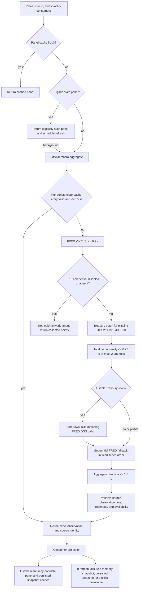

# T570 Official Macro Provider-Order Decision Dossier

> Classification: Temporary audit evidence
> Authority: Protected provider-order decision record; not a general provider policy document
> Lifecycle: Registered in [`docs/documentation-manifest.json`](../documentation-manifest.json); delete after the decision is encoded in canonical source/tests and no workflow depends on the dossier

## Decision status

**Recommendation:** retain the current cache-first hybrid policy: use FRED for
`VIXCLS`, use the direct US Treasury daily par-yield feed as the primary source
for `DGS2`/`DGS10`/`DGS30`, and use the corresponding FRED series only when the
Treasury attempt does not produce a usable observation. T568 should update the
four protected test expectations; it should not change production behavior.

This is a decision audit, not an implementation. No provider, cache, timeout,
retry, source-authority, test, topology, or baseline behavior is changed by
T570.

## Audit identity and boundary

| Field | Value |
| --- | --- |
| Audit | T570 |
| Generated at | `2026-07-19T11:43:58Z` |
| Checkout branch | `codex/t570-official-macro-order-decision-audit` |
| Accepted base / `HEAD` | `4220b383cdfd0afa70f51e674c22246262ec0195` |
| Git tree | `74b8cae5ba78cd5944f66286ccc9d44ff21a92a3` |
| Base equivalence | `HEAD == main == origin/main` at audit start |
| Initial status | clean |
| Authorized writes | this dossier and `validation/t570_official_macro_provider_order_decision.json` only |
| Protected nodes | 4 |
| Production implementation in T570 | none |

The accepted base placeholder was resolved to the exact checked-out and remote
main commit above. The repository state was clean before discovery and before
the report edits.

## Environment identity

The reproduction used the repository-owned Wolfy test environment, not ambient
package resolution.

| Component | Identity |
| --- | --- |
| Host | macOS 26.5.2 (`25F84`), Darwin 25.5.0, arm64 |
| Shell | zsh 5.9 |
| Git | 2.50.1 |
| Python | CPython 3.11.15 |
| Node / npm | 20.20.2 / 10.8.2 |
| Python lock projection | `requirements-python311-dev.lock` |
| Environment fingerprint | `f706a3347b41e5598fad2068950a4fbd6ccd14ac43d0480f22f4df76f8ffa07a` |
| Bootstrap implementation | `wolfystock_bootstrap_v7` |
| Test-environment policy | `wolfystock_test_environment_policy_v1` |
| Network during environment verification/bootstrap | false |

`./wolfy env verify` and `./wolfy bootstrap --ensure` both returned `status=ok`.

## Scope and protected nodes

The decision applies only to these existing nodes in
[`tests/test_market_overview_provider_deadlines.py`](../../tests/test_market_overview_provider_deadlines.py):

1. `test_official_macro_points_attempt_fred_dgs10_dgs30_after_treasury_timeout`
2. `test_official_macro_points_prioritize_vixcls_then_fred_dgs10_dgs30_after_treasury_miss`
3. `test_official_macro_points_protect_fred_series_from_slow_treasury_fallback`
4. `test_rates_macro_and_volatility_reuse_official_macro_observations_within_micro_cache_ttl`

The protected semantics include provider order, deadlines, retries, observation
freshness, micro-cache reuse, UAT provider isolation, source identity, and
consumer-visible missing/stale truth. They do not include a license to alter
provider adapters or source contracts in T570.

## Current runtime graph



### Ownership graph

| Responsibility | Current owner |
| --- | --- |
| Consumer projections and aggregate ordering | [`src/services/market_overview_service.py`](../../src/services/market_overview_service.py) |
| FRED/Treasury request mechanics and retry classification | [`src/services/official_macro_transport.py`](../../src/services/official_macro_transport.py) |
| Canonical source contracts | [`src/services/official_macro_source_registry.py`](../../src/services/official_macro_source_registry.py) |
| No-live/injected-transport boundary | [`src/services/uat_provider_isolation.py`](../../src/services/uat_provider_isolation.py) |
| The four disputed expectations | [`tests/test_market_overview_provider_deadlines.py`](../../tests/test_market_overview_provider_deadlines.py) |
| Residual-failure allocation | [`validation/t563_residual_failure_census.json`](../../validation/t563_residual_failure_census.json) |
| This decision record | [`validation/t570_official_macro_provider_order_decision.json`](../../validation/t570_official_macro_provider_order_decision.json) |

## Current policy, precisely

### Attempt order

On a cold aggregate miss, the current order is:

1. Reuse valid per-series micro-cache observations.
2. Attempt FRED `VIXCLS` first because no Treasury equivalent exists.
3. If FRED reports an absent/disabled credential, stop remaining cold network
   fanout. This is the current fail-closed activation behavior.
4. Attempt the Treasury batch for missing `DGS2`, `DGS10`, and `DGS30`.
5. Store usable Treasury rows and skip their matching FRED series.
6. Attempt still-missing FRED series sequentially in the fixed order
   `VIXCLS`, `DGS10`, `DGS30`, `DGS2`, `SOFR`, `T10Y2Y`, `T10Y3M`, followed by
   configured optional series.

An ordinary transient/empty `VIXCLS` outcome does not prevent the Treasury
attempt. An isolation violation is not converted into a provider miss.

### Deadlines and retries

| Control | Current value and consequence |
| --- | --- |
| Outer cold-start wait | 2.0 s |
| Official-macro aggregate budget | 1.8 s |
| Per-FRED-call cap | 0.9 s |
| Treasury fallback cap | 0.25 s |
| Critical FRED floor | 0.2 s when remaining aggregate budget permits |
| Treasury attempts | at most 2, sharing the supplied total timeout |
| Treasury retryable outcomes | timeout, transport error, empty response |
| FRED retries at this consumer boundary | none |
| Concurrency | none; attempts are sequential |

The transport functions expose a 4.0-second standalone default, but the market
overview owner always supplies the smaller effective caps above. Separate live
smoke defaults (FRED 1.0 s and Treasury 1.5 s) are not part of this consumer
request graph and were not run in this no-live decision audit.

These are code-enforced budgets, not measured provider latency. No p50/p95
production telemetry was available or produced by this no-live audit.

### Cache behavior

The per-series official-macro micro-cache TTL is 15 seconds. Only non-empty,
valid, non-stale observations are stored and reused. Rates, macro, and
volatility share the aggregate owner, so later projections within the TTL reuse
the exact observation and source identity rather than refetching it.

The outer panel cache uses 600 seconds for rates and the 300-second default for
macro and volatility. It may serve an eligible previous panel explicitly marked
stale while background refresh runs. A stale panel is a display fallback; it is
not promoted to fresh source authority. The persistence fallback order is
in-memory snapshot, persisted snapshot, then explicit unavailable/fallback.

### Source authority and consumer-visible truth

The registry identifies Treasury as the direct US Treasury daily par-yield
source and FRED DGS as a relay of official Treasury daily-yield series. Both are
business-daily, delayed-eligible, non-live, observation-only sources. The direct
publisher is therefore the stronger default origin for the overlapping DGS
observations, while FRED remains a useful independent delivery path.

The selected observation keeps its exact `source_id`, observation timestamp,
freshness, and availability. Stale calendar rows are unusable for the aggregate.
Missing/unavailable observations remain null; they are not converted to zero,
fresh, live, or score-contributing data. Delayed data remains delayed.
Eligibility still depends on a usable value, acceptable observation age,
deadline completion, and allowed transport; nominal authority alone does not
make a row usable. Proxies remain proxies, synthetic values remain synthetic,
fixtures remain non-production evidence, and an unchecked state never becomes
ready.

### Isolation and no-live behavior

The UAT no-live boundary allows explicitly injected test transport and records
it as fixture/mock evidence. Default live transport remains blocked unless the
environment explicitly allows that source. Merely configuring provider
credentials does not bypass no-live enforcement. Diagnostic detail is
sanitized; an injected transport is not presented as live-provider evidence.

## Reproduction and disagreement

All commands below ran against the exact base and environment identities above.

```bash
./wolfy exec --profile test -- python -m pytest -vv \
  tests/test_market_overview_provider_deadlines.py::test_official_macro_points_attempt_fred_dgs10_dgs30_after_treasury_timeout \
  tests/test_market_overview_provider_deadlines.py::test_official_macro_points_prioritize_vixcls_then_fred_dgs10_dgs30_after_treasury_miss \
  tests/test_market_overview_provider_deadlines.py::test_official_macro_points_protect_fred_series_from_slow_treasury_fallback \
  tests/test_market_overview_provider_deadlines.py::test_rates_macro_and_volatility_reuse_official_macro_observations_within_micro_cache_ttl
```

| Validation | Result |
| --- | --- |
| Four exact protected nodes, `-vv` | 4 collected, 4 failed, exit 1, 1.85 s |
| Entire provider-deadline file | 12 collected, 8 passed, 4 failed, exit 1, 2.15 s |
| Transport + registry + cache-prewarm focus | 90 passed, exit 0, 2.34 s |
| Boundaries + freshness + cache fallback + isolation + API focus | 61 passed, 3 warnings, exit 0, 5.96 s |
| Domain topology `verify-all` | exit 0; backend 8,142 (`383fd5b6...7745`), Vitest 176 (`9330504c...6108`), Playwright 64 specs / 718 project cases |

The three warnings were existing framework/dependency deprecations and did not
change assertion outcomes.

### Node-by-node disagreement

| Node | Current observed attempt sequence | Stale expectation / disagreement | Decision consequence |
| --- | --- | --- | --- |
| `...attempt_fred_dgs10_dgs30_after_treasury_timeout` | `VIXCLS -> treasury -> DGS10 -> DGS30` | expects FRED DGS before Treasury | Update expectation to assert Treasury attempt precedes FRED DGS fallback after timeout. |
| `...prioritize_vixcls_then_fred_dgs10_dgs30_after_treasury_miss` | `VIXCLS -> treasury -> DGS10 -> DGS30` | expects `VIXCLS -> DGS10 -> DGS30 -> DGS2` before Treasury | Preserve VIX-first but assert Treasury-primary DGS and FRED fallback. |
| `...protect_fred_series_from_slow_treasury_fallback` | `VIXCLS -> treasury -> DGS10 -> DGS30 -> DGS2 -> SOFR -> T10Y2Y -> T10Y3M -> DTWEXBGS` | expects all FRED attempts before Treasury | Assert the bounded Treasury slot and remaining aggregate budget protect the FRED fallback series. |
| `...reuse_official_macro_observations_within_micro_cache_ttl` | `VIXCLS -> treasury -> SOFR -> T10Y2Y -> T10Y3M -> DFF -> CPIAUCSL -> PPIACO -> BAMLH0A0HYM2 -> WALCL -> RRPONTSYD -> WTREGEN -> WRESBAL -> DTWEXBGS` | expects FRED DGS calls before Treasury | Treasury supplied all DGS observations; their absent FRED calls are intended. The sequence contains no duplicate fetches across the three consumers and still proves micro-cache reuse. |

### Historical cause

Commit `97ece532c65ef307c02aaeaa8542d0e43b48d3a3` moved the implementation and
these expectations toward FRED-first behavior. Commit
`14dbb5110e51d34460634c305a950d0f5db15647` later restored Treasury before the
remaining FRED loop as part of provider-regression repair, but the four
expectations were not reconciled. Later T539/T552/T562 changes tightened
transport isolation, cache/source truth, and provider integration without
reversing that restored order. T563 correctly allocated the remaining four
failures to T568 as a provider-order decision.

This history explains the exact four-node island: the tests encode an earlier
policy; the surrounding current contracts consistently encode the restored
hybrid policy.

## Options A-E

Definitions:

- **A - Treasury-first:** after caches, attempt Treasury for overlapping DGS
  observations before any FRED DGS attempt; retain FRED fallback.
- **B - FRED-first:** after caches, attempt FRED `VIXCLS`, `DGS10`, `DGS30`,
  and `DGS2` when requested before Treasury fallback.
- **C - race/concurrent:** launch Treasury and FRED DGS concurrently and accept
  a policy-defined winner.
- **D - cache-first bounded order:** strengthen cache/prewarm as the main
  latency policy, then use a bounded provider order selected separately.
- **E - hybrid current policy:** cache-first, FRED `VIXCLS`, Treasury-primary
  DGS batch, then sequential FRED fallback for missing DGS and other series.

Ratings use `strong`, `mixed`, or `weak` relative to this repository's current
contracts. Latency statements compare request shapes and enforced budgets; they
do not claim measured provider performance.

| Criterion | A Treasury-first | B FRED-first | C Race/concurrent | D Cache-first bounded order | E Hybrid current |
| --- | --- | --- | --- | --- | --- |
| Source authority | strong: direct publisher for DGS | mixed: official relay leads | mixed: winner may vary | mixed: cached origin varies | strong: direct DGS, exact fallback identity |
| Freshness | strong: same business-daily class | strong: same class | mixed: winner may vary by timing | strong on hit, unresolved on miss | strong: same class, validation retained |
| Expected latency | strong for three-rate batch | mixed: multiple sequential calls | strong potential, unmeasured | strongest on hit only | strong: cache/VIX then one rate batch |
| Worst-case latency | mixed: bounded Treasury plus fallback | mixed: FRED sequence plus fallback | mixed: bounded race but more work | weak on cold miss | strong: aggregate 1.8 s bound retained |
| Timeout amplification | strong: one bounded rate slot | mixed: several rate slots | mixed: concurrent deadlines | unresolved on miss | strong: 0.25 s Treasury cap |
| Retry amplification | strong: max two Treasury attempts | strong: no FRED consumer retry | weak: both paths active | unresolved on miss | strong: retries isolated to Treasury slot |
| Cache efficiency | strong | strong | mixed: duplicate winner work | strong on hits | strong: shared micro-cache and panel cache |
| Cache-hit latency | strong | strong | strong | strong | strong |
| Partial failure behavior | strong: explicit FRED fallback | strong: explicit Treasury fallback | weak: race arbitration complexity | weak on cold miss | strong: usable partial rows skip duplicates |
| Provider isolation | strong with existing guard | strong with existing guard | weak: two simultaneous egress paths | strong on hit | strong: existing sequential guard |
| No-live behavior | strong | strong | mixed: broader blocked fanout | strong on hit, unresolved on miss | strong: injected identity preserved |
| Deterministic output | strong | strong | weak: timing-dependent without extra rules | mixed: cache state dominates | strong: fixed sequence and exact identity |
| Observability | strong: simple attempts | strong: simple attempts | weak: winner/loser telemetry required | mixed: cache telemetry needed | strong: existing attempt details |
| Operational complexity | strong: low | strong: low | weak: cancellation/arbitration | mixed: prewarm/invalidation work | strong: already implemented |
| Rate-limit exposure | strong: one Treasury batch | weak: three extra FRED calls | weak: both providers contacted | strong on hit only | strong: successful batch skips FRED DGS |
| External dependency exposure | strong: direct plus fallback | mixed: FRED credential leads | weak: simultaneous dependencies | strong on hit only | strong: bounded, sequential exposure |
| Consumer-visible truth | strong | strong | mixed: timing can change source | mixed: stale/cache policy dominates | strong: source/freshness remain explicit |
| Migration risk | mixed: order implementation needed | weak: reverses current authority | weak: substantial new behavior | mixed: cache policy change | strong: no production migration |
| Regression risk | mixed | weak: contradicts restored behavior | weak: concurrency/cancellation surface | mixed: freshness/invalidation surface | strong: only stale tests change |
| Rollback complexity | strong: one policy revert | strong: one policy revert | weak: several coupled mechanisms | mixed: cache/prewarm rollback | strong: revert test-only T568 commit |

### Option conclusions

- A is defensible in isolation but incomplete for `VIXCLS` and shared cache
  behavior; E is its repository-specific complete form.
- B matches the stale assertions but weakens direct-source precedence and adds
  avoidable sequential FRED DGS calls.
- C has no supporting latency telemetry and introduces timing-dependent source
  selection, cancellation, doubled egress, and new observability requirements.
- D is already an important layer of the current policy, but cache-first does
  not decide cold-miss provider order and cannot stand alone as the answer.
- E fits current source authority, bounded request shape, isolation, cache reuse,
  deterministic output, and the intentional restoration history.

## Recommended policy

Approve **Option E - hybrid current policy** under this complete normative
contract:

| Decision field | Approved-policy meaning |
| --- | --- |
| Provider attempt order | Fresh panel cache returns immediately; an eligible stale panel returns explicitly stale while refresh runs in the background; a cold refresh then checks the valid per-series micro-cache, FRED `VIXCLS`, the Treasury batch for missing DGS2/DGS10/DGS30, and remaining FRED series in fixed order while skipping DGS rows supplied by Treasury. An absent/disabled FRED credential keeps the current early stop before the Treasury batch. |
| Scheduling | Provider requests remain sequential, never raced. |
| Deadlines | Outer cold start 2.0 s; aggregate 1.8 s; each FRED request at most 0.9 s; Treasury slot normally at most 0.25 s; critical FRED floor 0.2 s only when aggregate budget permits. |
| Retry | Treasury gets at most two attempts within its one supplied timeout for timeout, transport error, or empty response. This consumer adds no FRED retry. |
| Cache lookup | Each consumer checks its fresh panel cache before aggregate work; the aggregate checks every requested series in the 15-second micro-cache before provider calls. |
| Cache write | Store each usable non-stale provider observation in the per-series micro-cache under its exact series/source truth; after a usable consumer projection, update the in-memory snapshot, persisted snapshot, and panel cache through the existing owner path. Failed/empty rows are not cached as observations. |
| TTL and reuse | Official-macro micro-cache 15 s; rates panel 600 s; macro and volatility panels 300 s. Rates, macro, and volatility reuse the same valid observations inside 15 s. |
| Stale-cache eligibility | Only an eligible prior panel/snapshot may be served, explicitly marked stale, while refresh proceeds or fails. Stale data is never fresh source authority and stale provider rows do not enter the official aggregate. |
| Source authority | Prefer the direct Treasury publisher for overlapping DGS rows; use FRED as the relay fallback. Preserve the selected row's exact source, observation time, freshness, and availability. `VIXCLS` and other FRED-only series retain FRED authority. |
| Fallback eligibility | FRED DGS is eligible only when the matching Treasury observation is missing, invalid, stale, timed out, or otherwise unusable. Existing panel/snapshot fallback remains separate from provider fallback. |
| Partial results | Keep every valid observation. Missing series remain unavailable/null; partial data does not become a complete or ready result. A successful Treasury subset suppresses only its matching FRED DGS calls. |
| Unavailable projection | Project null/unavailable, never zero or neutral. |
| Stale projection | Project explicit stale state only from an eligible prior panel/snapshot; never relabel it fresh. |
| Delayed projection | Preserve delayed status; never relabel it live. |
| Failure-reason projection | Preserve the allowlisted sanitized reasons: not configured, cache miss, transport/HTTP error, timeout, missing credential, disabled configuration, empty response, stale official row, parse error, missing series, refresh not attempted, or budget exhausted. When both official paths are attempted, retain provider-attempt detail instead of collapsing the failure into success. |
| No-live/UAT | Configured credentials do not authorize egress. Default live transport stays blocked unless allowlisted; explicitly injected transport remains fixture/mock evidence, not live evidence. |
| One source slow | Its per-provider cap and the 1.8-second aggregate deadline bound consumer-visible waiting; a slow Treasury slot must leave protected budget for eligible FRED work. |
| One source fails | Use FRED fallback only for overlapping DGS; retain valid partial observations; FRED-only failures remain unavailable unless an eligible stale panel exists. |
| All sources fail | Do not synthesize observations. Return explicit unavailable/partial truth, or an eligible prior panel explicitly stale through the existing outer fallback path. |
| Protected-node treatment | Update all four stale expectations: assert Treasury-before-FRED DGS on miss/timeout, assert the bounded Treasury slot protects later FRED work, and assert successful Treasury DGS plus micro-cache reuse suppress duplicate calls. |
| Authoritative owner | `MarketOverviewService` remains the single ordering/cache policy owner; transport mechanics and source registry remain subordinate canonical owners for their existing concerns. |

The current absent/disabled FRED-credential early stop is retained by this
decision because changing activation semantics is a separate protected-policy
question. T568 should not broaden into that question.

## T568 ownership and validation contract

### Expected change ownership

| Category | T568 expectation |
| --- | --- |
| Production files | none |
| Test files | `tests/test_market_overview_provider_deadlines.py` only |
| Topology | no node additions, removals, owner changes, or hash delta |
| Known baseline declarations | no changes |
| Provider/source registry | no changes |
| Root config, dependencies, CI, environment | no changes |

The production owners remain authoritative references, not expected T568 write
targets. If implementation shows that production code must change to satisfy
the approved Option E assertions, T568 must stop and return for a new decision;
it must not silently expand scope.

### Required T568 assertions

T568 should prove, with injected transports and deterministic clocks:

- VIX-first, then Treasury-primary DGS order on a cold miss.
- FRED DGS fallback after Treasury timeout/miss, without exceeding the aggregate
  budget contract.
- A slow Treasury slot does not consume the remaining protected FRED work.
- Successful Treasury DGS observations suppress duplicate FRED DGS requests.
- Rates, macro, and volatility reuse observations inside the micro-cache TTL.
- Exact provider/source/freshness truth remains intact; no skipped or missing
  result is treated as passed or zero.

### Required T568 validation

At minimum, rerun:

```bash
./wolfy exec --profile test -- python -m pytest -vv tests/test_market_overview_provider_deadlines.py
./wolfy exec --profile test -- python -m pytest -q tests/test_official_macro_transport.py tests/test_official_macro_source_registry.py tests/test_official_macro_cache_prewarm.py
./wolfy exec --profile test -- python -m pytest -q tests/test_market_overview_provider_boundaries.py tests/test_market_overview_provider_freshness.py tests/test_market_cache_fallback_contracts.py tests/test_uat_provider_isolation_boundary.py tests/test_market_overview_api.py
./wolfy exec --profile test -- python scripts/domain_test_topology.py verify-all
```

No live provider execution is required or authorized for T568. The injected
transport evidence must remain labelled as fixture/mock evidence.

## Risks, uncertainty, and rollback

| Item | Assessment / mitigation |
| --- | --- |
| Provider latency comparison | Unknown: no live p50/p95 telemetry. Recommendation relies on authority, request count, enforced deadlines, current green contracts, and history. |
| Upstream availability correlation | Unknown. Sequential fallback preserves an alternate delivery path without speculative concurrency. |
| FRED credential early stop | Existing behavior, deliberately out of T568 scope; track separately if product policy wants Treasury without FRED activation. |
| Test-only reconciliation could mask runtime drift | Mitigate with order, timeout, fallback, source, and cross-consumer reuse assertions rather than merely changing literal arrays. |
| Topology drift | Expected zero because node IDs and ownership remain unchanged; verify `verify-all`. |
| Release risk | Low and test-only after approval, provided T568 changes exactly the four expectations and all focused gates pass; no live-provider qualification claim is made. |
| Rollback risk | Low: no schema, data, cache migration, or production behavior changes are expected. Reverting T568 reopens the four known failures but does not alter runtime. |
| Rollback | Revert the single T568 test-policy commit if the approval is withdrawn. Revert the T570 dossier commit separately if this audit record itself must be removed. |

## Decision arithmetic

The machine-readable dossier records 5 alternatives x 20 required criteria =
100 option-evaluation cells. It also records all 4 protected nodes, their 4
reproduced failures, 151 focused passing tests outside the disagreement, the
8/4 whole-file split, and a zero expected topology delta.

## Approval

Decision awaiting user approval:

- Recommended policy: Option E - retain cache-first VIX-first, Treasury-primary DGS, and FRED DGS fallback; update the four stale test expectations only.
- Production behavior change required: no
- Test expectation change required: yes
- Proposed implementation task: T568
- Proposed commit subject:
  fix(market): decide official macro fetch order
- Approval options:
  1. Approve recommended policy.
  2. Reject and retain current behavior.
  3. Request a specified alternative.
