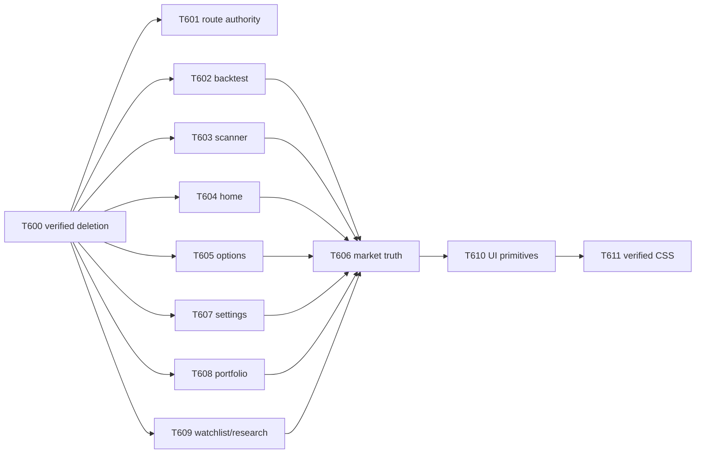

# T576 Frontend Production Simplification Audit

> Classification: Temporary audit evidence
> Authority: Roadmap evidence for T600-T611; not the frontend design authority
> Lifecycle: Registered in [`docs/documentation-manifest.json`](../documentation-manifest.json); delete after all lanes resolve and durable decisions move to canonical owners

## Status and decision

**Result: audit complete; implementation not authorized or performed.** The accepted base is
`4220b383cdfd0afa70f51e674c22246262ec0195` (`fix(test): isolate canonical runtime state`) on
`codex/t576-frontend-production-simplification-audit`.

The production frontend contains **325 files and 164,283 logical lines of code (LLOC)**. All 325
files are reachable from the production entry graph. The audit therefore does not support a broad
"delete orphan files" program. It supports a deliberately small deletion wave followed by owner-
bounded consolidation:

- **205 LLOC are removable with high confidence**: 201 LLOC in 23 unreferenced symbols plus two
  dead barrel re-export lines, and 4 LLOC in the intentionally ignored `Button.glow` path.
- A **moderate additional 3,770-6,160 LLOC** is a planning estimate across nonoverlapping route,
  page-controller, market-truth, type, and design-system lanes. This range is not deletion proof.
- The safest first implementation is **T600**, a deletion-only task. Route aliases, persisted
  compatibility, and global CSS are explicitly excluded from that wave.
- After serial T600 and T601, the maximum safe feature concurrency is four owner-disjoint lanes:
  T602 backtest, T603 scanner, T604 home, and T607 settings. Market truth, shared primitives, CSS,
  and heavy validation stay serial.

The machine-readable source for every count, candidate field, and roadmap field is
`validation/t576_frontend_production_simplification_audit.json`.

## Protected invariants

No proposed simplification may weaken guest/member/admin separation, auth/RBAC, owner isolation,
fail-closed behavior, no-advice behavior, fixture/production identity, public/admin separation,
accessibility, responsive behavior, route integrity, privacy, secrets, or build provenance. In
particular, every implementation lane must preserve these non-equivalences:

```text
unavailable != zero       missing != neutral       stale != fresh
delayed != live           proxy != official        synthetic != real
fixture != production     not checked != ready
```

The audit found no static proof that the current UI collapses any of those distinctions. It did
find parallel projection logic that can drift. That is an authority risk, not evidence of an
existing user-visible falsehood. Future work must migrate a caller and remove its old authority in
the same task; it must not add fallbacks, compatibility shims, parallel authorities, silent
defaults, or wrapper paths.

## Scope and method

The production set is tracked `.ts`, `.tsx`, and `.css` under `apps/dsa-web/src`, excluding
`__tests__`, `test-utils`, `*.test.*`, `*.spec.*`, and `setupTests.ts`. T569 owns frontend test
reduction and workflow optimization. T575 owns backend production code and contract changes.

LLOC is the number of nonblank lines after TypeScript comment-token spans or CSS block comments
are removed; string and regular-expression contents are preserved. A component is a PascalCase
declaration with a JSX return path. A hook is a declared custom `use*` function; the Zustand store
hook is counted as a store. A page is a production `pages/*Page.tsx` file. A large file is at least
500 LLOC.

Reachability resolves static imports, re-exports, side-effect imports, and dynamic imports from
`main.tsx` and `index.css`. Export use was classified by TypeScript symbol identity across
production and tests; route-default dynamic exports were excluded from the dead set. This avoids
the false name-only conclusion that both `DuplicateTaskError` declarations were unused: the
runtime class in `api/analysis.ts` is used, while the separate interface in `types/analysis.ts` is
not.

Inventory fingerprints:

- path-set SHA-256: `5901947db7343de5b7f910565d774e517fe933d04ed9512e1f1260f617bc3a24`
- content inventory SHA-256: `1f5ff5c2114612dccf0de6d6c01e4d4db0bb25c760bcf16741b24c27a5ae3a19`

## Exact production inventory

| Metric | Exact value |
|---|---:|
| Files | 325: 143 TS, 181 TSX, 1 CSS |
| LLOC / physical LOC | 164,283 / 176,538 |
| Route elements | 118 |
| Address/index route records | 117 |
| Pathless layout routes | 1 |
| Distinct full paths | 116 |
| Locale-normalized route identities | 58 |
| `Navigate` records / stock legacy redirects | 44 / 4 |
| Pages / layout component symbols | 34 / 11 |
| Component symbols / custom hooks | 552 / 19 |
| API-client modules | 32: 31 endpoint modules plus `api/index.ts` |
| Total modules under `api` | 38 |
| Stores / contexts | 1 / 6 |
| Dedicated type files / utility files | 14 / 36 |
| Styling files | 1 |
| Dynamic imports | 58 |
| Files at least 500 LLOC | 78 |
| Export entries / unique export targets | 2,072 / 2,012 |
| Reachable / unreachable production files | 325 / 0 |

The 117 address records include both a parent `/locale` route and its index route, which explains
the difference from 116 distinct full paths. The six contexts are Auth, UiPreferences,
UiLanguage, UiLanguageRouteSync, ShellRail, and ThemeStyle. The single store is `stockPoolStore`.

### Inventory by source owner

| Owner | Files | LLOC | Pages | Components | Hooks | API | Contexts | Stores | Types | Utils | CSS | Dynamic | Large | Exports |
|---|---:|---:|---:|---:|---:|---:|---:|---:|---:|---:|---:|---:|---:|---:|
| root | 3 | 9,573 | 0 | 11 | 0 | 0 | 0 | 0 | 0 | 0 | 1 | 31 | 2 | 3 |
| api | 38 | 18,663 | 0 | 0 | 0 | 32 | 0 | 0 | 0 | 0 | 0 | 0 | 9 | 610 |
| components | 178 | 50,303 | 0 | 289 | 7 | 0 | 2 | 0 | 2 | 0 | 0 | 6 | 31 | 634 |
| contexts | 3 | 593 | 0 | 3 | 3 | 0 | 4 | 0 | 0 | 0 | 0 | 0 | 0 | 10 |
| hooks | 9 | 1,056 | 0 | 0 | 8 | 0 | 0 | 0 | 0 | 0 | 0 | 0 | 0 | 30 |
| i18n | 5 | 6,092 | 0 | 0 | 0 | 0 | 0 | 0 | 1 | 0 | 0 | 4 | 2 | 17 |
| pages | 41 | 66,545 | 34 | 249 | 1 | 0 | 0 | 0 | 0 | 0 | 0 | 17 | 25 | 70 |
| stores | 1 | 708 | 0 | 0 | 0 | 0 | 0 | 1 | 0 | 0 | 0 | 0 | 1 | 3 |
| types | 11 | 4,518 | 0 | 0 | 0 | 0 | 0 | 0 | 11 | 0 | 0 | 0 | 4 | 463 |
| utils | 36 | 6,232 | 0 | 0 | 0 | 0 | 0 | 0 | 0 | 36 | 0 | 0 | 4 | 232 |
| **Total** | **325** | **164,283** | **34** | **552** | **19** | **32** | **6** | **1** | **14** | **36** | **1** | **58** | **78** | **2,072** |

### Inventory by feature owner

The classifier is deterministic: explicit page/API/component/type name families win; remaining
root, common/layout/terminal/linear, contexts, hooks, i18n, and utilities belong to
`shared-shell-platform`.

| Feature owner | Files | LLOC | Pages | Components | Hooks | API | Contexts | Stores | Types | Utils | CSS | Dynamic | Large | Exports |
|---|---:|---:|---:|---:|---:|---:|---:|---:|---:|---:|---:|---:|---:|---:|
| admin-ops | 24 | 18,211 | 9 | 89 | 0 | 8 | 0 | 0 | 0 | 1 | 0 | 0 | 11 | 171 |
| auth-access | 11 | 1,772 | 2 | 6 | 1 | 1 | 1 | 0 | 0 | 1 | 0 | 0 | 0 | 27 |
| backtest | 36 | 21,117 | 3 | 68 | 2 | 1 | 0 | 0 | 1 | 0 | 0 | 9 | 14 | 266 |
| home-analysis | 22 | 13,321 | 3 | 35 | 1 | 5 | 0 | 1 | 2 | 2 | 0 | 2 | 6 | 180 |
| market-research | 38 | 29,708 | 6 | 112 | 1 | 7 | 0 | 0 | 1 | 3 | 0 | 2 | 13 | 398 |
| portfolio | 7 | 8,814 | 1 | 14 | 0 | 1 | 0 | 0 | 1 | 1 | 0 | 0 | 4 | 133 |
| scanner | 19 | 9,646 | 2 | 26 | 0 | 1 | 0 | 0 | 1 | 0 | 0 | 3 | 4 | 90 |
| settings-config | 34 | 14,524 | 3 | 46 | 2 | 2 | 0 | 0 | 1 | 3 | 0 | 7 | 9 | 155 |
| shared-shell-platform | 117 | 33,095 | 1 | 121 | 12 | 1 | 5 | 0 | 4 | 24 | 1 | 35 | 13 | 510 |
| stock-research | 5 | 6,080 | 2 | 23 | 0 | 2 | 0 | 0 | 1 | 0 | 0 | 0 | 2 | 67 |
| watchlist-research-queue | 12 | 7,995 | 2 | 12 | 0 | 3 | 0 | 0 | 2 | 1 | 0 | 0 | 2 | 75 |
| **Total** | **325** | **164,283** | **34** | **552** | **19** | **32** | **6** | **1** | **14** | **36** | **1** | **58** | **78** | **2,072** |

### Large-file inventory

| Rank | Production file | LLOC | Rank | Production file | LLOC |
|---:|---|---:|---:|---|---:|
| 1 | `index.css` | 8,814 | 40 | `components/backtest/ruleBacktestP6.ts` | 919 |
| 2 | `pages/HomeBentoDashboardPage.tsx` | 8,124 | 41 | `pages/PersonalSettingsPage.tsx` | 919 |
| 3 | `pages/PortfolioPage.tsx` | 5,296 | 42 | `api/optionsLab.ts` | 893 |
| 4 | `pages/UserScannerPage.tsx` | 5,054 | 43 | `pages/AdminNotificationsPage.tsx` | 873 |
| 5 | `pages/StockStructureDecisionPage.tsx` | 4,446 | 44 | `components/backtest/ParameterSweepPanel.tsx` | 818 |
| 6 | `pages/MarketProviderOperationsPage.tsx` | 4,386 | 45 | `api/error.ts` | 817 |
| 7 | `api/market.ts` | 3,930 | 46 | `components/settings/dataSourceLibraryShared.ts` | 814 |
| 8 | `pages/WatchlistPage.tsx` | 3,820 | 47 | `types/analysis.ts` | 803 |
| 9 | `components/market-overview/MarketOverviewWorkbench.tsx` | 3,558 | 48 | `components/backtest/BacktestAuditTables.tsx` | 796 |
| 10 | `pages/OptionsLabPage.tsx` | 3,529 | 49 | `components/charts/CoreMarketChart.tsx` | 759 |
| 11 | `pages/SettingsPage.tsx` | 3,415 | 50 | `api/adminLogs.ts` | 758 |
| 12 | `pages/AdminLogsPage.tsx` | 3,176 | 51 | `components/scanner/ScannerCandidatePresenters.tsx` | 754 |
| 13 | `i18n/catalogs/en.ts` | 2,986 | 52 | `App.tsx` | 738 |
| 14 | `i18n/catalogs/zh.ts` | 2,985 | 53 | `stores/stockPoolStore.ts` | 708 |
| 15 | `pages/MarketRotationRadarPage.tsx` | 2,556 | 54 | `components/scanner/ScannerDisplayPanels.tsx` | 704 |
| 16 | `pages/LiquidityMonitorPage.tsx` | 2,429 | 55 | `components/settings/FactorResearchReportPanel.tsx` | 692 |
| 17 | `components/market-overview/MarketOverviewWorkbenchTopSurface.tsx` | 1,860 | 56 | `components/settings/useDataSourceLibraryController.ts` | 686 |
| 18 | `pages/MarketOverviewPage.tsx` | 1,814 | 57 | `components/backtest/shared.tsx` | 677 |
| 19 | `components/backtest/BacktestResultReport.tsx` | 1,809 | 58 | `components/backtest/BacktestSupportExportsDisclosure.tsx` | 673 |
| 20 | `pages/BacktestPage.tsx` | 1,781 | 59 | `components/home-bento/homeCandlestickChartUtils.ts` | 636 |
| 21 | `pages/DeterministicBacktestResultPage.tsx` | 1,658 | 60 | `components/home-bento/FullDecisionReportDrawer.tsx` | 629 |
| 22 | `pages/RuleBacktestComparePage.tsx` | 1,604 | 61 | `pages/AdminLaunchCockpitPage.tsx` | 626 |
| 23 | `pages/MarketDecisionCockpitPage.tsx` | 1,515 | 62 | `components/backtest/HistoricalEvaluationPanel.tsx` | 620 |
| 24 | `api/portfolio.ts` | 1,498 | 63 | `pages/AdminMissionControlPage.tsx` | 608 |
| 25 | `pages/ResearchRadarPage.tsx` | 1,458 | 64 | `components/backtest/strategyCatalog.ts` | 597 |
| 26 | `components/backtest/ProBacktestWorkspace.tsx` | 1,440 | 65 | `api/marketProviderOperations.ts` | 583 |
| 27 | `components/backtest/DeterministicBacktestFlow.tsx` | 1,430 | 66 | `types/scanner.ts` | 581 |
| 28 | `pages/AdminUsersPage.tsx` | 1,403 | 67 | `utils/homeReportIdentity.ts` | 570 |
| 29 | `types/backtest.ts` | 1,397 | 68 | `components/common/Drawer.tsx` | 567 |
| 30 | `components/settings/LLMChannelEditor.tsx` | 1,302 | 69 | `components/linear/LinearPrimitives.tsx` | 564 |
| 31 | `pages/ScenarioLabPage.tsx` | 1,255 | 70 | `utils/evidenceDisplay.ts` | 561 |
| 32 | `pages/AdminProviderCircuitDiagnosticsPage.tsx` | 1,166 | 71 | `components/settings/DataSourceLibraryDrawer.tsx` | 558 |
| 33 | `api/stocks.ts` | 1,142 | 72 | `components/settings/settingsDerivedState.ts` | 531 |
| 34 | `api/marketRotation.ts` | 1,122 | 73 | `components/portfolio/PortfolioScenarioRiskPanel.tsx` | 526 |
| 35 | `components/layout/SidebarNav.tsx` | 1,121 | 74 | `utils/consumerDataQualityViewModel.ts` | 526 |
| 36 | `pages/AdminCostObservabilityPage.tsx` | 1,063 | 75 | `components/market-overview/marketOverviewPrimitives.tsx` | 522 |
| 37 | `components/layout/Shell.tsx` | 1,013 | 76 | `components/settings/SystemControlPlane.tsx` | 514 |
| 38 | `types/portfolio.ts` | 970 | 77 | `components/evidence/AdminEvidenceDiagnosticsConsole.tsx` | 511 |
| 39 | `api/researchReadiness.ts` | 919 | 78 | `utils/marketIntelligenceGuidance.ts` | 501 |

## Routes, reachability, and loading

All route targets, components, hooks, API modules, type modules, utilities, and the CSS file have a
surviving production entry path. There are no unregistered routes, whole-file orphans, uncalled
hook declarations, obsolete API client modules, or unconsumed style modules.

The 58 normalized identities are:

```text
/, /*, /admin, /admin/ai, /admin/cost-observability, /admin/costs,
/admin/evidence, /admin/evidence-workflow, /admin/launch-cockpit, /admin/logs,
/admin/market-providers, /admin/mission-control, /admin/notifications,
/admin/provider, /admin/provider-circuits, /admin/provider-operations,
/admin/providers, /admin/system, /admin/system-logs, /admin/users,
/admin/users/:userId, /admin/users/:userId/activity, /backtest,
/backtest/compare, /backtest/results/:runId, /chat, /cockpit,
/decision-cockpit, /guest, /guest/scanner, /holdings, /liquidity, /login,
/market, /market-overview, /market/decision-cockpit,
/market/liquidity-monitor, /market/rotation-radar, /options, /options-lab,
/portfolio, /radar, /register, /research, /research-radar, /research/radar,
/reset-password, /rotation, /scanner, /scenario-lab, /settings,
/settings/system, /stock/:stockCode, /stock/:stockCode/structure-decision,
/stocks/:stockCode/structure-decision, /stocks/structure-decision,
/user/scanner, /watchlist
```

Twenty-four normalized identities are aliases: `/guest/scanner`, `/user/scanner`, `/market`, the
nine admin aliases, `/cockpit`, `/decision-cockpit`, `/radar`, `/research`, `/research-radar`,
`/holdings`, `/liquidity`, `/rotation`, `/options`, `/chat`, and the two `/stock/:stockCode`
forms. They have no in-repo callers, but recent Git history and missing external telemetry make
their status **insufficient evidence**, not dead. `/register` has an active internal call to action.

`App.tsx` duplicates locale and non-locale declarations. A single route registry can remove that
declaration duplication while preserving every path, guard, redirect, title, and lazy boundary.
Route/access authority remains `App.tsx`, `utils/adminCapabilities.ts`, and
`hooks/useProductSurface.ts`; an admin cue rendered inside a page is not an access guard.

Document-title ownership is a single chain:
`App.tsx:DocumentTitleOwner -> utils/DocumentTitleLifecycle.tsx ->
utils/documentTitle.ts:getDocumentTitle`. Navigation taxonomy is
`components/layout/coreProductRoutes.ts -> SidebarNav.tsx/Shell.tsx`. No production
`Breadcrumb` symbol or breadcrumb-specific owner exists; route context is currently conveyed by
navigation resolution, document title, and page headings.

There are 31 route lazy imports and 58 dynamic imports in total. Scanner and System Settings each
add a deliberate nested boundary: the 266.96 kB raw member scanner chunk remains behind product-
surface resolution, and the 236.30 kB Settings chunk remains behind the admin entry surface. Git
history (`e86f3eb5`, `8e12bb23`) confirms these were intentional. They should be retained.

## Dead code and historical residue

The exact symbol-identity result is 23 fully unreferenced symbols: 199 declaration LLOC plus two
dead barrel lines. Dynamic route defaults were excluded.

| File | Unreferenced symbols | LLOC |
|---|---|---:|
| `api/error.ts` | `isApiRequestError` | 7 |
| `api/researchReadiness.ts` | `extractMarketResearchReadiness`, `inferMarketResearchReadiness`, `inferOptionsResearchReadiness`, `convertOptionsReadiness` | 99 |
| `components/layout/coreProductRoutes.ts` | `DIRECT_PRIMARY_CONSUMER_ROUTES`, `PRIMARY_CONSUMER_ROUTES`, `SECONDARY_CONSUMER_ROUTES`, `resolveConsumerNavGroupForPath`, `resolveCurrentConsumerRouteKey` | 14 |
| `components/market-rotation/rotationEvidenceSemantics.ts` | `isFiniteMetric`, `deriveVisualStrengthDomainFromValues` | 14 |
| `components/research/anatomy/researchDensity.ts` | `RESEARCH_DENSITY_PAGE_DEFAULTS` | 12 |
| `components/research/anatomy/researchNesting.ts` | `isResearchFrameRole` | 3 |
| `types/analysis.ts` | `AnalyzeResponse`, `TaskStatus`, interface `DuplicateTaskError`, `HistoryPagination`, `ApiError`, `getSentimentLabel`, `getSentimentColor` | 43 |
| `types/systemConfig.ts` | `SystemConfigSchemaResponse` | 4 |
| `utils/appRouteGuards.ts` | `isPreviewRoutePath` | 3 |
| `components/research/anatomy/index.ts` | two re-export lines for the dead density/role symbols | 2 |
| **Total** | **23 symbols plus two barrel lines** | **201** |

Eighteen production exports are referenced only by tests. They are not attributed to T576
deletion because T569 owns test seams: four `api/error` helpers,
`POINT_AND_SHOOT_TEMPLATES`, four `LinearPrimitives` exports,
`parseNullableConfidence`, `describePartialMetricState`, `RESEARCH_DENSITY_MODES`,
`nestingBudgetViolation`, `MetricValue`, two MarketOverview test seams,
`consumerPresentationDataState`, and `serializeCsvRow`.

Another 750 exported symbols are used only inside their own module. Removing their `export`
modifiers could reduce public surface but would not remove production code or shipped bytes; they
are not counted as deletion. No production TODO/FIXME residue was found.

History also rejects several tempting false positives: stock aliases were restored in June 2026,
rough-shell helpers were still used in July migrations, and DEV/TEST fixture paths are explicitly
environment-separated. These are not production fallbacks.

## API, query, cache, and truth ownership

There is one REST transport owner: `api/index.ts`. It centralizes Axios, `withCredentials`,
`Accept-Language`, timeout tiers, GET in-flight deduplication, a 750 ms GET cache, and error
interception. Across 31 endpoint modules there are 187 call sites, 176 literal/template endpoint
calls, 11 dynamic calls, and 174 unique method-plus-literal endpoint keys. There is no production
raw `fetch`, parallel Axios owner, cross-module duplicate literal endpoint, TanStack/React Query
owner, query-key registry, or cache-invalidation authority.

The two repeated same-module endpoints are legitimate branch variants: market rotation calls the
same endpoint with/without market parameters, and stock import posts file versus text bodies.

Transport ownership is therefore **not fragmented**. Semantic response/type/projection ownership
is fragmented around market data: `api/market.ts` (3,930 LLOC, 118 exports),
`api/marketOverview.ts`, `api/marketDecisionCockpit.ts`, `api/marketRotation.ts`,
`api/liquidityMonitor.ts`, `api/optionsLab.ts`, `api/scenarioLab.ts`, readiness utilities, and
page-level view models independently transform portions of freshness, authority, availability,
readiness, reason, severity, and display state.

The surviving architecture should keep endpoint modules split, so provider diagnostics do not
enter public chunks, while introducing one frontend market observation/truth projection owner.
That owner must consume, not reinterpret, the authoritative backend contract. Generic formatters
may localize prices, percentages, timestamps, and labels, but they must not decide official/proxy,
fresh/stale, live/delayed, available/unavailable, or ready/not-checked.

Explicit cache/state owners that should survive:

- `api/index.ts`: short-lived GET cache and in-flight map.
- `marketOverviewRequestOwnership.ts`: MarketOverview request deduplication.
- `MarketOverviewPage.tsx`: contract-validated localStorage last-known-good view.
- `stockPoolStore.ts`: stock pool state and request sequencing.
- `ruleBacktestP6.ts`: canonical backtest preset persistence.
- Browser preference and session owners: scoped persisted UI state.

`ProBacktestWorkspace` directly parses the same preset key already owned by
`loadRuleBacktestPresets`; this is a bounded authority move. Corrupt persisted JSON must not become
an empty-success state.

## State, effects, and component complexity

The production set contains 1,464 hook calls: 657 state/reducer calls, 192 effect/layout-effect
calls, and 269 memo/callback calls.

| File | Hooks | State/reducer | Effects | Memo/callback | Primary signal |
|---|---:|---:|---:|---:|---|
| `pages/UserScannerPage.tsx` | 140 | 50 | 12 | 66 | highest hook/memo count and fan-out |
| `pages/HomeBentoDashboardPage.tsx` | 93 | 34 | 21 | 6 | highest raw effect count |
| `pages/PortfolioPage.tsx` | 87 | 66 | 6 | 10 | highest raw state count |
| `pages/DeterministicBacktestResultPage.tsx` | 78 | 23 | 9 | 41 | normalization and result-view ownership mixed |
| `pages/BacktestPage.tsx` | 75 | 63 | 2 | 0 | large implicit state machine |
| `pages/WatchlistPage.tsx` | 72 | 32 | 11 | 22 | queue, overlay, alert, and list state |
| `pages/AdminLogsPage.tsx` | 65 | 38 | 5 | 18 | high render branching, cohesive domain |
| `pages/MarketOverviewPage.tsx` | 55 | 19 | 11 | 11 | request/LKG/stream synchronization |
| `components/layout/Shell.tsx` | 42 | 4 | 11 | 7 | cohesive session/navigation/a11y shell |
| `pages/SettingsPage.tsx` | 40 | 28 | 4 | 2 | config family ownership |
| `pages/OptionsLabPage.tsx` | 39 | 16 | 4 | 18 | four request-key effect chains |
| `pages/MarketProviderOperationsPage.tsx` | 34 | 26 | 7 | 0 | composed operations panels |

The backtest family has the most duplicated state ownership even though the raw one-file maxima
belong to Portfolio, Home, and Scanner. Normal/pro/historical/result/audit/compare surfaces repeat
execution and metric models; `ProBacktestWorkspace` receives 57 destructured prop bindings,
`DeterministicBacktestFlow` about 46, and `BacktestAuditTables` about 51. One controller/reducer
should own execution state while domain-specific views remain separate.

Syntactic component ranking is a prioritization signal, not a semantic proof:

| Component | Physical span | Approx component LLOC | Props | Hooks | State | Effects | Branches / render | Fan-in/out | Assessment |
|---|---:|---:|---:|---:|---:|---:|---:|---:|---|
| `PortfolioPage` | 3,758 | 3,659 | 0 | 87 | 66 | 6 | 990 / 359 | 1 / 29 | overloaded across account, cash, trades, import, drawers, risk |
| `SettingsPage` | 3,004 | 2,901 | 0 | 40 | 28 | 4 | 599 / 211 | 1 / 38 | overloaded configuration/compatibility owner |
| `UserScannerPage` | 2,762 | 2,695 | 0 | 140 | 50 | 12 | 751 / 344 | 1 / 44 | overloaded; highest hook and fan-out counts |
| `WatchlistPage` | 2,072 | 2,004 | 0 | 71 | 32 | 11 | 418 / 193 | 1 / 25 | overloaded list/queue/overlay owner |
| `HomeBentoDashboardPage` | 2,002 | 1,909 | 1 | 82 | 30 | 19 | 375 / 184 | 2 / 42 | overloaded task/drawer/data owner |
| `AdminLogsPage` | 1,898 | 1,838 | 0 | 64 | 37 | 5 | 721 / 470 | 1 / 12 | large but cohesive admin-log domain |
| `BacktestPage` | 1,569 | 1,493 | 0 | 75 | 63 | 2 | 247 / 38 | 1 / 17 | state-controller overloaded |
| `DeterministicBacktestResultPage` | 1,364 | 1,311 | 0 | 78 | 23 | 9 | not retained | 1 / 23 | result normalization mixed with view state |
| `ProBacktestWorkspace` | 1,239 | 1,203 | 57 | 8 | 7 | 1 | 372 / 284 | 1 / 10 | excessive prop and render contract |
| `Shell` | 766 | 716 | 1 | 41 | 4 | 11 | not retained | 1 / 17 | large but cohesive; retain a11y owner |

`not retained` means the component-body branch counter was not preserved in the evidence snapshot;
the report does not infer a number. The other values in those rows were retained and verified.

`MarketProviderOperationsPage.tsx` and `MarketOverviewWorkbench.tsx` are large files but not
monolithic main components: their main component spans are about 450 and 126 physical lines. Split
their file/semantic ownership only when it resolves real authority, not to satisfy a LOC metric.

## Types and schemas

The AST inventory contains 1,211 structural declarations with at least three fields. It found 17
exact-shape groups/41 declarations, of which 16 groups/39 declarations cross files. The substantive
groups are:

- `MarketDecisionCockpitResearchCandidate` and `ResearchRadarItem`: ten exact fields.
- `StressScenarioDetail` duplicated between BacktestAuditTables and deterministic result: seven.
- `ScenarioRunState` duplicated in those same owners: seven.
- Three research handoff target types across unified queue, portfolio, and watchlist: four.
- Stock/portfolio consumer issue and Home/stock fact four-field pairs are structurally equal but
  may be legitimate domain-local views; retain unless semantics, not names, align.

Near duplicates with the strongest authority signal:

| Pair | Shape evidence | Decision |
|---|---|---|
| `MarketSnapshotPayload` / `MarketDataMeta` | 45 shared fields; 0.882 Jaccard | strongest parallel product authority; T606 |
| `DeterministicBacktestMetrics` / `RuleBacktestCompareRunMetrics` | 16 shared; 0.941 | consolidate inside T602 |
| settings acquisition queue/API item | 13 shared; 0.929 | consolidate only after schema evidence |
| scanner summary component/type models | 13 shared; 0.867 | one scanner contract in T603 |
| market-regime/liquidity evidence items | 17 shared; 0.850 | likely shared evidence envelope, domain body retained |
| `GateCopy` / `AccessGatePageProps` | 8 shared; 0.889 | small access-contract candidate, not priority |

There are zero `any` tokens, but 808 type assertions, 1,410 `unknown` tokens, 41 index signatures,
6,258 optional-property signatures, 720 optional parameters, and ten non-null assertions. These
are review signals, not a blanket tightening target: optionality often carries unavailable or
versioned contract truth. Do not make fields optional or default them merely to silence contract
uncertainty.

## Duplicate component families and design-system ownership

`market-research` has the largest raw component count (112), but **backtest has the most repeated
component family**: workspace shells, execution feedback, result summary, audit tables, metric
models, support/export disclosures, and compare views repeat structure and large prop contracts.
Domain-specific result semantics are legitimate; execution/view plumbing is the duplication.

Loading, empty, error, status, freshness, table, card, drawer, modal, tab, pagination, research
summary, provider diagnostic, and admin panel families fall into three classes:

1. Share visual/a11y mechanics: `Drawer`, `ConfirmDialog`, `ApiErrorAlert`, Pagination,
   Terminal empty/notice/status visual atoms, reduced-motion ownership.
2. Share an envelope but retain domain projection: evidence badges, freshness/readiness panels,
   research summaries, provider diagnostics, and no-advice limitation copy.
3. Retain domain variation: scanner scoring/results, backtest metrics, portfolio ledger views,
   admin diagnostic actions, and auth gates.

`TerminalPrimitives.tsx` has 79 importers and 14 exports; `LinearPrimitives.tsx` has 17 importers
and mixes layout, rows, and disclosure concerns. These modules are **too generic** and a conflict
surface. After feature migrations they should be split into direct-import surface, control,
status, layout, and feedback atoms. Do not leave a compatibility barrel and do not move domain
readiness/source/severity decisions into the generic layer.

`pages/roughShellShared.tsx` has five active importers and is migration residue, not dead code.
Feature wrappers that only rename layout props can be flattened into
`DenseWorkbenchPrimitives`, but landmarks, headings, mobile overflow, and density must be verified
per page.

Accessibility ownership is mostly sound. Common Drawer centralizes modal stack, body lock, focus
trap, Escape, focus restoration, and inert behavior; ConfirmDialog uses the same overlay model.
`AuthGuardOverlay` remains specialized because fail-closed authentication is not a generic content
modal. Menu-specific Escape handling in scanner, watchlist, sidebar, shell, and charts is not
duplicate modal ownership. Reduced-motion ownership is the legitimate pairing of
`motionPreference.ts` and `usePrefersReducedMotion`.

Responsive ownership is more fragmented: `useIsDesktopViewport`, direct page layout logic, media
rules, and shared primitives overlap. Mobile drawer, table overflow, headings, and keyboard/focus
behavior require managed-browser evidence before consolidation.

Separate mobile/desktop render branches exist in Shell navigation, Pro backtest execution rails,
Options contract cards/table, Liquidity indicators, AdminUsers holdings, AdminLogs events,
Portfolio holdings, and Scanner candidate presentation. These are not separate old page
generations: card/list versus table/rail DOM often carries a different reading order and interaction
contract. The simplification target is a shared row/evidence projection, not forced reuse of the
same DOM. The deterministic backtest mobile digest supplements the full report and should remain.

## Compatibility and fallback debt

The only proven obsolete compatibility path is `Button.glow`: it is declared, destructured,
explicitly ignored, and supplied by one `LLMChannelEditor` caller. Removing the prop, discard, and
caller is exactly four LLOC.

Active compatibility that must be retained until an explicit version/support sunset includes
UiPreferences persisted options, stockPool deprecated history cleanup, Settings legacy LLM
keys/routes, the portfolio preference legacy key, backtest setup aliases, auth `legacyAdmin`, and
MarketOverview's legacy freshness normalization. These paths have active readers or migration
behavior. Replacing them requires an atomic owner migration, not a shim.

The sole explicit product feature flag found in production source,
`VITE_WOLFYSTOCK_ADMIN_MISSION_CONTROL_PROTOTYPE_ENABLED`, is resolved through
`utils/adminCapabilities.ts` and keeps a bounded admin prototype fail-closed. It is active, not an
obsolete flag. No separately routed old page generation was proven obsolete.

Broad catches around backtest presets, stock queue, and preferences need corrupt-versus-empty
tests, but static review did not prove that they convert a production network failure into a zero,
neutral, ready, or empty-success result. Development mocks and Home fixtures are explicitly
DEV/TEST separated and must remain distinguishable from production.

## Bundle evidence

One repository-native production bundle was built to an external temporary directory:

```bash
./wolfy exec --profile test -- npm --prefix apps/dsa-web run build:bundle -- --outDir "$TMP_BUILD_DIR"
```

Vite 7.3.6 transformed 3,065 modules in 17.31 seconds. The output contained 140 assets: 139 JS and
one CSS, totaling 5,822,893 raw bytes and 1,752,812 bytes under local gzip level 9.

| Initial referenced asset | Raw bytes | Local gzip bytes |
|---|---:|---:|
| index JavaScript | 338,667 | 107,038 |
| vendor-react | 193,308 | 60,571 |
| vendor-router | 38,165 | 13,770 |
| index CSS | 436,274 | 61,756 |
| **Initial total** | **1,006,414** | **243,135** |

Only React, Router, and CSS are modulepreloaded. The 597,148-byte ECharts vendor asset is lazy.
Admin and provider-diagnostic chunks are separate and absent from initial preloads, so the audit
found no evidence that admin implementation is pulled into the public initial bundle.

| Largest business route chunk | Build raw kB | Build gzip kB |
|---|---:|---:|
| UserScannerPage | 266.96 | 75.61 |
| MarketOverviewPage | 252.92 | 77.93 |
| HomeBentoDashboardPage | 242.97 | 76.45 |
| SettingsPage | 236.30 | 68.06 |
| PortfolioPage | 206.10 | 54.47 |
| MarketProviderOperationsPage | 169.74 | 45.07 |
| WatchlistPage | 147.78 | 41.75 |
| StockStructureDecisionPage | 139.05 | 45.08 |
| OptionsLabPage | 125.89 | 37.43 |
| AdminLogsPage | 118.98 | 31.87 |
| BacktestPage | 117.29 | 39.51 |

The 205-LLOC conservative deletion should have near-zero shipped-byte benefit because tree shaking
already removes unreachable exports. Page controller work primarily reduces maintenance and
rerender paths unless it also removes transformations. The 436,274-byte initial CSS asset is the
largest plausible initial-byte target, but there is no selector-coverage artifact; it therefore has
zero proven deletion estimate in this audit.

## Simplification scenarios

| Scenario | Estimate | Included | Required restraint |
|---|---:|---|---|
| Conservative | **205 exact LLOC**, 0.125% | 201 dead export/re-export LLOC + 4 no-op prop LLOC | Do not touch test-only exports, aliases, CSS, persisted migrations |
| Moderate | **3,770-6,160 additional**, 3,975-6,365 total (2.42%-3.87%) | route declaration; backtest, scanner, home, options, portfolio, watchlist; market truth; types; rough shell; primitives; settings | Each range is a planning target; remeasure per task and avoid overlap |
| Aggressive | **4,400-7,420 additional**, 4,605-7,625 total | moderate plus evidence-gated CSS (600-1,200) and aliases (30-60) | Requires CSS coverage, route telemetry/support window, managed browser, contract-owner agreement; do not schedule as one rewrite |

## Exact candidate records

The tables below contain every required candidate field. LOC ranges marked `planning` are gross
source-reduction targets to verify in the implementation task. S-002 is included in S-001 and
A-002 in A-001; neither is added twice to the moderate scenario.

### Identity, evidence, and benefit

| ID | Current files and symbols | Surviving owner | Evidence / confidence | Disposition | Estimated LOC reduction | Bundle/runtime effect | Maintenance reduction |
|---|---|---|---|---|---:|---|---|
| F-001 | `api/error.ts:isApiRequestError`; four readiness functions; five `coreProductRoutes` helpers; two rotation helpers; research density/role plus two barrel lines; seven `types/analysis` declarations/helpers; `SystemConfigSchemaResponse`; `isPreviewRoutePath` | Called symbols in the existing modules; no replacement owner | Symbol-identity scan over production/tests: 23 unreferenced symbols, route defaults excluded; **high** | delete | **201 exact** | Near-zero shipped bytes; smaller source/type surface | Removes 23 false authorities and two misleading re-exports |
| F-002 | `components/common/Button.tsx:ButtonProps.glow`, ignored `_glow`; `components/settings/LLMChannelEditor.tsx` caller | Supported `Button` variants | Prop declared, destructured, explicitly discarded, one caller; **high** | delete | **4 exact** | Negligible; no-op path | Removes misleading compatibility affordance |
| F-003 | The 18 test-only production exports enumerated in the dead-code section/JSON | T569 test ownership plus each module's real API | Test references but no production references; classification **high**, deletion **low pending T569** | retain | 0 | None; already tree-shaken | Possible visibility cleanup after test redesign |
| R-001 | `App.tsx` localized and non-localized route declarations | One `App.tsx` declarative registry rendered beneath both parents | 118 Route elements/58 normalized identities; **high duplication, medium estimate** | consolidate | 90-140 planning | Small parse reduction; chunk graph unchanged | One guard/metadata/lazy declaration per identity |
| R-002 | `App.tsx` 24 normalized legacy aliases plus locale variants | Canonical `App.tsx` route registry | No in-repo callers; recent restoration and no external telemetry; **insufficient** | insufficient evidence | 0 now; 30-60 only after evidence | Negligible | Possible smaller route contract after support window |
| S-001 | Backtest, deterministic result, compare pages; Normal/Pro workspaces; deterministic flow; audit tables | Backtest workspace controller/reducer plus domain views | 63 Backtest state calls; 57 Pro props; repeated mode/result models; **high hotspot, medium estimate** | simplify state/effects | 550-850 planning, includes S-002 | Small-moderate chunk/rerender-path reduction | One execution state machine; narrower view contracts |
| S-002 | `ProBacktestWorkspace` direct preset JSON parsing; `ruleBacktestP6:loadRuleBacktestPresets` | `ruleBacktestP6.ts` persistence API | Same storage key and parallel parser; **high** | move to authoritative owner | 10-18, included in S-001 | Negligible | Removes second persisted-data parser/error path |
| S-003 | Scanner surface/user page/shared file; candidate presenters/display panels | UserScanner controller plus domain presenters | 140 hooks, 66 memos, 344 render branches, fan-out 44; **high hotspot, medium estimate** | simplify state/effects | 450-700 planning | Moderate scanner chunk/rerender benefit; keep member gate | One request/filter/selection owner |
| S-004 | Home dashboard, report drawer, candlestick helpers, report identity | Home controller plus report-drawer view model | 93 hooks/21 effects; main component 19 effects; fan-out 42; **high hotspot, medium estimate** | simplify state/effects | 400-650 planning | Moderate Home chunk/rerender benefit | One task/request lifecycle and no-advice projection |
| S-005 | `OptionsLabPage.tsx`, `api/optionsLab.ts` | Options request controller/reducer; API remains transport contract | Four run-key effect chains with repeated lifecycle/cancellation state; **high hotspot, medium estimate** | simplify state/effects | 250-400 planning | Small-moderate chunk/stale-work benefit | One explicit request state machine |
| S-006 | Portfolio page, risk panel, API, types, preferences | Portfolio controller plus bounded account/import/activity/risk panels | Largest component: span 3,758, 66 state calls, 990 branches; **high hotspot, medium estimate** | simplify state/effects | 350-600 planning | Moderate only if useful panel boundaries survive | Separates view state from account/ledger commands |
| S-007 | Watchlist and ResearchRadar pages, watchlist API/types, queue copy | Shared research-handoff contract plus feature controllers | 72 Watchlist hooks/11 effects; repeated research link targets; **medium-high** | consolidate | 250-450 planning | Small route/overlay state benefit | One handoff shape; feature-owned lifecycle |
| A-001 | Market, overview, cockpit, rotation, liquidity, options, scenario API owners; MarketOverview page/workbench | One frontend market observation/truth projection owner; endpoint transports stay split | Snapshot/meta share 45 fields; truth projection recurs across eight owners; **high fragmentation, medium estimate** | move to authoritative owner | 650-1,050 planning, includes A-002 | Moderate across market chunks; diagnostics remain separate | One source/time/availability/freshness/readiness definition |
| A-002 | Readiness API; market/overview API; overview formatter; data-quality/evidence/display/product-read utilities | A-001 truth owner plus formatting-only utilities | Overlapping readiness/freshness/severity/reason mappings; four old functions already dead; **high overlap, medium mapping confidence** | move to authoritative owner | 250-450, included in A-001 | Small-moderate market-chunk reduction | Eliminates parallel truth vocabularies |
| T-001 | Exact/near duplicate market candidate, backtest state/metric, research target, settings queue, scanner summary types | Feature contract modules for each bounded family | 16 cross-file exact groups/39 declarations; strong near-shape evidence; **medium** because shape is not semantics | consolidate | 120-220 planning | Near-zero erased-type benefit; small normalizer benefit | Fewer parallel product contracts |
| U-001 | `pages/roughShellShared.tsx` exported Rough helpers, `DenseWorkbenchPrimitives`, and five feature callers | DenseWorkbench layout atoms plus feature domain content | Five active rough importers; wrapper-only layout renames; **medium-high after history** | flatten | 180-300 planning | Small across affected route chunks | One workbench layout vocabulary |
| U-002 | Terminal/Linear primitives; common Button/Badge/Card/Glass/Pill; feature-local visual wrappers | Direct-import surface/control/status/layout/feedback atoms; domain projection stays local | Terminal: 79 importers/14 exports; Linear mixes responsibilities; visual families overlap; **medium-high** | consolidate | 300-500 planning | Small shared-chunk/barrel benefit | Smaller primitive APIs and fewer visual variants |
| U-003 | Common Drawer, ConfirmDialog, specialized AuthGuardOverlay | Common content-modal owner plus specialized fail-closed auth owner | Drawer owns stack/body/focus/Escape/inert; auth overlay has distinct semantics; **high** | retain | 0 | None | Prevents feature-local modal reimplementation |
| L-001 | Scanner and Settings route plus nested product-surface lazy imports | Existing route/product-surface boundaries | Large deferred chunks and deliberate Git history; **high** | retain | 0 | Preserves meaningful deferral and guest/admin separation | Documents boundary ownership |
| C-001 | Settings page, derived state, LLM editor, system-config API/types | Canonical system-config schema and one derived-state adapter | Legacy keys/variants plus 3,415-LLOC page, 28 state calls, fan-out 38; **medium, support window unknown** | replace compatibility path | 180-300 after evidence | Small Settings-chunk reduction | One config vocabulary and branch model |
| C-002 | UiPreferences migration, stockPool cleanup, portfolio legacy key, backtest aliases, auth `legacyAdmin` | Existing persisted/API contract owners | Active reads, migration, or cleanup behavior; **high retain** | retain | 0 | None material | Requires explicit future version sunset |
| B-001 | `apps/dsa-web/src/index.css` | Current global CSS until selector coverage proves a smaller owner | 8,814 LLOC and 436,274 initial raw bytes; no selector coverage; **high cost, insufficient deletion evidence** | insufficient evidence | 0 now; 600-1,200 only after coverage | Potentially strongest initial-byte benefit, currently unquantified | Potential removal of historical selectors |

### Risk, verification, migration, and coordination

| ID | Semantic risk | Accessibility / responsive risk | Test impact | Migration need | Rollback boundary | Dependencies | Active-task conflicts |
|---|---|---|---|---|---|---|---|
| F-001 | Low; verify no named imports and preserve called truth/route helpers | None identified / none | Affected API, route, research anatomy, utility Vitest plus typecheck | None | One deletion-only commit | None | Coordinate test-only classification with T569 |
| F-002 | Low because current behavior is explicitly no-op | Low: retain focus/disabled/label / none | Button and LLMChannelEditor Vitest | Remove prop and caller together | Prop plus single caller | None | None |
| F-003 | Medium if tests use deliberate seams | Low / low | Test contracts must be redesigned, not silently deleted | T569 coordination | Per module after tests move | T569 decision | T569 |
| R-001 | High: guest/member/admin, locale, redirects, lazy identity | Medium: title/focus / low | App routes, locale, auth-required, route truth; critical/locale/UAT route Playwright | Atomic registry plus parity assertion for every path | Route registry commit | T600 | T569 route tests |
| R-002 | High: external route contract | Low / none | Redirect identity and external-link sampling | Telemetry, support policy, explicit sunset | One alias family | R-001, telemetry | None |
| S-001 | High: fills, costs, metrics, benchmark, parameters, winner/stored results | Medium tables/feedback / medium workspace tables | Backtest, deterministic result, normal workspace, rule P6; managed visual workflow | Incremental controller extraction without value changes | One mode per commit within T602 | T600 | T569 backtest tests |
| S-002 | Medium: corrupt JSON must not become empty | None / none | Rule P6 and Pro workspace tests | Call canonical loader | Preset call site | S-001 lane | None |
| S-003 | High: score/filter/order/source and guest/member semantics | High keyboard/announcements / high dense-mobile layout | Scanner surface/user/presenters; launch/home/public-safety browser cases | Controller first; no score/payload normalization | Scanner controller commit | T600 | T569 scanner tests |
| S-004 | High: source, fixture, task identity, unavailable, no-advice | High drawer/status / high bento/charts | Home surface/page/drawer/identity; Home chart/fundamental browser cases | Extract controller; preserve fixture gates | Controller then drawer projection | T600 | T569 Home tests |
| S-005 | High: readiness, delayed/live, result identity | Medium loading/error / medium | Options page/API and research-surface browser cases | Reducer plus request-token stale-response tests | One request family | T600 | T569 Options tests |
| S-006 | Very high: accounts, cash, holdings, trades, P&L, FX, basis, broker import | High dialogs/tables/errors / high | Portfolio page/panels; launch/empty/IBKR browser cases | View extraction first; protected API/ledger changes need separate authority | One responsibility per commit | T600 | T575 backend; T569 tests |
| S-007 | High: no-advice, readiness, queue status, research identity | High overlay/list / high tables | Watchlist/research IA/queue; watchlist empty/alert browser cases | Contract first, then one controller/page | Shared contract then page | T600 | T569 tests |
| A-001 | Very high: every protected truth distinction | Medium status copy / medium evidence panels | Truth-table unit tests and all market consumers; managed market truth cases | Define invariants, migrate one family, delete old owner in same task | One projection family; no shim | T575, T600, feature lanes | T575; T569 |
| A-002 | Very high: truth vocabulary | Medium / low | Truth-table unit tests plus pages | Atomic caller migration; no defaults | One vocabulary at a time | A-001 | T575; T569 |
| T-001 | High where equal shape has different evidence scope | None direct / none | Compile fixtures and owning unit tests | Confirm semantics per family; no catch-all shared package | One family | A-001, S-001, S-007 | T575 if contracts move |
| U-001 | Medium: retain research/route identity | High landmarks/headings / high density/overflow | Research anatomy and affected pages; managed responsive evidence | One page family; remove wrapper at last caller | Per family | Feature lanes, T610 | T569 visual tests |
| U-002 | Medium: never absorb domain truth into visual primitive | Very high semantics/focus/status / high panels/tables | Terminal, Linear, Button, Badge, Drawer and representative pages; responsive Playwright | Split after feature lanes; direct imports, no compatibility barrel | One visual family | T602-T609, U-001 | T569 broad tests |
| U-003 | High if auth gate is generalized | Very high / high | Drawer, ConfirmDialog, ProtectedRoute/AuthGuard | None | Not applicable | None | None |
| L-001 | High if guest/member/admin checks collapse | Medium loading/focus / low | Scanner/settings lazy and access tests | None | Not applicable | None | None |
| C-001 | High: config/provider credentials and persisted shape | High form/error/focus / medium | Settings/System/LLM/data-source plus disclosure/admin browser cases | Inventory persisted keys/backend schema; remove old path atomically | One config family | T575 confirmation, T600 | T575; T569 |
| C-002 | High: persisted/API support | Low / low | Migration and contract tests | Versioned sunset | Per contract | Usage/version evidence | T575 fields |
| B-001 | Medium semantics | Very high focus/visibility/contrast/motion / very high breakpoints | Coverage plus representative public/member/admin/locale managed browser | Collect state/route coverage first | Selector family with before/after bundle/screenshots | T610 | T566 resources; T569 visual work |

## Direct conclusions

- **How much is removable with high confidence?** Exactly **205 LLOC (0.125%)**. Nothing else is
  represented as proven deletion.
- **Which feature has the most duplicated components?** Backtest. Market-research has more raw
  components, but backtest repeats the most workspace/result/audit structures and prop contracts.
- **Which feature has the most duplicated state/effects?** Backtest across modes/results. Raw
  maxima are Portfolio for state (66), Home for effects (21), and Scanner for all hooks (140).
- **Which API-client ownership is fragmented?** Transport is not fragmented; `api/index.ts` is the
  sole client. Market semantic response/type/truth projection is fragmented.
- **Which compatibility paths appear obsolete?** Only `Button.glow` is proven obsolete. Alias and
  persisted-data removal lack support-window evidence.
- **Which types are parallel authorities?** Market snapshot/metadata is strongest; bounded
  secondary families are backtest metrics/result state, research handoff, settings acquisition
  queue, and scanner summary frames.
- **Which components are too generic?** `TerminalPrimitives` and `LinearPrimitives`; rough-shell
  wrappers are active migration residue.
- **Which components should be shared?** Drawer, ConfirmDialog, ApiErrorAlert, Pagination,
  visual-only status/empty/notice atoms, and reduced-motion ownership.
- **Which shared components should be split?** Terminal and Linear primitives, after feature
  migrations, into direct-import surface/control/status/layout/feedback atoms.
- **Which page families migrate independently?** Backtest, scanner, home, settings, options,
  portfolio, and watchlist/research. Route, market truth, primitives, and CSS stay serial.
- **Safest first wave?** T600 deletion-only cleanup with targeted tests/typecheck.
- **Maximum-safe parallel plan?** Four lanes in Wave 2, three in Wave 3, then serial shared-owner
  lanes; builds, Playwright, and browser qualification are always serialized away from T566.

## T600+ implementation roadmap

### Dependency and concurrency graph



| Wave | Tasks | Maximum concurrency | Constraint |
|---:|---|---:|---|
| 0 | T600 | 1 | deletion-only baseline |
| 1 | T601 | 1 | shared protected route/access owner |
| 2 | T602, T603, T604, T607 | 4 | disjoint feature files; coordinate T569/T575; serialize validation |
| 3 | T605, T608, T609 | 3 | disjoint page/API owners; serialize validation |
| 4 | T606 | 1 | shared market truth/type authority |
| 5 | T610 | 1 | shared primitive imports across features |
| 6 | T611 | 1 | global CSS plus browser evidence |

T601 does not technically block the feature-page lanes, but it is placed first because route tests,
`App.tsx`, access gates, and browser navigation form a shared integration surface. T606 waits for
feature controllers so it can replace, rather than duplicate, projections. T610 waits for page
callers to settle. No heavy Vitest aggregate, build, Playwright, or managed-browser run should
overlap T566's full-suite validation window.

### T600 - verified dead/no-op cleanup

- **Exact owner:** verified dead production symbols and `Button` no-op compatibility.
- **Exact expected files:** `apps/dsa-web/src/api/error.ts`,
  `apps/dsa-web/src/api/researchReadiness.ts`,
  `apps/dsa-web/src/components/layout/coreProductRoutes.ts`,
  `apps/dsa-web/src/components/market-rotation/rotationEvidenceSemantics.ts`,
  `apps/dsa-web/src/components/research/anatomy/researchDensity.ts`,
  `apps/dsa-web/src/components/research/anatomy/researchNesting.ts`,
  `apps/dsa-web/src/components/research/anatomy/index.ts`,
  `apps/dsa-web/src/types/analysis.ts`, `apps/dsa-web/src/types/systemConfig.ts`,
  `apps/dsa-web/src/utils/appRouteGuards.ts`,
  `apps/dsa-web/src/components/common/Button.tsx`, and
  `apps/dsa-web/src/components/settings/LLMChannelEditor.tsx`.
- **Protected adjacent owners:** T569 test-only exports, route guard behavior, and research
  readiness truth.
- **Dependencies / parallel safety:** none; run as the serial first wave.
- **Expected reduction / benefit:** exactly 205 LLOC; near-zero shipped bytes; remove 23 false
  authorities, two dead re-exports, and one no-op prop path.
- **Required Vitest:** error API, market readiness, research anatomy, Button, LLM editor, and
  `appRouteGuards` focused suites.
- **Required Playwright / browser UAT:** none for dead symbols; a managed smoke is required only if
  Button rendering changes unexpectedly.
- **Topology / QoderWork:** no topology edit expected; `verify-all` required. QoderWork not
  required.
- **Model / reasoning:** `gpt-5.6-terra` / `high`.
- **Exact commit subject:** `refactor(web): remove verified dead production exports`.

### T601 - route declaration authority

- **Exact owner:** route declarations and locale-path authority.
- **Exact expected files:** `apps/dsa-web/src/App.tsx`,
  `apps/dsa-web/src/utils/localeRouting.ts`, `apps/dsa-web/src/utils/appRouteGuards.ts`, and
  `apps/dsa-web/src/utils/adminCapabilities.ts`.
- **Protected adjacent owners:** guest/member/admin, auth/RBAC, public/admin routes, locale
  identity, lazy loading, document title, and focus.
- **Dependencies / parallel safety:** T600; serial, with no concurrent `App.tsx`, access-owner, or
  route-test edits.
- **Expected reduction / benefit:** 90-140 LLOC; small parse reduction; one declaration and
  metadata/guard owner for 58 normalized identities; aliases excluded.
- **Required Vitest:** AppRoutes, AppLocaleRouting, ProtectedRouteAuthRequired, and
  `appRouteGuards`.
- **Required Playwright / browser UAT:** `critical-route-launch`, `locale-route-switch`,
  `route-truth`, and `uat-route-identity-auth-session`; real browser required for public/member/
  admin and both locale forms.
- **Topology / QoderWork:** no manifest edit expected; verify exact route-case inventory and run
  `verify-all`. QoderWork not required.
- **Model / reasoning:** `gpt-5.6-sol` / `ultra`.
- **Exact commit subject:** `refactor(web): centralize route declarations`.

### T602 - backtest state ownership

- **Exact owner:** backtest workspace state and result projection.
- **Exact expected files:** `apps/dsa-web/src/pages/BacktestPage.tsx`,
  `apps/dsa-web/src/pages/DeterministicBacktestResultPage.tsx`,
  `apps/dsa-web/src/pages/RuleBacktestComparePage.tsx`,
  `apps/dsa-web/src/components/backtest/NormalBacktestWorkspace.tsx`,
  `apps/dsa-web/src/components/backtest/ProBacktestWorkspace.tsx`,
  `apps/dsa-web/src/components/backtest/DeterministicBacktestFlow.tsx`,
  `apps/dsa-web/src/components/backtest/BacktestAuditTables.tsx`,
  `apps/dsa-web/src/components/backtest/ruleBacktestP6.ts`, and
  `apps/dsa-web/src/types/backtest.ts`.
- **Protected adjacent owners:** fills, costs, metrics, benchmark, parameters, winner semantics,
  and stored result identity.
- **Dependencies / parallel safety:** T600; may run with T603/T604/T607, but not with backtest
  contract/test edits or T606.
- **Expected reduction / benefit:** 550-850 LLOC; small-moderate lazy chunk and rerender-path
  benefit; one execution state machine and narrower view contracts.
- **Required Vitest:** BacktestPage, DeterministicBacktestResultPage, NormalBacktestWorkspace,
  `ruleBacktestP6`, and BacktestAuditTables.
- **Required Playwright / browser UAT:** `backtest-visual` and T179 workflow; real browser required
  for lifecycle, tables, charts, export disclosure, focus, and responsive layout.
- **Topology / QoderWork:** likely new focused Vitest IDs; register exact IDs only and run
  `verify-all`. QoderWork not required.
- **Model / reasoning:** `gpt-5.6-sol` / `ultra`.
- **Exact commit subject:** `refactor(backtest): consolidate workspace state ownership`.

### T603 - scanner controller

- **Exact owner:** scanner page controller and presentation boundary.
- **Exact expected files:** `apps/dsa-web/src/pages/UserScannerPage.tsx`,
  `apps/dsa-web/src/pages/ScannerSurfacePage.tsx`,
  `apps/dsa-web/src/pages/scannerPageShared.ts`,
  `apps/dsa-web/src/components/scanner/ScannerCandidatePresenters.tsx`,
  `apps/dsa-web/src/components/scanner/ScannerDisplayPanels.tsx`, and
  `apps/dsa-web/src/types/scanner.ts`.
- **Protected adjacent owners:** scanner score/filter/order, live/fallback labels, guest/member,
  and no-advice behavior.
- **Dependencies / parallel safety:** T600; may run with T602/T604/T607; no concurrent scanner
  tests or nested-lazy `App.tsx` changes.
- **Expected reduction / benefit:** 450-700 LLOC; moderate scanner chunk/rerender benefit while
  retaining the member-only lazy gate; one request/filter/selection controller.
- **Required Vitest:** ScannerSurfacePage, UserScannerPage, ScannerCandidatePresenters, scanner
  API/type suites.
- **Required Playwright / browser UAT:** `scanner-launch`, `home-scanner`, `public-safety`; real
  browser required for gates, keyboard, announcements, and desktop/mobile tables.
- **Topology / QoderWork:** preserve Playwright ownership; register exact new Vitest IDs if added;
  `verify-all`. QoderWork not required.
- **Model / reasoning:** `gpt-5.6-sol` / `xhigh`.
- **Exact commit subject:** `refactor(scanner): isolate scanner page controller`.

### T604 - Home dashboard controller

- **Exact owner:** Home request, task, and report-drawer state.
- **Exact expected files:** `apps/dsa-web/src/pages/HomeBentoDashboardPage.tsx`,
  `apps/dsa-web/src/components/home-bento/FullDecisionReportDrawer.tsx`,
  `apps/dsa-web/src/components/home-bento/homeCandlestickChartUtils.ts`,
  `apps/dsa-web/src/utils/homeReportIdentity.ts`, and
  `apps/dsa-web/src/stores/stockPoolStore.ts`.
- **Protected adjacent owners:** fixture/production, task accepted/completed, source truth,
  no-advice, and stockPool request sequencing.
- **Dependencies / parallel safety:** T600; may run with T602/T603/T607; no concurrent Home test
  or T606 truth-owner edit.
- **Expected reduction / benefit:** 400-650 LLOC; moderate Home chunk/rerender/effect benefit; one
  task/request lifecycle and report identity projection.
- **Required Vitest:** HomeSurfacePage, HomeBentoDashboardPage, FullDecisionReportDrawer, and
  `homeReportIdentity`.
- **Required Playwright / browser UAT:** T193 Home workflow, `home-chart`, and
  `home-fundamentals`; real browser required for lifecycle, drawer focus, no-advice, charts, and
  mobile bento layout.
- **Topology / QoderWork:** register exact focused IDs only if added; `verify-all`. QoderWork not
  required.
- **Model / reasoning:** `gpt-5.6-sol` / `xhigh`.
- **Exact commit subject:** `refactor(home): simplify dashboard state ownership`.

### T605 - Options request lifecycle

- **Exact owner:** OptionsLab request lifecycle.
- **Exact expected files:** `apps/dsa-web/src/pages/OptionsLabPage.tsx` and
  `apps/dsa-web/src/api/optionsLab.ts`.
- **Protected adjacent owners:** readiness, delayed/live identity, request/result identity, and
  no-advice.
- **Dependencies / parallel safety:** T600; may run with T608/T609 in Wave 3; avoid concurrent
  T606 market truth changes.
- **Expected reduction / benefit:** 250-400 LLOC; small-moderate Options chunk and stale-work
  reduction; replace four effect chains with one explicit request state machine.
- **Required Vitest:** OptionsLabPage and options API suites.
- **Required Playwright / browser UAT:** public-safety and options research-surface cases; real
  browser required for loading/error/readiness and responsive results.
- **Topology / QoderWork:** register exact focused IDs only if added; `verify-all`. QoderWork not
  required.
- **Model / reasoning:** `gpt-5.6-sol` / `xhigh`.
- **Exact commit subject:** `refactor(options): consolidate analysis request state`.

### T606 - market truth projection

- **Exact owner:** frontend market observation and truth projection.
- **Exact expected files:** `apps/dsa-web/src/api/market.ts`,
  `apps/dsa-web/src/api/marketOverview.ts`,
  `apps/dsa-web/src/api/marketDecisionCockpit.ts`,
  `apps/dsa-web/src/api/marketRotation.ts`,
  `apps/dsa-web/src/api/liquidityMonitor.ts`, `apps/dsa-web/src/api/optionsLab.ts`,
  `apps/dsa-web/src/api/scenarioLab.ts`,
  `apps/dsa-web/src/api/researchReadiness.ts`,
  `apps/dsa-web/src/pages/MarketOverviewPage.tsx`,
  `apps/dsa-web/src/components/market-overview/marketOverviewFormat.ts`,
  `apps/dsa-web/src/components/market-overview/marketOverviewUtils.ts`,
  `apps/dsa-web/src/utils/consumerDataQualityViewModel.ts`,
  `apps/dsa-web/src/utils/evidenceDisplay.ts`,
  `apps/dsa-web/src/utils/displayStatus.ts`, and
  `apps/dsa-web/src/utils/productReadModelView.ts`.
- **Protected adjacent owners:** T575 backend contracts, provider/source authority, freshness,
  availability, readiness, no-advice, public/admin separation, and every protected truth
  distinction.
- **Dependencies / parallel safety:** T575 contract inventory and T602-T609 feature controllers;
  serial. Do not overlap any market/API/type consumer migration.
- **Expected reduction / benefit:** 650-1,050 LLOC; moderate duplicate projection reduction across
  lazy market chunks while endpoint chunking survives; one truth table.
- **Required Vitest:** market API/readiness, MarketOverview, market utilities, cockpit, rotation,
  liquidity, options, and scenario truth matrices.
- **Required Playwright / browser UAT:** G005 market overview, market-overview/scanner, T270, and
  readiness/limitation surfaces. Real managed-browser qualification is mandatory for official/
  proxy, fresh/stale, live/delayed, unavailable/zero, and no-advice presentation.
- **Topology / QoderWork:** focused truth-matrix tests are expected; add only exact IDs while
  preserving all old entries, then `verify-all`. QoderWork not required.
- **Model / reasoning:** `gpt-5.6-sol` / `ultra`.
- **Exact commit subject:** `refactor(market): centralize frontend truth projection`.

### T607 - Settings ownership

- **Exact owner:** Settings page state and configuration projection.
- **Exact expected files:** `apps/dsa-web/src/pages/SettingsPage.tsx`,
  `apps/dsa-web/src/pages/SystemSettingsPage.tsx`,
  `apps/dsa-web/src/components/settings/settingsDerivedState.ts`,
  `apps/dsa-web/src/components/settings/LLMChannelEditor.tsx`,
  `apps/dsa-web/src/components/settings/useDataSourceLibraryController.ts`,
  `apps/dsa-web/src/components/settings/dataSourceLibraryShared.ts`,
  `apps/dsa-web/src/api/systemConfig.ts`, and
  `apps/dsa-web/src/types/systemConfig.ts`.
- **Protected adjacent owners:** root configuration, provider credentials, admin access,
  persisted-setting migration, and the nested lazy boundary.
- **Dependencies / parallel safety:** T575 contract confirmation and T600; may run with
  T602/T603/T604; no concurrent schema/root-config/Settings-test edit.
- **Expected reduction / benefit:** 180-300 LLOC after compatibility evidence; small Settings
  chunk reduction; one config vocabulary and derived-state owner.
- **Required Vitest:** SettingsPage, SystemSettingsPage, LLMChannelEditor,
  DataSourceLibraryDrawer, and settings-derived-state suites.
- **Required Playwright / browser UAT:** settings disclosure and admin-auth settings cases; real
  browser required for form labels/errors, keyboard disclosure, focus, auth, and responsive layout.
- **Topology / QoderWork:** register exact focused IDs only if added; `verify-all`. QoderWork not
  required.
- **Model / reasoning:** `gpt-5.6-sol` / `xhigh`.
- **Exact commit subject:** `refactor(settings): retire legacy config projections`.

### T608 - Portfolio responsibility boundaries

- **Exact owner:** Portfolio page responsibility boundaries.
- **Exact expected files:** `apps/dsa-web/src/pages/PortfolioPage.tsx`,
  `apps/dsa-web/src/components/portfolio/PortfolioScenarioRiskPanel.tsx`,
  `apps/dsa-web/src/api/portfolio.ts`, `apps/dsa-web/src/types/portfolio.ts`, and
  `apps/dsa-web/src/utils/portfolioPreferences.ts`.
- **Protected adjacent owners:** accounts, cash, holdings, transactions, P&L, FX, cost basis,
  broker import, and ledger semantics.
- **Dependencies / parallel safety:** T600; may run with T605/T609; no overlap with T575 portfolio
  contracts or portfolio tests.
- **Expected reduction / benefit:** 350-600 LLOC; moderate only if optional panels retain useful
  boundaries; separate view state from account/ledger commands and import state.
- **Required Vitest:** PortfolioPage, PortfolioScenarioRiskPanel, API, and preference suites.
- **Required Playwright / browser UAT:** portfolio launch, empty, and IBKR cases; mandatory real
  browser for account isolation, tables, import errors, dialog focus, and mobile layout.
- **Topology / QoderWork:** register exact focused IDs only if added; `verify-all`. QoderWork not
  required.
- **Model / reasoning:** `gpt-5.6-sol` / `ultra`.
- **Exact commit subject:** `refactor(portfolio): split portfolio page responsibilities`.

### T609 - Watchlist and research handoff

- **Exact owner:** Watchlist and research-queue handoff state.
- **Exact expected files:** `apps/dsa-web/src/pages/WatchlistPage.tsx`,
  `apps/dsa-web/src/pages/ResearchRadarPage.tsx`,
  `apps/dsa-web/src/api/watchlist.ts`, `apps/dsa-web/src/types/watchlist.ts`, and
  `apps/dsa-web/src/utils/researchQueueConsumerCopy.ts`.
- **Protected adjacent owners:** no-advice, readiness, queue status, research identity, and user
  alerts.
- **Dependencies / parallel safety:** T600; may run with T605/T608; no concurrent watchlist or
  research-test changes.
- **Expected reduction / benefit:** 250-450 LLOC; small route/overlay-state reduction; one
  research-handoff shape with feature controllers.
- **Required Vitest:** WatchlistPage, ResearchIaPages, research queue copy, and watchlist API.
- **Required Playwright / browser UAT:** T177 watchlist, watchlist-empty, and user-alert cases;
  real browser required for overlay focus, announcements, empty/error states, and mobile tables.
- **Topology / QoderWork:** register exact focused IDs only if added; `verify-all`. QoderWork not
  required.
- **Model / reasoning:** `gpt-5.6-sol` / `xhigh`.
- **Exact commit subject:** `refactor(research): consolidate queue presentation contracts`.

### T610 - workbench and visual primitives

- **Exact owner:** shared workbench and visual primitive architecture.
- **Exact expected files:** `apps/dsa-web/src/components/terminal/TerminalPrimitives.tsx`,
  `apps/dsa-web/src/components/terminal/DenseWorkbenchPrimitives.tsx`,
  `apps/dsa-web/src/components/linear/LinearPrimitives.tsx`,
  `apps/dsa-web/src/pages/roughShellShared.tsx`,
  `apps/dsa-web/src/components/common/Button.tsx`,
  `apps/dsa-web/src/components/common/Badge.tsx`,
  `apps/dsa-web/src/components/common/Card.tsx`, and
  `apps/dsa-web/src/components/common/PillBadge.tsx`.
- **Protected adjacent owners:** domain status/readiness/source semantics, focus/keyboard,
  headings/landmarks, responsive tables/drawers, and reduced motion.
- **Dependencies / parallel safety:** T602-T609 and T606; serial because 79 TerminalPrimitive
  importers make concurrent caller edits unsafe.
- **Expected reduction / benefit:** 480-800 LLOC across rough wrappers and primitive families;
  small shared-chunk/barrel benefit; smaller direct-import APIs.
- **Required Vitest:** Linear, Terminal, Button, Badge, Drawer, and representative feature suites.
- **Required Playwright / browser UAT:** mobile dense table, T244, T249, and T560 cases; mandatory
  real browser desktop/mobile focus, keyboard, contrast, overflow, modal, and reduced-motion checks.
- **Topology / QoderWork:** focused component tests expected; preserve exact Playwright cases and
  `verify-all`. QoderWork not required.
- **Model / reasoning:** `gpt-5.6-sol` / `ultra`.
- **Exact commit subject:** `refactor(ui): consolidate workbench primitives`.

### T611 - evidence-backed CSS cleanup

- **Exact owner:** verified unused global selectors.
- **Exact expected files:** `apps/dsa-web/src/index.css`.
- **Protected adjacent owners:** focus visibility, contrast, reduced motion, responsive
  breakpoints, and loading/empty/error/modal states.
- **Dependencies / parallel safety:** T610 plus representative CSS coverage; serial and never
  concurrent with visual/browser qualification.
- **Expected reduction / benefit:** zero proven now; evidence-gated planning range 600-1,200 LLOC;
  potentially meaningful reduction from the 436,274-byte initial CSS asset, to be measured.
- **Required Vitest:** targeted components affected by each selector family.
- **Required Playwright / browser UAT:** representative public/member/admin/locale routes;
  mandatory real browser desktop/mobile/contrast/focus/reduced-motion qualification.
- **Topology / QoderWork:** no topology edit unless new tests are added; `verify-all` required.
  QoderWork not required.
- **Model / reasoning:** `gpt-5.6-sol` / `xhigh`.
- **Exact commit subject:** `refactor(web): remove verified unused styles`.

## Residual uncertainties

- Static reachability cannot observe external bookmarks, embedded links, runtime plugin lookup, or
  support contracts. Route aliases are not deletion candidates without telemetry.
- Unused-export results are snapshot-specific and must be rerun at each implementation base,
  especially after T569.
- Component branches and approximate component LLOC are syntactic prioritization signals, not
  proofs of bad semantics.
- No CSS selector coverage exists. The global-style range remains a hypothesis.
- Bundle bytes represent one production build; local gzip level 9 is used except where Vite's
  rounded chunk report is explicitly labeled.
- T576 did not inspect or change backend contracts. T606 and T607 require T575 coordination.
- No protected truth collapse was proven by static inspection. Parallel authority remains a drift
  risk, not a current defect claim.
- Browser, Playwright, UAT, QoderWork, backend pytest, full gate, and release-real-runtime were
  prohibited for this audit and are not represented as passed.

## Validation evidence

| Check | Command/evidence | Result |
|---|---|---|
| Worktree environment | `./wolfy env verify` | passed |
| Production bundle inspection | `./wolfy exec --profile test -- npm --prefix apps/dsa-web run build:bundle -- --outDir "$TMP_BUILD_DIR"` | passed: Vite 7.3.6, 3,065 modules, 17.31 s |
| Narrow frontend typecheck | `./wolfy exec --profile test -- python scripts/web_build_artifact.py typecheck` | passed: `Web build artifact: PASS` |
| JSON parse/schema assertions | `jq -e` over the canonical JSON | passed: 22 unique candidates, 12 unique lanes, required fields/dispositions/models/modes valid |
| Inventory/range arithmetic | `jq -e` assertions | passed: owner/feature sums, routes, large files, dead exports, bundle initial bytes, and scenario totals |
| Domain topology | `./wolfy exec --profile test -- python scripts/domain_test_topology.py verify-all` | passed: backend 8,142, Vitest 176 files, Playwright 64 specs / 718 project cases |
| Patch whitespace | `git diff --cached --check` | passed: exactly two authorized added files, no whitespace errors |
| Changed-file secret/private-path scan | exact two-file high-confidence pattern scan | passed: no private path, private-key header, credentialed URL, or token-pattern match |

No full canonical gate, backend pytest, Playwright, browser/UAT, QoderWork, or release-real-runtime
was run. This preserves the T576 audit boundary and avoids competing with T566.
