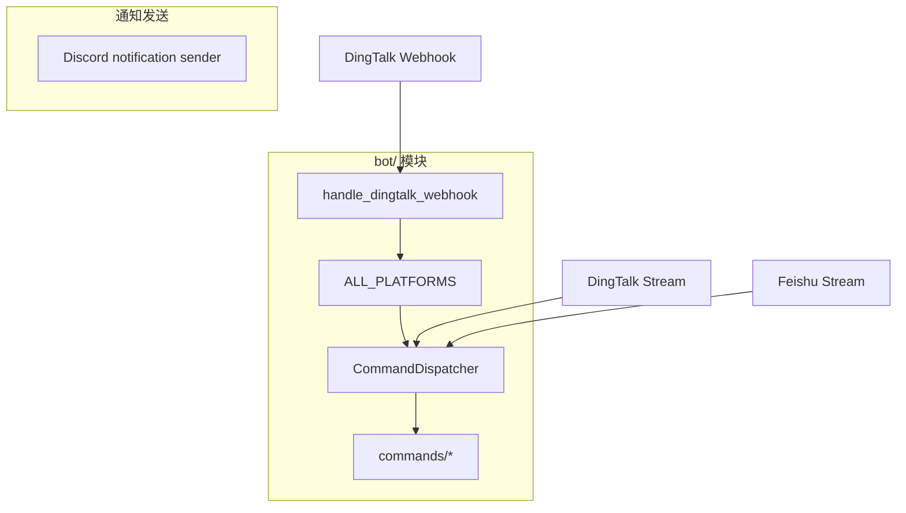

# Bot 命令集成现状

本文档只描述仓库当前真实存在的命令机器人能力，不再把历史草案、未注册平台和通知发送能力混写在一起。

## 一、当前真值

- `bot/platforms/__init__.py` 当前只把 `DingtalkPlatform` 注册到 `ALL_PLATFORMS`。
- `bot/handler.py` 中虽然保留了 `handle_feishu_webhook`、`handle_wecom_webhook`、`handle_telegram_webhook` helper，但这些平台没有注册适配器，直接调用会返回 unknown platform。
- 飞书和钉钉另有可选 Stream 客户端：`bot/platforms/feishu_stream.py`、`bot/platforms/dingtalk_stream.py`。
- Discord 目前不是活跃命令机器人平台；它保留的是通知发送能力，实际发送路径在 `src/notification.py` 和 `src/notification_sender/discord_sender.py`，通过 `requests` 调 Discord REST/Webhook。

## 二、当前架构



## 三、目录结构真值

```text
bot/
├── __init__.py
├── dispatcher.py
├── handler.py
├── models.py
├── commands/
│   ├── analyze.py
│   ├── ask.py
│   ├── batch.py
│   ├── chat.py
│   ├── help.py
│   ├── market.py
│   └── status.py
└── platforms/
    ├── __init__.py
    ├── base.py
    ├── dingtalk.py
    ├── dingtalk_stream.py
    └── feishu_stream.py
```

## 四、可确认的命令入口

### 4.1 DingTalk Webhook

- 平台类：`bot.platforms.dingtalk.DingtalkPlatform`
- 注册位置：`bot/platforms/__init__.py`
- Handler：`bot.handler.handle_dingtalk_webhook`
- 路由状态：仓库内未自动挂到 FastAPI，需要调用方手动挂载 `/bot/dingtalk`

示例：

```python
from bot.handler import handle_dingtalk_webhook

@app.post("/bot/dingtalk")
async def dingtalk_webhook(request: Request):
    headers = dict(request.headers)
    body = await request.body()
    return handle_dingtalk_webhook(headers, body)
```

### 4.2 DingTalk / Feishu Stream

- `main.py` 会按配置尝试启动钉钉/飞书 Stream 客户端。
- 这两条路径不依赖 `/bot/<platform>` Webhook 路由。
- 它们属于消息接入客户端，不等于 `ALL_PLATFORMS` 中的 Webhook 命令平台注册。

## 五、支持的命令

当前 `bot/commands/` 中存在以下命令处理器：

| 命令 | 说明 | 示例 |
| --- | --- | --- |
| `/analyze` | 分析指定股票 | `/analyze 600519` |
| `/ask` | 单轮提问 | `/ask AAPL 的 RSI 是什么` |
| `/batch` | 批量分析自选股 | `/batch` |
| `/chat` | 多轮策略对话 | `/chat` |
| `/market` | 大盘复盘 | `/market` |
| `/help` | 帮助信息 | `/help` |
| `/status` | 系统状态 | `/status` |

## 六、配置边界

### 6.1 命令机器人

```dotenv
BOT_ENABLED=false
BOT_COMMAND_PREFIX=/

# DingTalk Webhook / Stream
DINGTALK_APP_KEY=
DINGTALK_APP_SECRET=

# Feishu Stream
FEISHU_APP_ID=
FEISHU_APP_SECRET=
FEISHU_VERIFICATION_TOKEN=
FEISHU_ENCRYPT_KEY=
```

### 6.2 当前未激活的 Webhook 平台

以下 helper 或配置名仍可能在代码中保留，但当前不应视为“已接通的命令机器人平台”：

- `feishu` Webhook 适配器
- `wecom` Webhook 适配器
- `telegram` Webhook 适配器

## 七、Discord 区分说明

- **是**：通知发送目标，可用 `DISCORD_WEBHOOK_URL` 或 `DISCORD_BOT_TOKEN + DISCORD_MAIN_CHANNEL_ID`
- **不是**：当前 `bot/` 模块里的活跃命令机器人平台
- **没有**：可验证的 Slash Command 注册、`python main.py --discord-bot` 启动模式、活跃 `DiscordPlatform` 注册

如需配置 Discord 通知发送，参考 [Discord bot config](./bot/discord-bot-config.md)。
