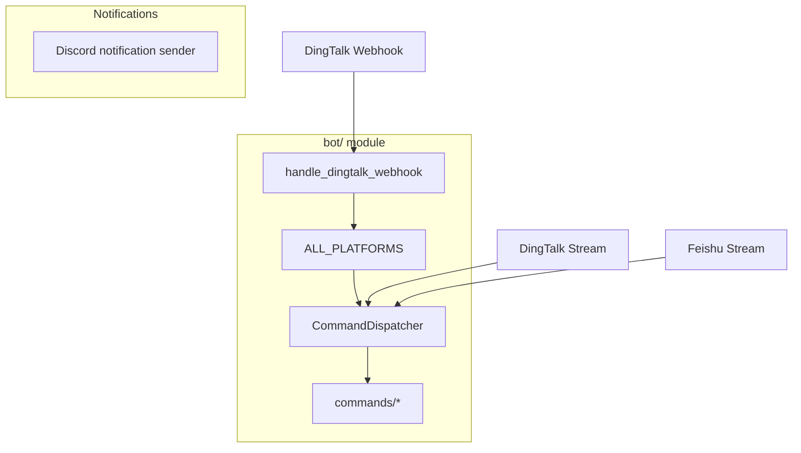

# Bot Integration Guide

This document describes the current truth of the `bot/` module. It does not treat historical sketches, placeholder handlers, and outbound notification senders as active command-bot integrations.

## 1. Current Truth

- `bot/platforms/__init__.py` currently registers only `DingtalkPlatform` in `ALL_PLATFORMS`.
- `bot/handler.py` still exposes helper functions for `feishu`, `wecom`, and `telegram`, but those platforms have no registered adapters, so they are not active command-bot routes.
- DingTalk and Feishu also have optional Stream clients in `bot/platforms/dingtalk_stream.py` and `bot/platforms/feishu_stream.py`.
- Discord is still supported as an outbound notification target, but not as an active command-bot platform. The live path is `src/notification.py` plus `src/notification_sender/discord_sender.py`, using `requests` against Discord REST/Webhook endpoints.

## 2. Architecture Overview



## 3. Directory Structure

```text
bot/
├── __init__.py
├── dispatcher.py
├── handler.py
├── models.py
├── commands/
│   ├── analyze.py
│   ├── ask.py
│   ├── batch.py
│   ├── chat.py
│   ├── help.py
│   ├── market.py
│   └── status.py
└── platforms/
    ├── __init__.py
    ├── base.py
    ├── dingtalk.py
    ├── dingtalk_stream.py
    └── feishu_stream.py
```

## 4. Active Entry Points

### 4.1 DingTalk Webhook

- Platform class: `bot.platforms.dingtalk.DingtalkPlatform`
- Registration: `bot/platforms/__init__.py`
- Handler: `bot.handler.handle_dingtalk_webhook`
- Route status: not auto-mounted into FastAPI; callers must mount `/bot/dingtalk` manually

```python
from bot.handler import handle_dingtalk_webhook

@app.post("/bot/dingtalk")
async def dingtalk_webhook(request: Request):
    headers = dict(request.headers)
    body = await request.body()
    return handle_dingtalk_webhook(headers, body)
```

### 4.2 DingTalk / Feishu Stream

- `main.py` can start DingTalk and Feishu Stream clients when configuration is present.
- These paths do not depend on `/bot/<platform>` webhook routes.
- They are message-ingress clients, not additional `ALL_PLATFORMS` webhook registrations.

## 5. Supported Commands

| Command | Description | Example |
|---------|-------------|---------|
| `/analyze` | Analyze a specific stock | `/analyze AAPL` or `/analyze 600519` |
| `/ask` | Single-turn question about a stock or the market | `/ask what is RSI for AAPL` |
| `/batch` | Batch-analyze your configured watchlist | `/batch` |
| `/chat` | Multi-turn strategy chat | `/chat` |
| `/market` | Market review | `/market` |
| `/help` | Show help text | `/help` |
| `/status` | Show system status | `/status` |

## 6. Configuration Boundary

Command-bot related keys that map to active or partially active code paths:

```dotenv
BOT_ENABLED=false
BOT_COMMAND_PREFIX=/

# DingTalk Webhook / Stream
DINGTALK_APP_KEY=
DINGTALK_APP_SECRET=

# Feishu Stream
FEISHU_APP_ID=
FEISHU_APP_SECRET=
FEISHU_VERIFICATION_TOKEN=
FEISHU_ENCRYPT_KEY=
```

## 7. Discord Distinction

- **Supported:** outbound Discord notifications via `DISCORD_WEBHOOK_URL` or `DISCORD_BOT_TOKEN + DISCORD_MAIN_CHANNEL_ID`
- **Not supported as current command-bot truth:** slash commands, a registered `DiscordPlatform`, or a dedicated `python main.py --discord-bot` runtime

For Discord notification delivery setup, see [Discord bot config](./bot/discord-bot-config.md).
